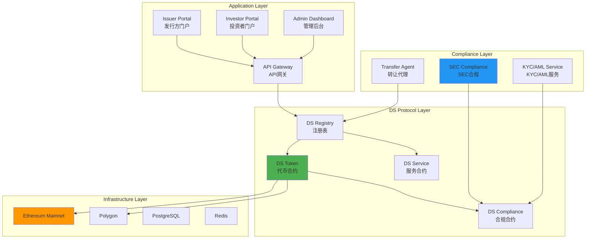
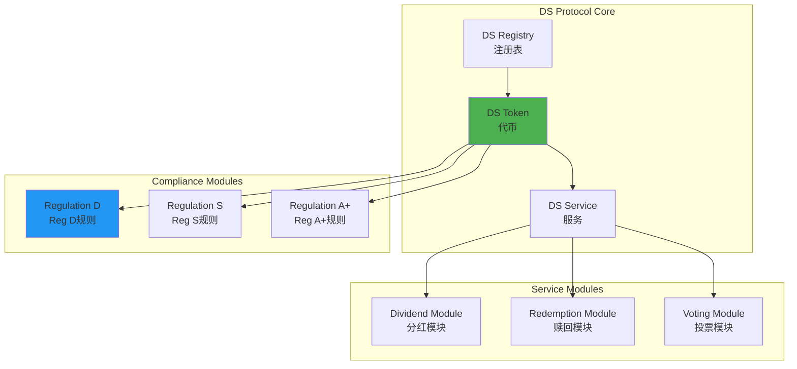
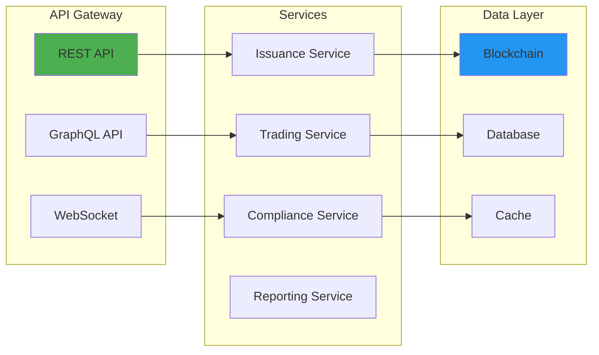
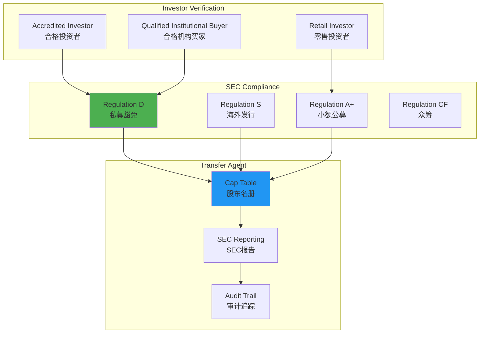
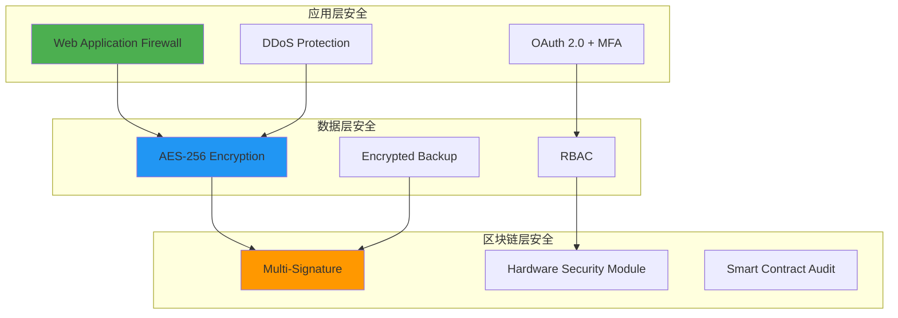

# Securitize 技术架构分析

**文档版本**: v1.0  
**创建时间**: 2025-10-09 10:36:00 CST  
**文档类型**: 技术架构分析  
**定位**: 机构级数字证券平台

---

## 📑 目录

1. [系统整体架构](#1-系统整体架构)
2. [DS Protocol详解](#2-ds-protocol详解)
3. [技术选型分析](#3-技术选型分析)
4. [合规架构](#4-合规架构)
5. [安全架构](#5-安全架构)

---

## 1. 系统整体架构

### 1.1 Securitize 整体架构



### 1.2 核心组件说明

| 组件 | 职责 | 关键功能 |
|------|------|----------|
| **DS Registry** | 注册表 | 投资者注册、身份验证、权限管理 |
| **DS Token** | 代币合约 | ERC20扩展、转账控制、合规检查 |
| **DS Service** | 服务合约 | 分红、赎回、公司行动 |
| **DS Compliance** | 合规合约 | SEC规则、转账限制、锁定期 |
| **Transfer Agent** | 转让代理 | 股东名册、股权登记、合规报告 |

### 1.3 技术栈

**区块链层**：
- Ethereum（主网）
- Polygon（Layer 2）
- Solidity 0.8.x
- Hardhat

**后端层**：
- Node.js 18.x
- NestJS
- PostgreSQL 14.x
- Redis 7.x
- GraphQL

**前端层**：
- React 18.x
- TypeScript
- Apollo Client
- Material-UI

---

## 2. DS Protocol详解

### 2.1 DS Protocol架构



### 2.2 DS Token标准

**DS Token特性**：
```solidity
interface IDSToken {
    // ERC20标准
    function transfer(address to, uint256 amount) external returns (bool);
    function balanceOf(address account) external view returns (uint256);
    
    // DS扩展
    function canTransfer(address from, address to, uint256 amount) 
        external view returns (bool, string memory);
    
    function isVerified(address investor) external view returns (bool);
    
    function getInvestorType(address investor) 
        external view returns (InvestorType);
    
    // 合规控制
    function setTransferRestriction(
        address investor,
        uint256 lockupEnd
    ) external;
    
    function setInvestmentLimit(
        InvestorType investorType,
        uint256 maxAmount
    ) external;
}
```

### 2.3 合规模块

**Regulation D（Reg D）**：
```solidity
contract RegulationD {
    // 506(b): 最多35个非合格投资者
    uint256 public constant MAX_NON_ACCREDITED = 35;
    
    // 506(c): 仅合格投资者
    bool public onlyAccredited;
    
    // 12个月锁定期
    uint256 public constant LOCKUP_PERIOD = 365 days;
    
    function checkCompliance(
        address investor,
        uint256 amount
    ) external view returns (bool, string memory) {
        // 检查合格投资者状态
        if (onlyAccredited && !isAccredited(investor)) {
            return (false, "Only accredited investors allowed");
        }
        
        // 检查非合格投资者数量
        if (!isAccredited(investor) && nonAccreditedCount >= MAX_NON_ACCREDITED) {
            return (false, "Max non-accredited investors reached");
        }
        
        // 检查锁定期
        if (block.timestamp < issuanceDate + LOCKUP_PERIOD) {
            return (false, "Tokens are locked");
        }
        
        return (true, "");
    }
}
```

**Regulation S（Reg S）**：
```solidity
contract RegulationS {
    // 禁止美国投资者
    mapping(address => bool) public isUSPerson;
    
    // 分销合规期（40天）
    uint256 public constant DISTRIBUTION_COMPLIANCE_PERIOD = 40 days;
    
    function checkCompliance(
        address investor,
        uint256 amount
    ) external view returns (bool, string memory) {
        // 检查美国人身份
        if (isUSPerson[investor]) {
            return (false, "US persons not allowed");
        }
        
        // 检查分销合规期
        if (block.timestamp < issuanceDate + DISTRIBUTION_COMPLIANCE_PERIOD) {
            return (false, "Distribution compliance period not ended");
        }
        
        return (true, "");
    }
}
```

---

## 3. 技术选型分析

### 3.1 为什么选择Ethereum

**优势**：
- ✅ 最成熟的智能合约平台
- ✅ 最高的安全性和去中心化
- ✅ 最大的开发者生态
- ✅ 机构认可度高

**挑战**：
- ❌ Gas费用高
- ❌ 交易速度慢

**解决方案**：
- 使用Polygon作为Layer 2
- 批量操作优化Gas
- 链下计算+链上验证

### 3.2 API-First设计

**API架构**：


**API特点**：
- RESTful API（发行、交易）
- GraphQL API（查询、订阅）
- WebSocket（实时更新）
- Webhook（事件通知）

---

## 4. 合规架构

### 4.1 SEC合规框架



### 4.2 Transfer Agent职责

**作为SEC注册的Transfer Agent**：
- ✅ 维护股东名册
- ✅ 处理股权转让
- ✅ 分发股息
- ✅ 提供合规报告
- ✅ 处理公司行动

**合规报告**：
- Form D（Reg D发行）
- Form 1-A（Reg A+发行）
- Form C（Reg CF发行）
- 年度报告
- 季度报告

---

## 5. 安全架构

### 5.1 多层安全防护



### 5.2 审计和认证

**安全审计**：
- ✅ SOC 2 Type II认证
- ✅ ISO 27001认证
- ✅ 智能合约审计（Quantstamp、Trail of Bits）
- ✅ 渗透测试（季度）
- ✅ Bug Bounty计划

**合规认证**：
- ✅ SEC注册Transfer Agent
- ✅ FINRA会员
- ✅ GDPR合规
- ✅ CCPA合规

---

## 📚 参考资源

- [Securitize官网](https://securitize.io)
- [DS Protocol文档](https://docs.securitize.io/ds-protocol)
- [SEC官网](https://www.sec.gov)

---

**文档维护**: RWA-HUSD技术团队  
**最后更新**: 2025-10-09 10:36:00 CST
