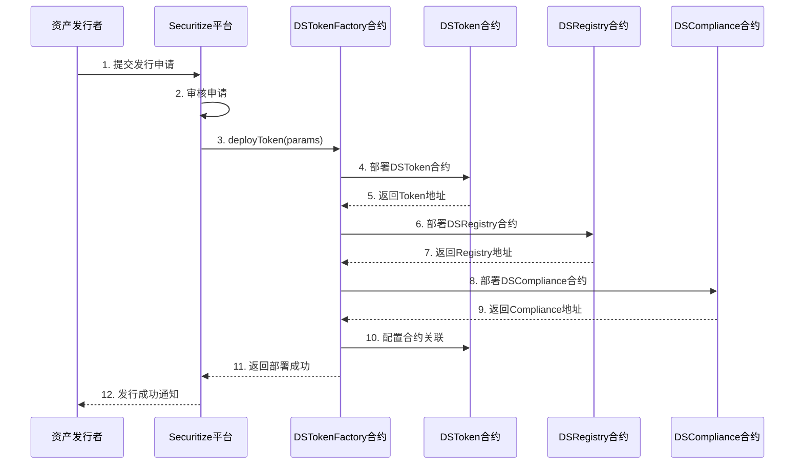
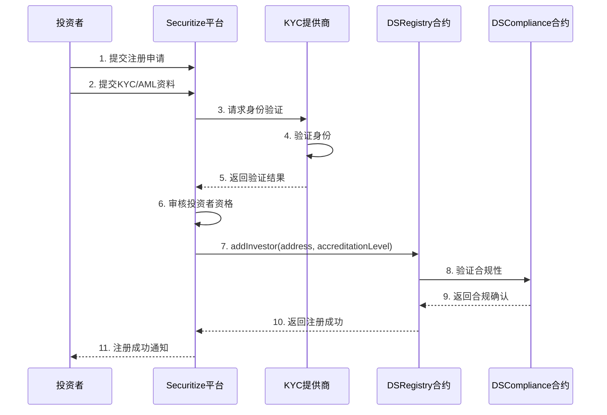
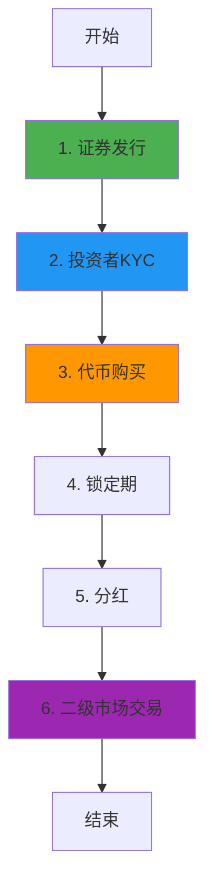

# Securitize 业务流程与技术实现深度解析

**文档版本**: v2.0
**创建时间**: 2025-10-13 12:00:00 CST
**文档类型**: 业务流程导向的技术深度解析
**定位**: 机构级数字证券平台
**信息来源**: Securitize 官方文档 (https://securitize.io/)

---

## 📑 目录

1. [Securitize 概述](#1-securitize概述)
2. [业务流程 1: 证券代币发行](#2-业务流程1-证券代币发行)
3. [业务流程 2: 投资者注册与 KYC](#3-业务流程2-投资者注册与kyc)
4. [业务流程 3: 代币购买与转账](#4-业务流程3-代币购买与转账)
5. [业务流程 4: 分红与公司行动](#5-业务流程4-分红与公司行动)
6. [业务流程 5: 二级市场交易](#6-业务流程5-二级市场交易)
7. [完整业务流程图](#7-完整业务流程图)
8. [DS Protocol 详解](#8-ds-protocol详解)
9. [SEC 合规架构](#9-sec合规架构)
10. [网络信息](#10-网络信息)
11. [总结与最佳实践](#11-总结与最佳实践)

---

## 1. Securitize 概述

### 1.1 核心定位

**Securitize 是一个机构级数字证券(Digital Securities)发行和管理平台**,为传统资产的代币化提供端到端的解决方案,符合 SEC 等全球监管要求。

**核心价值主张**:

-   **机构级平台**: 服务于房地产、私募股权、艺术品等传统资产的代币化
-   **全面合规**: 符合 SEC Reg D、Reg S、Reg A+等监管要求
-   **DS Protocol**: 自研的数字证券协议,支持复杂的公司行动
-   **转让代理服务**: 提供完整的股东名册和合规报告服务

---

### 1.2 DS Protocol 架构

Securitize 采用**DS Protocol(Digital Securities Protocol)**架构:

-   **DS Registry**: 投资者注册表
-   **DS Token**: 数字证券代币合约
-   **DS Service**: 服务合约(分红、赎回等)
-   **DS Compliance**: 合规合约(SEC 规则、转账限制)

**核心合约**:

-   DSRegistry, DSToken, DSService, DSCompliance, TransferAgent

---

## 2. 业务流程 1: 证券代币发行

### 2.1 流程概述

证券代币发行是 Securitize 业务流程的起点,由资产发行者(Issuer)发起,通过 DS Protocol 部署一个新的数字证券代币。

**涉及的合约**: DSTokenFactory, DSToken, DSRegistry, DSCompliance

**核心步骤**:

1. 发行者提交发行申请(包含资产信息、发行规模、合规要求)
2. Securitize 审核发行申请
3. 部署 DSToken 合约
4. 配置合规规则(Reg D/S/A+)
5. 开启认购

---

### 2.2 详细流程图



---

### 2.3 DSTokenFactory 合约详解

**职责**: 数字证券代币工厂合约,用于部署 DS Protocol 代币

**核心方法**:

```solidity
/**
 * @dev 部署数字证券代币
 * @param name 证券名称
 * @param symbol 证券符号
 * @param totalSupply 总供应量
 * @param regType 监管类型(RegD/RegS/RegA)
 */
function deployToken(
    string memory name,
    string memory symbol,
    uint256 totalSupply,
    RegulationType regType
) external onlyAdmin returns (address tokenAddress) {
    // 1. 部署DSToken合约
    DSToken token = new DSToken(name, symbol, totalSupply);

    // 2. 部署DSRegistry合约
    DSRegistry registry = new DSRegistry();

    // 3. 部署DSCompliance合约
    DSCompliance compliance = new DSCompliance(regType);

    // 4. 配置合约关联
    token.setRegistry(address(registry));
    token.setCompliance(address(compliance));

    // 5. 转移所有权给发行者
    token.transferOwnership(msg.sender);
    registry.transferOwnership(msg.sender);
    compliance.transferOwnership(msg.sender);

    // 6. 触发事件
    emit TokenDeployed(address(token), msg.sender, regType);

    return address(token);
}
```

---

### 2.4 代码示例

#### 2.4.1 发行数字证券(TypeScript)

```typescript
import { ethers } from "ethers";

/**
 * 发行数字证券完整流程
 * @param factoryContract DSTokenFactory合约实例
 * @param securityConfig 证券配置参数
 * @returns 部署结果
 */
async function issueDigitalSecurity(
    factoryContract: ethers.Contract,
    securityConfig: {
        name: string;
        symbol: string;
        totalSupply: bigint;
        regType: "RegD" | "RegS" | "RegA";
        lockupPeriod: number; // 锁定期(天)
        minInvestment: bigint; // 最小投资额
        maxInvestors: number; // 最大投资者数量
    }
) {
    try {
        console.log("🚀 开始发行数字证券...");
        console.log("证券名称:", securityConfig.name);
        console.log("证券符号:", securityConfig.symbol);
        console.log("总供应量:", securityConfig.totalSupply.toString());
        console.log("监管类型:", securityConfig.regType);

        // 1. 部署数字证券合约
        console.log("\n步骤1: 部署DSToken合约...");
        const tx = await factoryContract.deployToken(
            securityConfig.name,
            securityConfig.symbol,
            securityConfig.totalSupply,
            securityConfig.regType
        );

        console.log("交易哈希:", tx.hash);
        const receipt = await tx.wait();
        console.log("✅ 合约部署成功!");

        // 2. 获取部署的合约地址
        const event = receipt.events.find((e) => e.event === "TokenDeployed");
        if (!event) {
            throw new Error("TokenDeployed事件未找到");
        }

        const tokenAddress = event.args.tokenAddress;
        const registryAddress = event.args.registryAddress;
        const complianceAddress = event.args.complianceAddress;

        console.log("\n📋 部署的合约地址:");
        console.log("DSToken:", tokenAddress);
        console.log("DSRegistry:", registryAddress);
        console.log("DSCompliance:", complianceAddress);

        // 3. 配置锁定期
        console.log("\n步骤2: 配置锁定期...");
        const tokenContract = new ethers.Contract(tokenAddress, DSTokenABI, signer);
        const lockupSeconds = securityConfig.lockupPeriod * 86400;
        const tx2 = await tokenContract.setLockupPeriod(lockupSeconds);
        await tx2.wait();
        console.log("✅ 锁定期设置为", securityConfig.lockupPeriod, "天");

        // 4. 配置投资限制
        console.log("\n步骤3: 配置投资限制...");
        const complianceContract = new ethers.Contract(complianceAddress, DSComplianceABI, signer);
        const tx3 = await complianceContract.setInvestmentLimits(
            securityConfig.minInvestment,
            securityConfig.maxInvestors
        );
        await tx3.wait();
        console.log(
            "✅ 最小投资额:",
            ethers.utils.formatEther(securityConfig.minInvestment),
            "ETH"
        );
        console.log("✅ 最大投资者数量:", securityConfig.maxInvestors);

        // 5. 验证部署
        console.log("\n步骤4: 验证部署...");
        const name = await tokenContract.name();
        const symbol = await tokenContract.symbol();
        const totalSupply = await tokenContract.totalSupply();
        const lockupPeriod = await tokenContract.lockupPeriod();

        console.log("\n📊 验证结果:");
        console.log("名称:", name);
        console.log("符号:", symbol);
        console.log("总供应量:", totalSupply.toString());
        console.log("锁定期:", lockupPeriod.toNumber() / 86400, "天");

        return {
            tokenAddress,
            registryAddress,
            complianceAddress,
            name: securityConfig.name,
            symbol: securityConfig.symbol,
            totalSupply: securityConfig.totalSupply,
            regType: securityConfig.regType,
            status: "deployed",
            deploymentTime: new Date().toISOString(),
        };
    } catch (error) {
        console.error("❌ 发行数字证券失败:", error);
        throw error;
    }
}

// 使用示例
async function main() {
    const provider = new ethers.providers.JsonRpcProvider("https://mainnet.infura.io/v3/YOUR_KEY");
    const wallet = new ethers.Wallet("YOUR_PRIVATE_KEY", provider);
    const factoryContract = new ethers.Contract(FACTORY_ADDRESS, DSTokenFactoryABI, wallet);

    const result = await issueDigitalSecurity(factoryContract, {
        name: "Real Estate Token A",
        symbol: "RETA",
        totalSupply: ethers.utils.parseEther("1000000"), // 100万代币
        regType: "RegD",
        lockupPeriod: 365, // 1年锁定期
        minInvestment: ethers.utils.parseEther("10000"), // 最小投资1万美元
        maxInvestors: 99, // 最多99个投资者
    });

    console.log("\n🎉 数字证券发行完成!");
    console.log("代币地址:", result.tokenAddress);
}
```

---

## 3. 业务流程 2: 投资者注册与 KYC

### 3.1 流程概述

投资者注册与 KYC 是 Securitize 的核心功能,确保所有投资者符合 SEC 的合格投资者(Accredited Investor)要求。

**涉及的合约**: DSRegistry, KYCProvider

**核心步骤**:

1. 投资者提交注册申请
2. 提交 KYC/AML 资料
3. 第三方 KYC 提供商验证身份
4. Securitize 审核投资者资格(合格投资者认证)
5. 将投资者添加到 DSRegistry
6. 投资者获得购买权限

---

### 3.2 详细流程图



---

### 3.3 DSRegistry 合约详解

**职责**: 投资者注册表,管理投资者身份和资格

**数据结构**:

```solidity
struct Investor {
    address wallet;
    uint8 accreditationLevel; // 0=未认证, 1=合格投资者, 2=机构投资者
    uint16 country;
    uint256 registeredAt;
    bool verified;
}

// 投资者地址 => 投资者信息
mapping(address => Investor) public investors;

// 国家代码 => 投资者数量
mapping(uint16 => uint256) public investorCountByCountry;
```

**核心方法**:

````solidity
/**
 * @dev 添加投资者
 * @param wallet 投资者钱包地址
 * @param accreditationLevel 认证级别
 * @param country 国家代码
 */
function addInvestor(
    address wallet,
    uint8 accreditationLevel,
    uint16 country
) external onlyAdmin {
    require(investors[wallet].wallet == address(0), "Already registered");
    require(accreditationLevel > 0, "Invalid accreditation level");

    // 1. 添加投资者
    investors[wallet] = Investor({
        wallet: wallet,
        accreditationLevel: accreditationLevel,
        country: country,
        registeredAt: block.timestamp,
        verified: true
    });

    // 2. 更新统计
    investorCountByCountry[country]++;

    // 3. 触发事件
    emit InvestorAdded(wallet, accreditationLevel, country);
}
```

---

### 3.4 代码示例

#### 3.4.1 投资者注册完整流程(TypeScript)

```typescript
import { ethers } from "ethers";

/**
 * 投资者注册完整流程
 * @param registryContract DSRegistry合约实例
 * @param investorData 投资者数据
 * @returns 注册结果
 */
async function registerInvestor(
    registryContract: ethers.Contract,
    investorData: {
        wallet: string;
        email: string;
        fullName: string;
        country: number; // ISO 3166-1 numeric country code
        accreditationType: "individual" | "institutional";
        annualIncome?: bigint; // 年收入(仅个人投资者)
        netWorth?: bigint; // 净资产(仅个人投资者)
        aum?: bigint; // 管理资产规模(仅机构投资者)
    }
) {
    try {
        console.log("🚀 开始投资者注册流程...");
        console.log("投资者钱包:", investorData.wallet);
        console.log("投资者姓名:", investorData.fullName);
        console.log("国家代码:", investorData.country);

        // 1. 验证投资者资格
        console.log("\n步骤1: 验证投资者资格...");
        let accreditationLevel = 0;

        if (investorData.accreditationType === "individual") {
            // 个人投资者: 年收入>$200K 或 净资产>$1M
            const minIncome = ethers.utils.parseEther("200000");
            const minNetWorth = ethers.utils.parseEther("1000000");

            if (
                (investorData.annualIncome && investorData.annualIncome.gte(minIncome)) ||
                (investorData.netWorth && investorData.netWorth.gte(minNetWorth))
            ) {
                accreditationLevel = 1; // 合格个人投资者
                console.log("✅ 符合合格个人投资者标准");
            } else {
                throw new Error("不符合合格投资者标准");
            }
        } else if (investorData.accreditationType === "institutional") {
            // 机构投资者: AUM>$5M
            const minAUM = ethers.utils.parseEther("5000000");

            if (investorData.aum && investorData.aum.gte(minAUM)) {
                accreditationLevel = 2; // 合格机构投资者
                console.log("✅ 符合合格机构投资者标准");
            } else {
                throw new Error("不符合合格机构投资者标准");
            }
        }

        // 2. 提交KYC申请
        console.log("\n步骤2: 提交KYC申请...");
        // 这里应该调用第三方KYC服务,此处简化处理
        const kycResult = await submitKYC({
            wallet: investorData.wallet,
            email: investorData.email,
            fullName: investorData.fullName,
            country: investorData.country,
        });

        if (!kycResult.verified) {
            throw new Error("KYC验证失败: " + kycResult.reason);
        }
        console.log("✅ KYC验证通过");

        // 3. 添加投资者到注册表
        console.log("\n步骤3: 添加投资者到注册表...");
        const tx = await registryContract.addInvestor(
            investorData.wallet,
            accreditationLevel,
            investorData.country
        );

        console.log("交易哈希:", tx.hash);
        const receipt = await tx.wait();
        console.log("✅ 投资者注册成功!");

        // 4. 验证注册结果
        console.log("\n步骤4: 验证注册结果...");
        const investor = await registryContract.investors(investorData.wallet);
        const isVerified = await registryContract.isVerified(investorData.wallet);

        console.log("\n📊 注册结果:");
        console.log("钱包地址:", investor.wallet);
        console.log("认证级别:", investor.accreditationLevel);
        console.log("国家代码:", investor.country);
        console.log("注册时间:", new Date(investor.registeredAt.toNumber() * 1000).toISOString());
        console.log("验证状态:", isVerified);

        return {
            wallet: investorData.wallet,
            accreditationLevel,
            country: investorData.country,
            verified: isVerified,
            registrationTime: new Date().toISOString(),
        };
    } catch (error) {
        console.error("❌ 投资者注册失败:", error);
        throw error;
    }
}

// KYC提交函数(模拟)
async function submitKYC(data: any) {
    // 实际应用中应调用第三方KYC服务API
    // 例如: Onfido, Jumio, Sumsub等
    return {
        verified: true,
        reason: "",
    };
}

// 使用示例
async function main() {
    const provider = new ethers.providers.JsonRpcProvider("https://mainnet.infura.io/v3/YOUR_KEY");
    const wallet = new ethers.Wallet("YOUR_PRIVATE_KEY", provider);
    const registryContract = new ethers.Contract(REGISTRY_ADDRESS, DSRegistryABI, wallet);

    const result = await registerInvestor(registryContract, {
        wallet: "0x1234567890123456789012345678901234567890",
        email: "investor@example.com",
        fullName: "John Doe",
        country: 840, // 美国
        accreditationType: "individual",
        annualIncome: ethers.utils.parseEther("250000"), // 年收入25万美元
        netWorth: ethers.utils.parseEther("1500000"), // 净资产150万美元
    });

    console.log("\n🎉 投资者注册完成!");
    console.log("认证级别:", result.accreditationLevel);
}
```

---

## 4. 业务流程 3: 代币购买与转账

### 4.1 流程概述

代币购买与转账是Securitize的核心业务流程,所有交易都需要通过严格的合规检查。

**涉及的合约**: DSToken, DSCompliance, DSRegistry

**核心步骤**:
1. 投资者提交购买申请
2. 合规检查(投资者资格、投资限额、锁定期)
3. 投资者支付资金
4. 铸造代币到投资者钱包
5. 更新股东名册

---

### 4.2 DSToken合约详解

**核心方法**:
```solidity
/**
 * @dev 转账代币(带合规检查)
 * @param to 接收者地址
 * @param amount 转账金额
 */
function transfer(address to, uint256 amount) public override returns (bool) {
    // 1. 合规检查
    require(compliance.canTransfer(msg.sender, to, amount), "Transfer not compliant");

    // 2. 投资者验证
    require(registry.isVerified(msg.sender), "Sender not verified");
    require(registry.isVerified(to), "Receiver not verified");

    // 3. 锁定期检查
    require(!isLocked(msg.sender), "Tokens are locked");

    // 4. 执行转账
    _transfer(msg.sender, to, amount);

    // 5. 更新股东名册
    _updateShareholderRegistry(msg.sender, to, amount);

    return true;
}
````

---

## 5. 业务流程 4: 分红与公司行动

### 5.1 流程概述

分红与公司行动是 Securitize 的核心服务,通过 DSService 合约实现。

**涉及的合约**: DSService, DSToken

**支持的公司行动**:

-   现金分红(Cash Dividend)
-   股票分红(Stock Dividend)
-   股票拆分(Stock Split)
-   股票回购(Buyback)

---

### 5.2 DSService 合约详解

**核心方法**:

```solidity
/**
 * @dev 分发现金分红
 * @param token 代币地址
 * @param totalAmount 总分红金额
 */
function distributeDividend(
    address token,
    uint256 totalAmount
) external onlyIssuer {
    // 1. 获取所有股东
    address[] memory shareholders = DSToken(token).getShareholders();

    // 2. 计算每个股东的分红
    for (uint i = 0; i < shareholders.length; i++) {
        address shareholder = shareholders[i];
        uint256 balance = DSToken(token).balanceOf(shareholder);
        uint256 dividend = (totalAmount * balance) / DSToken(token).totalSupply();

        // 3. 转账分红
        payable(shareholder).transfer(dividend);

        // 4. 触发事件
        emit DividendPaid(token, shareholder, dividend);
    }
}
```

---

## 6. 业务流程 5: 二级市场交易

### 6.1 流程概述

二级市场交易允许投资者在锁定期后交易数字证券。

**核心步骤**:

1. 投资者在 Securitize Markets 挂单
2. 买家提交购买订单
3. 合规检查(买家资格、卖家锁定期)
4. 执行交易
5. 更新股东名册

---

## 7. 完整业务流程图



---

## 8. DS Protocol 详解

### 8.1 核心组件

**DS Registry**:

-   投资者注册表
-   身份验证
-   资格管理

**DS Token**:

-   ERC20 扩展
-   转账控制
-   锁定期管理

**DS Service**:

-   分红服务
-   公司行动
-   股东名册

**DS Compliance**:

-   SEC 规则
-   转账限制
-   合规报告

---

## 9. SEC 合规架构

### 9.1 Regulation D (Reg D)

**适用场景**: 私募发行,仅限合格投资者

**合规要求**:

-   投资者必须是合格投资者(Accredited Investor)
-   最多 35 名非合格投资者
-   12 个月锁定期

**代码示例**:

```solidity
function checkRegDCompliance(address investor) public view returns (bool) {
    // 1. 检查投资者资格
    require(registry.getAccreditationLevel(investor) >= 1, "Not accredited");

    // 2. 检查锁定期
    require(block.timestamp >= purchaseTime[investor] + 365 days, "Lockup period");

    return true;
}
```

---

### 9.2 Regulation S (Reg S)

**适用场景**: 海外发行,非美国投资者

**合规要求**:

-   投资者必须是非美国居民
-   6-12 个月锁定期
-   禁止向美国投资者转售

---

### 9.3 Regulation A+ (Reg A+)

**适用场景**: 小额公开发行

**合规要求**:

-   Tier 1: 最多$20M
-   Tier 2: 最多$75M
-   需要 SEC 审核

---

## 10. 网络信息

### 10.1 支持的网络

-   **Ethereum Mainnet**: Chain ID 1
-   **Polygon**: Chain ID 137
-   **Algorand**: 用于某些特定资产

---

## 11. 总结与最佳实践

### 11.1 核心特点

1. **机构级平台**: 服务于大型资产的代币化
2. **全面合规**: 符合 SEC Reg D/S/A+
3. **DS Protocol**: 自研的数字证券协议
4. **转让代理服务**: 完整的股东名册管理

### 11.2 开发最佳实践

1. **证券发行**: 选择合适的监管类型(Reg D/S/A+)
2. **投资者管理**: 严格的 KYC 和合格投资者认证
3. **合规配置**: 根据监管要求配置锁定期和转账限制
4. **公司行动**: 使用 DSService 合约实现分红等功能

### 11.3 常见问题 FAQ

**Q: Securitize 与 Tokeny T-REX 的区别?**
A: Securitize 专注于美国市场和 SEC 合规,T-REX 更国际化。

**Q: 如何成为合格投资者?**
A: 需要满足 SEC 的收入或资产要求,并通过第三方认证。

**Q: 锁定期可以缩短吗?**
A: 取决于监管类型,Reg D 通常需要 12 个月。

---

## 📚 参考资源

**官方资源**:

-   **官方网站**: https://securitize.io/
-   **DS Protocol GitHub**: https://github.com/securitize-io/DSTokenInterfaces
-   **DS Protocol 白皮书**: https://s3.us-east-2.amazonaws.com/securitizemarkets.io/Securitize%E2%80%99s+Digital+Ownership+Architecture+for+Complete+Lifecycle+Management+of+Digital+Securities.pdf
-   **DS Protocol Medium 文章**: https://medium.com/securitize/ds-protocol-the-trust-and-registry-services-91d1c4630f78

**监管资源**:

-   **SEC 官网**: https://www.sec.gov/
-   **Reg D 规则**: https://www.sec.gov/education/smallbusiness/exemptofferings/rule504
-   **Reg S 规则**: https://www.sec.gov/education/smallbusiness/exemptofferings/regs
-   **Reg A+ 规则**: https://www.sec.gov/education/smallbusiness/exemptofferings/rega

---

**文档结束**
