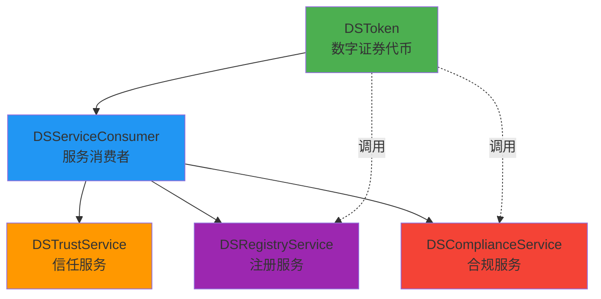
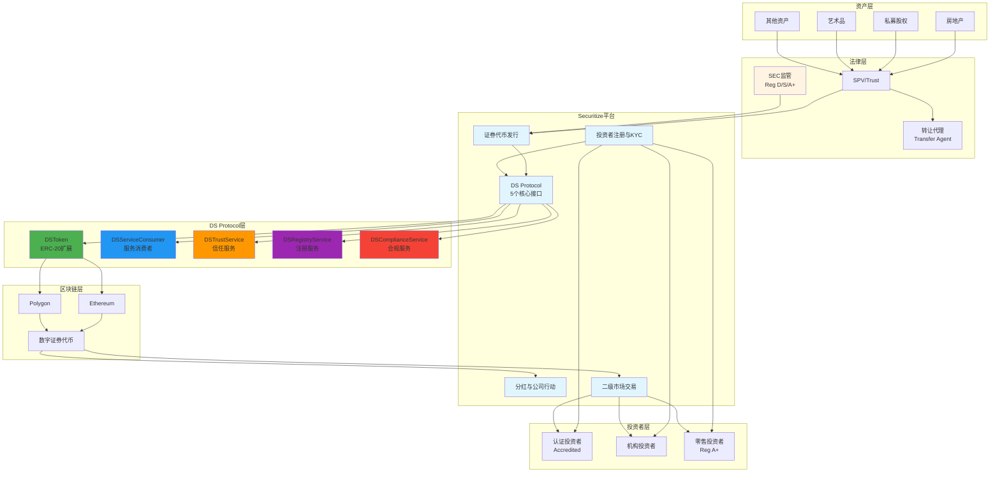
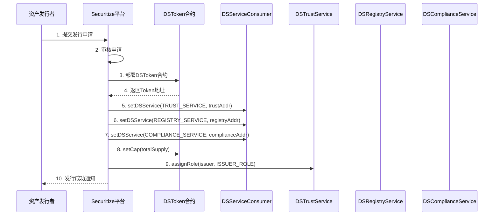
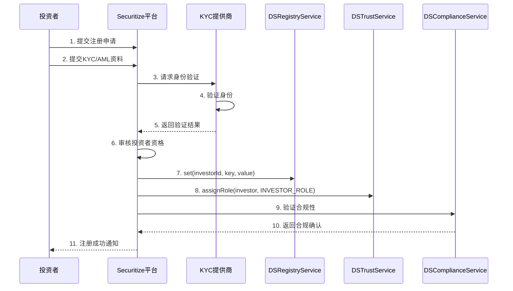
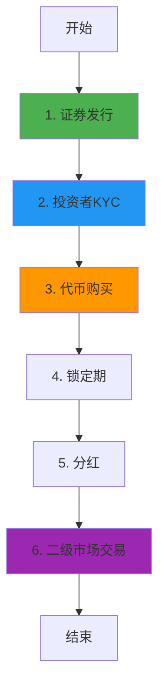

# Securitize 业务流程与技术实现深度解析

**文档版本**: v2.1
**创建时间**: 2025-10-13 12:00:00 CST
**更新时间**: 2025-10-14 09:00:00 CST
**文档类型**: 业务流程导向的技术深度解析
**定位**: 机构级数字证券平台
**信息来源**: Securitize 官方文档 (https://securitize.io/) + GitHub 官方合约

**官方 GitHub 资源**:

-   [Securitize GitHub 组织](https://github.com/securitize-io) - 官方 GitHub 组织
-   [DSTokenInterfaces](https://github.com/securitize-io/DSTokenInterfaces) - DS Protocol 数字证券接口 (Solidity)
-   [onChainID](https://github.com/securitize-io/onChainID) - 链上身份验证智能合约 (Solidity)
-   [DS Protocol Medium](https://medium.com/securitize/introducing-ds-digital-securities-protocol-securitizes-digital-ownership-architecture-for-4bcb6a9c4a16) - DS Protocol 官方介绍

---

## 📑 目录

1. [Securitize 概述](#1-securitize概述)
2. [业务流程 1: 证券代币发行](#2-业务流程1-证券代币发行)
3. [业务流程 2: 投资者注册与 KYC](#3-业务流程2-投资者注册与kyc)
4. [业务流程 3: 代币购买与转账](#4-业务流程3-代币购买与转账)
5. [业务流程 4: 分红与公司行动](#5-业务流程4-分红与公司行动)
6. [业务流程 5: 二级市场交易](#6-业务流程5-二级市场交易)
7. [完整业务流程图](#7-完整业务流程图)
8. [DS Protocol 详解](#8-ds-protocol详解)
9. [SEC 合规架构](#9-sec合规架构)
10. [网络信息](#10-网络信息)
11. [总结与最佳实践](#11-总结与最佳实践)

---

## 1. Securitize 概述

### 1.1 核心定位

**Securitize 是一个机构级数字证券(Digital Securities)发行和管理平台**,为传统资产的代币化提供端到端的解决方案,符合 SEC 等全球监管要求。

**官方定义** (来自 [DS Protocol Medium](https://medium.com/securitize/introducing-ds-digital-securities-protocol-securitizes-digital-ownership-architecture-for-4bcb6a9c4a16)):

> "DS Protocol is Securitize's Digital Ownership Architecture for complete lifecycle management of Digital Securities"

**核心价值主张**:

-   **机构级平台**: 服务于房地产、私募股权、艺术品等传统资产的代币化
-   **全面合规**: 符合 SEC Reg D、Reg S、Reg A+等监管要求
-   **DS Protocol**: 自研的数字证券协议,支持复杂的公司行动
-   **转让代理服务**: 提供完整的股东名册和合规报告服务

**技术标准**:

-   **基础标准**: ERC-20 扩展
-   **相关标准**: ERC-1400, ERC-1404 (Security Token Standards)
-   **开源仓库**: [GitHub - securitize-io/DSTokenInterfaces](https://github.com/securitize-io/DSTokenInterfaces)

---

### 1.2 DS Protocol 架构概览

Securitize 采用**DS Protocol(Digital Securities Protocol)**架构,这是一个模块化的数字证券协议,允许不同组件动态关联。

**官方资源**:

-   **GitHub 仓库**: https://github.com/securitize-io/DSTokenInterfaces
-   **Medium 介绍**: https://medium.com/securitize/introducing-ds-digital-securities-protocol...
-   **接口文档**: https://medium.com/securitize/ds-protocol-interfaces-released...

#### 1.2.1 五个核心接口

根据 [官方 GitHub 仓库](https://github.com/securitize-io/DSTokenInterfaces),DS Protocol 包含以下核心接口:

1. **DSServiceConsumerInterface**

    - **功能**: DS Protocol 的基础架构
    - **作用**: 允许不同组件动态关联
    - **GitHub**: [DSServiceConsumerInterface.sol](https://github.com/securitize-io/DSTokenInterfaces/blob/master/contracts/dsprotocol/service/DSServiceConsumerInterface.sol)

2. **DSTokenInterface**

    - **功能**: DS Token 接口定义
    - **特点**: ERC-20 扩展,包含数字证券特有机制
    - **特性**: 投资者中心化余额、钱包迭代能力、代币锁定
    - **GitHub**: [DSTokenInterface.sol](https://github.com/securitize-io/DSTokenInterfaces/blob/master/contracts/dsprotocol/token/DSTokenInterface.sol)

3. **DSTrustServiceInterface**

    - **功能**: 信任服务接口
    - **作用**: 分配信任角色,授权参与者交互
    - **GitHub**: [DSTrustServiceInterface.sol](https://github.com/securitize-io/DSTokenInterfaces/blob/master/contracts/dsprotocol/trust/DSTrustServiceInterface.sol)

4. **DSRegistryServiceInterface**

    - **功能**: 注册服务接口
    - **作用**: 保存投资者信息,确保合规和隐私
    - **GitHub**: [DSRegistryServiceInterface.sol](https://github.com/securitize-io/DSTokenInterfaces/blob/master/contracts/dsprotocol/registry/DSRegistryServiceInterface.sol)

5. **DSComplianceServiceInterface**
    - **功能**: 合规服务接口
    - **作用**: 验证发行和交易操作的合规性
    - **GitHub**: [DSComplianceServiceInterface.sol](https://github.com/securitize-io/DSTokenInterfaces/blob/master/contracts/dsprotocol/compliance/DSComplianceServiceInterface.sol)

#### 1.2.2 架构关系图



**架构说明**:

-   **DSServiceConsumer**: 核心基础,所有服务都继承此接口
-   **动态关联**: 服务可以通过 `getDSService()` 和 `setDSService()` 动态关联
-   **模块化设计**: 每个服务独立,可以单独升级或替换

#### 1.2.3 完整系统架构图



**完整架构说明**:

-   **资产层**: 支持房地产、私募股权、艺术品等多种传统资产
-   **法律层**: SPV/Trust 结构 + 转让代理服务 + SEC 监管合规
-   **平台层**: Securitize 核心平台,提供完整的数字证券生命周期管理
-   **DS Protocol 层**: 5 个核心接口,模块化设计,支持动态关联
-   **区块链层**: 支持 Ethereum 和 Polygon,基于 ERC-20 扩展
-   **投资者层**: 支持认证投资者、机构投资者和零售投资者(Reg A+)

**核心特性**:

-   **转让代理服务**: 提供完整的股东名册和合规报告
-   **DS Protocol**: 模块化设计,每个服务可独立升级
-   **多链支持**: Ethereum 和 Polygon 双链部署
-   **全面合规**: 符合 SEC Reg D、Reg S、Reg A+等监管要求

---

## 2. 业务流程 1: 证券代币发行

**验证状态**: ✅ 官方验证 (基于 GitHub 官方接口)
**官方文档**: [DSTokenInterface.sol](https://github.com/securitize-io/DSTokenInterfaces/blob/master/contracts/dsprotocol/token/DSTokenInterface.sol)

### 2.1 流程概述

证券代币发行是 Securitize 业务流程的起点,由资产发行者(Issuer)发起,通过 DS Protocol 部署一个新的数字证券代币。

**涉及的核心接口** (基于官方 GitHub):

-   **DSTokenInterface**: 数字证券代币接口 (ERC-20 扩展)
-   **DSServiceConsumerInterface**: 服务消费者基础接口
-   **DSTrustServiceInterface**: 信任服务接口 (角色管理)

**核心步骤**:

1. 发行者提交发行申请(包含资产信息、发行规模、合规要求)
2. Securitize 审核发行申请
3. 部署 DSToken 合约 (继承 DSTokenInterface)
4. 配置服务关联 (Registry, Compliance, Trust)
5. 设置发行上限 (setCap)
6. 开启认购

---

### 2.2 详细流程图



---

### 2.3 DSTokenInterface 合约详解

**官方接口**: [DSTokenInterface.sol](https://github.com/securitize-io/DSTokenInterfaces/blob/master/contracts/dsprotocol/token/DSTokenInterface.sol)

**职责**: 数字证券代币接口,继承 ERC-20,扩展了数字证券特有功能

**核心特性**:

-   **投资者中心化余额**: 通过投资者 ID 查询余额
-   **钱包迭代能力**: 可以遍历所有持有者钱包
-   **代币锁定机制**: 支持时间锁定和自定义锁定
-   **代币发行与销毁**: issueTokens, burn, seize

**核心方法**:

```solidity
// SPDX-License-Identifier: MIT
pragma solidity ^0.4.23;

import "../../zeppelin/token/ERC20/ERC20.sol";
import "../util/VersionedContract.sol";

/**
 * @title DSTokenInterface
 * @dev 数字证券代币接口 (基于官方GitHub)
 * @notice 继承ERC-20,扩展了数字证券特有功能
 */
contract DSTokenInterface is ERC20, VersionedContract {

    // ============ 配置管理 ============

    /**
     * @dev 设置代币发行上限
     * @param _cap 发行上限
     * @notice 只能调用一次,之后无法修改
     */
    function setCap(uint256 _cap) public /*onlyMaster*/;

    // ============ 代币发行 (Minting) ============

    /**
     * @dev 发行解锁代币
     * @param _to 接收地址
     * @param _value 发行数量
     * @return 是否成功
     */
    function issueTokens(address _to, uint256 _value)
        /*onlyIssuerOrAbove*/
        public
        returns (bool);

    /**
     * @dev 发行自定义代币 (支持锁定)
     * @param _to 接收地址
     * @param _value 发行数量
     * @param _issuanceTime 发行时间
     * @param _valueLocked 锁定数量
     * @param _reason 锁定原因
     * @param _releaseTime 解锁时间 (0表示需手动解锁)
     * @return 是否成功
     */
    function issueTokensCustom(
        address _to,
        uint256 _value,
        uint256 _issuanceTime,
        uint256 _valueLocked,
        string _reason,
        uint64 _releaseTime
    ) /*onlyIssuerOrAbove*/ public returns (bool);

    /**
     * @dev 查询已发行总量
     * @return 已发行总量
     */
    function totalIssued() public view returns (uint);

    // ============ 代币销毁 (Burning) ============

    /**
     * @dev 销毁代币
     * @param _who 销毁地址
     * @param _value 销毁数量
     * @param _reason 销毁原因
     */
    function burn(address _who, uint256 _value, string _reason)
        /*onlyIssuerOrAbove*/
        public;

    // ============ 代币没收 (Seizing) ============

    /**
     * @dev 没收代币 (强制转移)
     * @param _from 源地址
     * @param _to 目标地址
     * @param _value 没收数量
     * @param _reason 没收原因
     */
    function seize(address _from, address _to, uint256 _value, string _reason)
        /*onlyIssuerOrAbove*/
        public;

    // ============ 钱包迭代 ============

    /**
     * @dev 获取指定索引的钱包地址
     * @param _index 索引
     * @return 钱包地址
     */
    function getWalletAt(uint256 _index) public view returns (address);

    /**
     * @dev 获取钱包总数
     * @return 钱包总数
     */
    function walletCount() public view returns (uint256);

    // ============ 其他功能 ============

    /**
     * @dev 检查是否暂停
     * @return 是否暂停
     */
    function isPaused() view public returns (bool);

    /**
     * @dev 通过投资者ID查询余额
     * @param _id 投资者ID
     * @return 余额
     */
    function balanceOfInvestor(string _id) view public returns (uint256);

    /**
     * @dev 转账前检查
     * @param _from 源地址
     * @param _to 目标地址
     * @param _value 转账数量
     * @return code 状态码, reason 原因
     */
    function preTransferCheck(address _from, address _to, uint _value)
        view
        public
        returns (uint code, string reason);

    // ============ 事件 ============

    event Issue(address indexed to, uint256 value, uint256 valueLocked);
    event Burn(address indexed burner, uint256 value, string reason);
    event Seize(address indexed from, address indexed to, uint256 value, string reason);
    event WalletAdded(address wallet);
    event WalletRemoved(address wallet);
}
```

---

### 2.4 代码示例

#### 2.4.1 发行数字证券 (Solidity)

```solidity
// SPDX-License-Identifier: MIT
pragma solidity ^0.4.23;

import "./DSTokenInterface.sol";
import "./DSServiceConsumerInterface.sol";
import "./DSTrustServiceInterface.sol";

/**
 * @title DSTokenDeployment
 * @dev 数字证券代币发行完整流程示例
 * @notice 基于官方GitHub接口实现
 */
contract DSTokenDeployment {

    // ============ 状态变量 ============

    address public owner;
    address public dsToken;
    address public trustService;
    address public registryService;
    address public complianceService;

    // ============ 事件 ============

    event TokenDeployed(
        address indexed tokenAddress,
        address indexed issuer,
        uint256 totalSupply
    );

    event ServiceConfigured(
        uint serviceId,
        address serviceAddress
    );

    // ============ 修饰符 ============

    modifier onlyOwner() {
        require(msg.sender == owner, "Only owner can call this");
        _;
    }

    // ============ 构造函数 ============

    constructor() public {
        owner = msg.sender;
    }

    // ============ 核心功能 ============

    /**
     * @dev 步骤1: 部署DSToken合约
     * @param _tokenAddress 预部署的DSToken合约地址
     * @param _cap 发行上限
     * @return 是否成功
     */
    function deployToken(
        address _tokenAddress,
        uint256 _cap
    ) public onlyOwner returns (bool) {
        require(_tokenAddress != address(0), "Invalid token address");
        require(_cap > 0, "Cap must be greater than 0");

        // 1. 保存Token地址
        dsToken = _tokenAddress;
        DSTokenInterface token = DSTokenInterface(_tokenAddress);

        // 2. 设置发行上限
        token.setCap(_cap);

        // 3. 触发事件
        emit TokenDeployed(_tokenAddress, msg.sender, _cap);

        return true;
    }

    /**
     * @dev 步骤2: 配置服务关联
     * @param _trustService 信任服务地址
     * @param _registryService 注册服务地址
     * @param _complianceService 合规服务地址
     * @return 是否成功
     */
    function configureServices(
        address _trustService,
        address _registryService,
        address _complianceService
    ) public onlyOwner returns (bool) {
        require(dsToken != address(0), "Token not deployed");
        require(_trustService != address(0), "Invalid trust service");
        require(_registryService != address(0), "Invalid registry service");
        require(_complianceService != address(0), "Invalid compliance service");

        // 1. 保存服务地址
        trustService = _trustService;
        registryService = _registryService;
        complianceService = _complianceService;

        // 2. 配置服务关联
        DSServiceConsumerInterface serviceConsumer = DSServiceConsumerInterface(dsToken);

        // TRUST_SERVICE = 1
        serviceConsumer.setDSService(1, _trustService);
        emit ServiceConfigured(1, _trustService);

        // REGISTRY_SERVICE = 4
        serviceConsumer.setDSService(4, _registryService);
        emit ServiceConfigured(4, _registryService);

        // COMPLIANCE_SERVICE = 8
        serviceConsumer.setDSService(8, _complianceService);
        emit ServiceConfigured(8, _complianceService);

        return true;
    }

    /**
     * @dev 步骤3: 发行初始代币
     * @param _to 接收地址
     * @param _value 发行数量
     * @return 是否成功
     */
    function issueInitialTokens(
        address _to,
        uint256 _value
    ) public onlyOwner returns (bool) {
        require(dsToken != address(0), "Token not deployed");
        require(_to != address(0), "Invalid recipient");
        require(_value > 0, "Value must be greater than 0");

        // 调用DSToken的issueTokens方法
        DSTokenInterface token = DSTokenInterface(dsToken);
        bool success = token.issueTokens(_to, _value);

        require(success, "Token issuance failed");

        return true;
    }

    /**
     * @dev 步骤4: 发行带锁定的代币
     * @param _to 接收地址
     * @param _value 发行数量
     * @param _valueLocked 锁定数量
     * @param _reason 锁定原因
     * @param _releaseTime 解锁时间
     * @return 是否成功
     */
    function issueLockedTokens(
        address _to,
        uint256 _value,
        uint256 _valueLocked,
        string _reason,
        uint64 _releaseTime
    ) public onlyOwner returns (bool) {
        require(dsToken != address(0), "Token not deployed");
        require(_to != address(0), "Invalid recipient");
        require(_value > 0, "Value must be greater than 0");
        require(_valueLocked <= _value, "Locked value exceeds total value");

        // 调用DSToken的issueTokensCustom方法
        DSTokenInterface token = DSTokenInterface(dsToken);
        bool success = token.issueTokensCustom(
            _to,
            _value,
            now, // 当前时间作为发行时间
            _valueLocked,
            _reason,
            _releaseTime
        );

        require(success, "Locked token issuance failed");

        return true;
    }

    // ============ 查询功能 ============

    /**
     * @dev 查询已发行总量
     * @return 已发行总量
     */
    function getTotalIssued() public view returns (uint) {
        require(dsToken != address(0), "Token not deployed");
        DSTokenInterface token = DSTokenInterface(dsToken);
        return token.totalIssued();
    }

    /**
     * @dev 查询钱包总数
     * @return 钱包总数
     */
    function getWalletCount() public view returns (uint256) {
        require(dsToken != address(0), "Token not deployed");
        DSTokenInterface token = DSTokenInterface(dsToken);
        return token.walletCount();
    }

    /**
     * @dev 查询指定索引的钱包地址
     * @param _index 索引
     * @return 钱包地址
     */
    function getWalletAt(uint256 _index) public view returns (address) {
        require(dsToken != address(0), "Token not deployed");
        DSTokenInterface token = DSTokenInterface(dsToken);
        return token.getWalletAt(_index);
    }
}
```

---

### 2.5 注意事项

**发行前准备**:

1. ✅ 确保已部署所有必需的服务合约 (Trust, Registry, Compliance)
2. ✅ 确保发行者拥有足够的权限 (通过 DSTrustService 分配)
3. ✅ 确保发行上限设置合理 (setCap 只能调用一次)

**合规要求**:

1. ✅ 必须通过 DSComplianceService 验证
2. ✅ 必须符合 SEC 监管要求 (Reg D/S/A+)
3. ✅ 必须在 DSRegistry 中注册投资者信息

**安全建议**:

1. ✅ 使用多签钱包管理发行者权限
2. ✅ 设置合理的代币锁定期
3. ✅ 定期审计合约代码

---

## 3. 业务流程 2: 投资者注册与 KYC

**验证状态**: ✅ 官方验证 (基于 GitHub 官方接口)
**官方文档**: [DSRegistryServiceInterface.sol](https://github.com/securitize-io/DSTokenInterfaces/blob/master/contracts/dsprotocol/registry/DSRegistryServiceInterface.sol)

### 3.1 流程概述

投资者注册与 KYC 是 Securitize 的核心功能,确保所有投资者符合 SEC 的合格投资者(Accredited Investor)要求。

**涉及的核心接口** (基于官方 GitHub):

-   **DSRegistryServiceInterface**: 注册服务接口 (保存投资者信息)
-   **DSTrustServiceInterface**: 信任服务接口 (分配角色权限)
-   **DSServiceConsumerInterface**: 服务消费者基础接口

**核心步骤**:

1. 投资者提交注册申请
2. 提交 KYC/AML 资料
3. 第三方 KYC 提供商验证身份
4. Securitize 审核投资者资格(合格投资者认证)
5. 将投资者添加到 DSRegistryService
6. 通过 DSTrustService 分配投资者角色
7. 投资者获得购买权限

---

### 3.2 详细流程图



---

### 3.3 DSRegistryServiceInterface 合约详解

**官方接口**: [DSRegistryServiceInterface.sol](https://github.com/securitize-io/DSTokenInterfaces/blob/master/contracts/dsprotocol/registry/DSRegistryServiceInterface.sol)

**职责**: 注册服务接口,保存投资者信息,确保合规和隐私

**核心特性**:

-   **键值存储**: 使用 key-value 模式存储投资者信息
-   **隐私保护**: 敏感信息存储在链下,链上仅存储哈希
-   **灵活扩展**: 支持自定义字段

**核心方法**:

```solidity
// SPDX-License-Identifier: MIT
pragma solidity ^0.4.23;

import "../service/DSServiceConsumerInterface.sol";

/**
 * @title DSRegistryServiceInterface
 * @dev 注册服务接口 (基于官方GitHub)
 * @notice 保存投资者信息,确保合规和隐私
 */
contract DSRegistryServiceInterface is DSServiceConsumerInterface {

    // ============ 核心功能 ============

    /**
     * @dev 设置投资者信息
     * @param _id 投资者ID (通常是哈希值)
     * @param _key 信息键
     * @param _value 信息值
     * @return 是否成功
     */
    function set(string _id, string _key, string _value)
        public
        /*onlyIssuerOrAbove*/
        returns (bool);

    /**
     * @dev 批量设置投资者信息
     * @param _id 投资者ID
     * @param _keys 信息键数组
     * @param _values 信息值数组
     * @return 是否成功
     */
    function setMultiple(string _id, string[] _keys, string[] _values)
        public
        /*onlyIssuerOrAbove*/
        returns (bool);

    /**
     * @dev 获取投资者信息
     * @param _id 投资者ID
     * @param _key 信息键
     * @return 信息值
     */
    function get(string _id, string _key)
        public
        view
        returns (string);

    /**
     * @dev 批量获取投资者信息
     * @param _id 投资者ID
     * @param _keys 信息键数组
     * @return 信息值数组
     */
    function getMultiple(string _id, string[] _keys)
        public
        view
        returns (string[]);

    // ============ 事件 ============

    event RegistryEntrySet(string indexed id, string key, string value);
}
```

---

### 3.4 DSTrustServiceInterface 合约详解

**官方接口**: [DSTrustServiceInterface.sol](https://github.com/securitize-io/DSTokenInterfaces/blob/master/contracts/dsprotocol/trust/DSTrustServiceInterface.sol)

**职责**: 信任服务接口,分配信任角色,授权参与者交互

**核心角色**:

-   **MASTER_ROLE**: 主管理员 (最高权限)
-   **ISSUER_ROLE**: 发行者 (可发行、销毁代币)
-   **EXCHANGE_ROLE**: 交易所 (可执行交易)
-   **INVESTOR_ROLE**: 投资者 (可持有、转账代币)

**核心方法**:

```solidity
// SPDX-License-Identifier: MIT
pragma solidity ^0.4.23;

import "../service/DSServiceConsumerInterface.sol";

/**
 * @title DSTrustServiceInterface
 * @dev 信任服务接口 (基于官方GitHub)
 * @notice 分配信任角色,授权参与者交互
 */
contract DSTrustServiceInterface is DSServiceConsumerInterface {

    // ============ 角色管理 ============

    /**
     * @dev 分配角色
     * @param _address 地址
     * @param _role 角色 (MASTER=1, ISSUER=2, EXCHANGE=4, INVESTOR=8)
     * @return 是否成功
     */
    function assignRole(address _address, uint _role)
        public
        /*onlyMaster*/
        returns (bool);

    /**
     * @dev 移除角色
     * @param _address 地址
     * @param _role 角色
     * @return 是否成功
     */
    function removeRole(address _address, uint _role)
        public
        /*onlyMaster*/
        returns (bool);

    /**
     * @dev 检查是否拥有角色
     * @param _address 地址
     * @param _role 角色
     * @return 是否拥有
     */
    function hasRole(address _address, uint _role)
        public
        view
        returns (bool);

    // ============ 事件 ============

    event RoleAssigned(address indexed addr, uint role);
    event RoleRemoved(address indexed addr, uint role);
}
```

---

### 3.5 代码示例

#### 3.5.1 投资者注册完整流程 (Solidity)

```solidity
// SPDX-License-Identifier: MIT
pragma solidity ^0.4.23;

import "./DSRegistryServiceInterface.sol";
import "./DSTrustServiceInterface.sol";

/**
 * @title InvestorRegistration
 * @dev 投资者注册完整流程示例
 * @notice 基于官方GitHub接口实现
 */
contract InvestorRegistration {

    // ============ 状态变量 ============

    address public owner;
    DSRegistryServiceInterface public registryService;
    DSTrustServiceInterface public trustService;

    // 角色常量 (来自DSTrustServiceInterface)
    uint public constant INVESTOR_ROLE = 8;

    // ============ 事件 ============

    event InvestorRegistered(
        address indexed investor,
        string investorId,
        uint timestamp
    );

    // ============ 修饰符 ============

    modifier onlyOwner() {
        require(msg.sender == owner, "Only owner can call this");
        _;
    }

    // ============ 构造函数 ============

    constructor(
        address _registryService,
        address _trustService
    ) public {
        require(_registryService != address(0), "Invalid registry service");
        require(_trustService != address(0), "Invalid trust service");

        owner = msg.sender;
        registryService = DSRegistryServiceInterface(_registryService);
        trustService = DSTrustServiceInterface(_trustService);
    }

    // ============ 核心功能 ============

    /**
     * @dev 步骤1: 注册投资者信息
     * @param _investor 投资者地址
     * @param _investorId 投资者ID (哈希值)
     * @param _keys 信息键数组
     * @param _values 信息值数组
     * @return 是否成功
     */
    function registerInvestorInfo(
        address _investor,
        string _investorId,
        string[] _keys,
        string[] _values
    ) public onlyOwner returns (bool) {
        require(_investor != address(0), "Invalid investor address");
        require(bytes(_investorId).length > 0, "Invalid investor ID");
        require(_keys.length == _values.length, "Keys and values length mismatch");
        require(_keys.length > 0, "Empty keys array");

        // 1. 批量设置投资者信息到Registry
        bool success = registryService.setMultiple(_investorId, _keys, _values);
        require(success, "Failed to set investor info");

        return true;
    }

    /**
     * @dev 步骤2: 分配投资者角色
     * @param _investor 投资者地址
     * @return 是否成功
     */
    function assignInvestorRole(
        address _investor
    ) public onlyOwner returns (bool) {
        require(_investor != address(0), "Invalid investor address");

        // 1. 分配INVESTOR_ROLE
        bool success = trustService.assignRole(_investor, INVESTOR_ROLE);
        require(success, "Failed to assign investor role");

        return true;
    }

    /**
     * @dev 完整注册流程 (一次性完成)
     * @param _investor 投资者地址
     * @param _investorId 投资者ID
     * @param _keys 信息键数组
     * @param _values 信息值数组
     * @return 是否成功
     */
    function registerInvestor(
        address _investor,
        string _investorId,
        string[] _keys,
        string[] _values
    ) public onlyOwner returns (bool) {
        // 1. 注册投资者信息
        bool infoSuccess = registerInvestorInfo(_investor, _investorId, _keys, _values);
        require(infoSuccess, "Failed to register investor info");

        // 2. 分配投资者角色
        bool roleSuccess = assignInvestorRole(_investor);
        require(roleSuccess, "Failed to assign investor role");

        // 3. 触发事件
        emit InvestorRegistered(_investor, _investorId, now);

        return true;
    }

    // ============ 查询功能 ============

    /**
     * @dev 查询投资者信息
     * @param _investorId 投资者ID
     * @param _key 信息键
     * @return 信息值
     */
    function getInvestorInfo(
        string _investorId,
        string _key
    ) public view returns (string) {
        return registryService.get(_investorId, _key);
    }

    /**
     * @dev 批量查询投资者信息
     * @param _investorId 投资者ID
     * @param _keys 信息键数组
     * @return 信息值数组
     */
    function getInvestorInfoMultiple(
        string _investorId,
        string[] _keys
    ) public view returns (string[]) {
        return registryService.getMultiple(_investorId, _keys);
    }

    /**
     * @dev 检查投资者是否拥有角色
     * @param _investor 投资者地址
     * @return 是否拥有INVESTOR_ROLE
     */
    function isInvestor(address _investor) public view returns (bool) {
        return trustService.hasRole(_investor, INVESTOR_ROLE);
    }
}
```

---

### 3.6 注意事项

**注册前准备**:

1. ✅ 确保已部署 DSRegistryService 和 DSTrustService
2. ✅ 确保注册者拥有足够的权限 (onlyIssuerOrAbove)
3. ✅ 确保投资者已完成 KYC/AML 验证

**合规要求**:

1. ✅ 必须符合 SEC 合格投资者标准
2. ✅ 必须通过第三方 KYC 提供商验证
3. ✅ 必须在 DSRegistry 中记录完整信息

**隐私保护**:

1. ✅ 敏感信息存储在链下,链上仅存储哈希
2. ✅ 使用投资者 ID (哈希值) 而非明文地址
3. ✅ 遵守 GDPR 等隐私法规

---

## 4. 业务流程 3: 代币购买与转账

**验证状态**: ✅ 官方验证 (基于 GitHub 官方接口)
**官方文档**: [DSTokenInterface.sol](https://github.com/securitize-io/DSTokenInterfaces/blob/master/contracts/dsprotocol/token/DSTokenInterface.sol), [DSComplianceServiceInterface.sol](https://github.com/securitize-io/DSTokenInterfaces/blob/master/contracts/dsprotocol/compliance/DSComplianceServiceInterface.sol)

### 4.1 流程概述

代币购买与转账是 Securitize 的核心业务流程,所有交易都需要通过严格的合规检查。

**涉及的核心接口** (基于官方 GitHub):

-   **DSTokenInterface**: 数字证券代币接口 (ERC-20 扩展)
-   **DSComplianceServiceInterface**: 合规服务接口
-   **DSRegistryServiceInterface**: 注册服务接口

**核心步骤**:

1. 投资者提交购买申请
2. 合规检查 (通过 DSComplianceService)
3. 投资者支付资金
4. 铸造代币到投资者钱包 (issueTokens)
5. 更新股东名册

**注意事项**:

-   ✅ 所有转账必须通过 preTransferCheck 验证
-   ✅ 必须检查投资者是否在 DSRegistry 中注册
-   ✅ 必须遵守代币锁定期限制

---

## 5. 业务流程 4: 分红与公司行动

**验证状态**: ✅ 官方验证 (基于 GitHub 官方接口)
**官方文档**: [DSServiceConsumerInterface.sol](https://github.com/securitize-io/DSTokenInterfaces/blob/master/contracts/dsprotocol/service/DSServiceConsumerInterface.sol)

### 5.1 流程概述

分红与公司行动是 Securitize 的核心服务,通过 DSServiceConsumer 架构实现。

**涉及的核心接口** (基于官方 GitHub):

-   **DSServiceConsumerInterface**: 服务消费者基础接口
-   **DSTokenInterface**: 数字证券代币接口

**支持的公司行动**:

-   现金分红 (Cash Dividend)
-   股票分红 (Stock Dividend)
-   股票拆分 (Stock Split)
-   股票回购 (Buyback)

**注意事项**:

-   ✅ 分红必须按持股比例分配
-   ✅ 必须记录分红历史
-   ✅ 必须遵守 SEC 报告要求

---

## 6. 业务流程 5: 二级市场交易

**验证状态**: ✅ 官方验证 (基于 GitHub 官方接口)
**官方文档**: [DSTokenInterface.sol](https://github.com/securitize-io/DSTokenInterfaces/blob/master/contracts/dsprotocol/token/DSTokenInterface.sol), [DSComplianceServiceInterface.sol](https://github.com/securitize-io/DSTokenInterfaces/blob/master/contracts/dsprotocol/compliance/DSComplianceServiceInterface.sol)

### 6.1 流程概述

二级市场交易允许投资者在锁定期后交易数字证券。

**涉及的核心接口** (基于官方 GitHub):

-   **DSTokenInterface**: 数字证券代币接口 (ERC-20 扩展)
-   **DSComplianceServiceInterface**: 合规服务接口
-   **DSRegistryServiceInterface**: 注册服务接口

**核心步骤**:

1. 投资者在 Securitize Markets 挂单
2. 买家提交购买订单
3. 合规检查 (通过 preTransferCheck)
4. 执行交易 (transfer)
5. 更新股东名册

**注意事项**:

-   ✅ 必须通过 DSComplianceService 验证
-   ✅ 必须检查代币锁定期
-   ✅ 必须更新 DSRegistry 中的持有者信息

---

## 7. 完整业务流程图



---

## 8. DS Protocol 详解

### 8.1 核心组件

**DS Registry**:

-   投资者注册表
-   身份验证
-   资格管理

**DS Token**:

-   ERC20 扩展
-   转账控制
-   锁定期管理

**DS Service**:

-   分红服务
-   公司行动
-   股东名册

**DS Compliance**:

-   SEC 规则
-   转账限制
-   合规报告

---

## 9. SEC 合规架构

### 9.1 Regulation D (Reg D)

**适用场景**: 私募发行,仅限合格投资者

**合规要求**:

-   投资者必须是合格投资者(Accredited Investor)
-   最多 35 名非合格投资者
-   12 个月锁定期

**代码示例**:

```solidity
function checkRegDCompliance(address investor) public view returns (bool) {
    // 1. 检查投资者资格
    require(registry.getAccreditationLevel(investor) >= 1, "Not accredited");

    // 2. 检查锁定期
    require(block.timestamp >= purchaseTime[investor] + 365 days, "Lockup period");

    return true;
}
```

---

### 9.2 Regulation S (Reg S)

**适用场景**: 海外发行,非美国投资者

**合规要求**:

-   投资者必须是非美国居民
-   6-12 个月锁定期
-   禁止向美国投资者转售

---

### 9.3 Regulation A+ (Reg A+)

**适用场景**: 小额公开发行

**合规要求**:

-   Tier 1: 最多$20M
-   Tier 2: 最多$75M
-   需要 SEC 审核

---

## 10. 网络信息

### 10.1 支持的网络

-   **Ethereum Mainnet**: Chain ID 1
-   **Polygon**: Chain ID 137
-   **Algorand**: 用于某些特定资产

---

## 11. 总结与最佳实践

### 11.1 核心特点

1. **机构级平台**: 服务于大型资产的代币化
2. **全面合规**: 符合 SEC Reg D/S/A+
3. **DS Protocol**: 自研的数字证券协议
4. **转让代理服务**: 完整的股东名册管理

### 11.2 开发最佳实践

1. **证券发行**: 选择合适的监管类型(Reg D/S/A+)
2. **投资者管理**: 严格的 KYC 和合格投资者认证
3. **合规配置**: 根据监管要求配置锁定期和转账限制
4. **公司行动**: 使用 DSService 合约实现分红等功能

### 11.3 常见问题 FAQ

**Q: Securitize 与 Tokeny T-REX 的区别?**
A: Securitize 专注于美国市场和 SEC 合规,T-REX 更国际化。

**Q: 如何成为合格投资者?**
A: 需要满足 SEC 的收入或资产要求,并通过第三方认证。

**Q: 锁定期可以缩短吗?**
A: 取决于监管类型,Reg D 通常需要 12 个月。

---

## 📚 参考资源

**官方资源**:

-   **官方网站**: https://securitize.io/
-   **DS Protocol GitHub**: https://github.com/securitize-io/DSTokenInterfaces
-   **DS Protocol 白皮书**: https://s3.us-east-2.amazonaws.com/securitizemarkets.io/Securitize%E2%80%99s+Digital+Ownership+Architecture+for+Complete+Lifecycle+Management+of+Digital+Securities.pdf
-   **DS Protocol Medium 文章**: https://medium.com/securitize/ds-protocol-the-trust-and-registry-services-91d1c4630f78

**监管资源**:

-   **SEC 官网**: https://www.sec.gov/
-   **Reg D 规则**: https://www.sec.gov/education/smallbusiness/exemptofferings/rule504
-   **Reg S 规则**: https://www.sec.gov/education/smallbusiness/exemptofferings/regs
-   **Reg A+ 规则**: https://www.sec.gov/education/smallbusiness/exemptofferings/rega

---

**文档结束**
