# Securitize 业务流程与技术实现深度解析

**文档版本**: v2.0
**创建时间**: 2025-10-13 12:00:00 CST
**文档类型**: 业务流程导向的技术深度解析
**定位**: 机构级数字证券平台
**信息来源**: Securitize 官方文档 (https://securitize.io/)

---

## 📑 目录

1. [Securitize 概述](#1-securitize概述)
2. [业务流程 1: 证券代币发行](#2-业务流程1-证券代币发行)
3. [业务流程 2: 投资者注册与 KYC](#3-业务流程2-投资者注册与kyc)
4. [业务流程 3: 代币购买与转账](#4-业务流程3-代币购买与转账)
5. [业务流程 4: 分红与公司行动](#5-业务流程4-分红与公司行动)
6. [业务流程 5: 二级市场交易](#6-业务流程5-二级市场交易)
7. [完整业务流程图](#7-完整业务流程图)
8. [DS Protocol 详解](#8-ds-protocol详解)
9. [SEC 合规架构](#9-sec合规架构)
10. [网络信息](#10-网络信息)
11. [总结与最佳实践](#11-总结与最佳实践)

---

## 1. Securitize 概述

### 1.1 核心定位

**Securitize 是一个机构级数字证券(Digital Securities)发行和管理平台**,为传统资产的代币化提供端到端的解决方案,符合 SEC 等全球监管要求。

**官方定义** (来自 [DS Protocol Medium](https://medium.com/securitize/introducing-ds-digital-securities-protocol-securitizes-digital-ownership-architecture-for-4bcb6a9c4a16)):

> "DS Protocol is Securitize's Digital Ownership Architecture for complete lifecycle management of Digital Securities"

**核心价值主张**:

-   **机构级平台**: 服务于房地产、私募股权、艺术品等传统资产的代币化
-   **全面合规**: 符合 SEC Reg D、Reg S、Reg A+等监管要求
-   **DS Protocol**: 自研的数字证券协议,支持复杂的公司行动
-   **转让代理服务**: 提供完整的股东名册和合规报告服务

**技术标准**:

-   **基础标准**: ERC-20 扩展
-   **相关标准**: ERC-1400, ERC-1404 (Security Token Standards)
-   **开源仓库**: [GitHub - securitize-io/DSTokenInterfaces](https://github.com/securitize-io/DSTokenInterfaces)

---

### 1.2 DS Protocol 架构概览

Securitize 采用**DS Protocol(Digital Securities Protocol)**架构,这是一个模块化的数字证券协议,允许不同组件动态关联。

**官方资源**:

-   **GitHub 仓库**: https://github.com/securitize-io/DSTokenInterfaces
-   **Medium 介绍**: https://medium.com/securitize/introducing-ds-digital-securities-protocol...
-   **接口文档**: https://medium.com/securitize/ds-protocol-interfaces-released...

#### 1.2.1 五个核心接口

根据 [官方 GitHub 仓库](https://github.com/securitize-io/DSTokenInterfaces),DS Protocol 包含以下核心接口:

1. **DSServiceConsumerInterface**

    - **功能**: DS Protocol 的基础架构
    - **作用**: 允许不同组件动态关联
    - **GitHub**: [DSServiceConsumerInterface.sol](https://github.com/securitize-io/DSTokenInterfaces/blob/master/contracts/dsprotocol/service/DSServiceConsumerInterface.sol)

2. **DSTokenInterface**

    - **功能**: DS Token 接口定义
    - **特点**: ERC-20 扩展,包含数字证券特有机制
    - **特性**: 投资者中心化余额、钱包迭代能力、代币锁定
    - **GitHub**: [DSTokenInterface.sol](https://github.com/securitize-io/DSTokenInterfaces/blob/master/contracts/dsprotocol/token/DSTokenInterface.sol)

3. **DSTrustServiceInterface**

    - **功能**: 信任服务接口
    - **作用**: 分配信任角色,授权参与者交互
    - **GitHub**: [DSTrustServiceInterface.sol](https://github.com/securitize-io/DSTokenInterfaces/blob/master/contracts/dsprotocol/trust/DSTrustServiceInterface.sol)

4. **DSRegistryServiceInterface**

    - **功能**: 注册服务接口
    - **作用**: 保存投资者信息,确保合规和隐私
    - **GitHub**: [DSRegistryServiceInterface.sol](https://github.com/securitize-io/DSTokenInterfaces/blob/master/contracts/dsprotocol/registry/DSRegistryServiceInterface.sol)

5. **DSComplianceServiceInterface**
    - **功能**: 合规服务接口
    - **作用**: 验证发行和交易操作的合规性
    - **GitHub**: [DSComplianceServiceInterface.sol](https://github.com/securitize-io/DSTokenInterfaces/blob/master/contracts/dsprotocol/compliance/DSComplianceServiceInterface.sol)

#### 1.2.2 架构关系图

```mermaid
graph TB
    Token[DSToken<br/>数字证券代币]
    Service[DSServiceConsumer<br/>服务消费者]
    Trust[DSTrustService<br/>信任服务]
    Registry[DSRegistryService<br/>注册服务]
    Compliance[DSComplianceService<br/>合规服务]

    Token --> Service
    Service --> Trust
    Service --> Registry
    Service --> Compliance

    Token -.调用.-> Registry
    Token -.调用.-> Compliance

    style Token fill:#4CAF50
    style Service fill:#2196F3
    style Trust fill:#FF9800
    style Registry fill:#9C27B0
    style Compliance fill:#F44336
```



**架构说明**:

-   **DSServiceConsumer**: 核心基础,所有服务都继承此接口
-   **动态关联**: 服务可以通过 `getDSService()` 和 `setDSService()` 动态关联
-   **模块化设计**: 每个服务独立,可以单独升级或替换

---

## 2. 业务流程 1: 证券代币发行

**验证状态**: ✅ 官方验证 (基于 GitHub 官方接口)
**官方文档**: [DSTokenInterface.sol](https://github.com/securitize-io/DSTokenInterfaces/blob/master/contracts/dsprotocol/token/DSTokenInterface.sol)

### 2.1 流程概述

证券代币发行是 Securitize 业务流程的起点,由资产发行者(Issuer)发起,通过 DS Protocol 部署一个新的数字证券代币。

**涉及的核心接口** (基于官方 GitHub):

-   **DSTokenInterface**: 数字证券代币接口 (ERC-20 扩展)
-   **DSServiceConsumerInterface**: 服务消费者基础接口
-   **DSTrustServiceInterface**: 信任服务接口 (角色管理)

**核心步骤**:

1. 发行者提交发行申请(包含资产信息、发行规模、合规要求)
2. Securitize 审核发行申请
3. 部署 DSToken 合约 (继承 DSTokenInterface)
4. 配置服务关联 (Registry, Compliance, Trust)
5. 设置发行上限 (setCap)
6. 开启认购

---

### 2.2 详细流程图

```mermaid
sequenceDiagram
    participant Issuer as 资产发行者
    participant Platform as Securitize平台
    participant Token as DSToken合约
    participant Service as DSServiceConsumer
    participant Trust as DSTrustService
    participant Registry as DSRegistryService
    participant Compliance as DSComplianceService

    Issuer->>Platform: 1. 提交发行申请
    Platform->>Platform: 2. 审核申请
    Platform->>Token: 3. 部署DSToken合约
    Token-->>Platform: 4. 返回Token地址
    Platform->>Service: 5. setDSService(TRUST_SERVICE, trustAddr)
    Platform->>Service: 6. setDSService(REGISTRY_SERVICE, registryAddr)
    Platform->>Service: 7. setDSService(COMPLIANCE_SERVICE, complianceAddr)
    Platform->>Token: 8. setCap(totalSupply)
    Platform->>Trust: 9. assignRole(issuer, ISSUER_ROLE)
    Platform-->>Issuer: 10. 发行成功通知
```



---

### 2.3 DSTokenInterface 合约详解

**官方接口**: [DSTokenInterface.sol](https://github.com/securitize-io/DSTokenInterfaces/blob/master/contracts/dsprotocol/token/DSTokenInterface.sol)

**职责**: 数字证券代币接口,继承 ERC-20,扩展了数字证券特有功能

**核心特性**:

-   **投资者中心化余额**: 通过投资者 ID 查询余额
-   **钱包迭代能力**: 可以遍历所有持有者钱包
-   **代币锁定机制**: 支持时间锁定和自定义锁定
-   **代币发行与销毁**: issueTokens, burn, seize

**核心方法**:

```solidity
// SPDX-License-Identifier: MIT
pragma solidity ^0.4.23;

import "../../zeppelin/token/ERC20/ERC20.sol";
import "../util/VersionedContract.sol";

/**
 * @title DSTokenInterface
 * @dev 数字证券代币接口 (基于官方GitHub)
 * @notice 继承ERC-20,扩展了数字证券特有功能
 */
contract DSTokenInterface is ERC20, VersionedContract {

    // ============ 配置管理 ============

    /**
     * @dev 设置代币发行上限
     * @param _cap 发行上限
     * @notice 只能调用一次,之后无法修改
     */
    function setCap(uint256 _cap) public /*onlyMaster*/;

    // ============ 代币发行 (Minting) ============

    /**
     * @dev 发行解锁代币
     * @param _to 接收地址
     * @param _value 发行数量
     * @return 是否成功
     */
    function issueTokens(address _to, uint256 _value)
        /*onlyIssuerOrAbove*/
        public
        returns (bool);

    /**
     * @dev 发行自定义代币 (支持锁定)
     * @param _to 接收地址
     * @param _value 发行数量
     * @param _issuanceTime 发行时间
     * @param _valueLocked 锁定数量
     * @param _reason 锁定原因
     * @param _releaseTime 解锁时间 (0表示需手动解锁)
     * @return 是否成功
     */
    function issueTokensCustom(
        address _to,
        uint256 _value,
        uint256 _issuanceTime,
        uint256 _valueLocked,
        string _reason,
        uint64 _releaseTime
    ) /*onlyIssuerOrAbove*/ public returns (bool);

    /**
     * @dev 查询已发行总量
     * @return 已发行总量
     */
    function totalIssued() public view returns (uint);

    // ============ 代币销毁 (Burning) ============

    /**
     * @dev 销毁代币
     * @param _who 销毁地址
     * @param _value 销毁数量
     * @param _reason 销毁原因
     */
    function burn(address _who, uint256 _value, string _reason)
        /*onlyIssuerOrAbove*/
        public;

    // ============ 代币没收 (Seizing) ============

    /**
     * @dev 没收代币 (强制转移)
     * @param _from 源地址
     * @param _to 目标地址
     * @param _value 没收数量
     * @param _reason 没收原因
     */
    function seize(address _from, address _to, uint256 _value, string _reason)
        /*onlyIssuerOrAbove*/
        public;

    // ============ 钱包迭代 ============

    /**
     * @dev 获取指定索引的钱包地址
     * @param _index 索引
     * @return 钱包地址
     */
    function getWalletAt(uint256 _index) public view returns (address);

    /**
     * @dev 获取钱包总数
     * @return 钱包总数
     */
    function walletCount() public view returns (uint256);

    // ============ 其他功能 ============

    /**
     * @dev 检查是否暂停
     * @return 是否暂停
     */
    function isPaused() view public returns (bool);

    /**
     * @dev 通过投资者ID查询余额
     * @param _id 投资者ID
     * @return 余额
     */
    function balanceOfInvestor(string _id) view public returns (uint256);

    /**
     * @dev 转账前检查
     * @param _from 源地址
     * @param _to 目标地址
     * @param _value 转账数量
     * @return code 状态码, reason 原因
     */
    function preTransferCheck(address _from, address _to, uint _value)
        view
        public
        returns (uint code, string reason);

    // ============ 事件 ============

    event Issue(address indexed to, uint256 value, uint256 valueLocked);
    event Burn(address indexed burner, uint256 value, string reason);
    event Seize(address indexed from, address indexed to, uint256 value, string reason);
    event WalletAdded(address wallet);
    event WalletRemoved(address wallet);
}
```

---

### 2.4 代码示例

#### 2.4.1 发行数字证券 (Solidity)

```solidity
// SPDX-License-Identifier: MIT
pragma solidity ^0.4.23;

import "./DSTokenInterface.sol";
import "./DSServiceConsumerInterface.sol";
import "./DSTrustServiceInterface.sol";

/**
 * @title DSTokenDeployment
 * @dev 数字证券代币发行完整流程示例
 * @notice 基于官方GitHub接口实现
 */
contract DSTokenDeployment {

    // ============ 状态变量 ============

    address public owner;
    address public dsToken;
    address public trustService;
    address public registryService;
    address public complianceService;

    // ============ 事件 ============

    event TokenDeployed(
        address indexed tokenAddress,
        address indexed issuer,
        uint256 totalSupply
    );

    event ServiceConfigured(
        uint serviceId,
        address serviceAddress
    );

    // ============ 修饰符 ============

    modifier onlyOwner() {
        require(msg.sender == owner, "Only owner can call this");
        _;
    }

    // ============ 构造函数 ============

    constructor() public {
        owner = msg.sender;
    }

    // ============ 核心功能 ============

    /**
     * @dev 步骤1: 部署DSToken合约
     * @param _tokenAddress 预部署的DSToken合约地址
     * @param _cap 发行上限
     * @return 是否成功
     */
    function deployToken(
        address _tokenAddress,
        uint256 _cap
    ) public onlyOwner returns (bool) {
        require(_tokenAddress != address(0), "Invalid token address");
        require(_cap > 0, "Cap must be greater than 0");

        // 1. 保存Token地址
        dsToken = _tokenAddress;
        DSTokenInterface token = DSTokenInterface(_tokenAddress);

        // 2. 设置发行上限
        token.setCap(_cap);

        // 3. 触发事件
        emit TokenDeployed(_tokenAddress, msg.sender, _cap);

        return true;
    }

    /**
     * @dev 步骤2: 配置服务关联
     * @param _trustService 信任服务地址
     * @param _registryService 注册服务地址
     * @param _complianceService 合规服务地址
     * @return 是否成功
     */
    function configureServices(
        address _trustService,
        address _registryService,
        address _complianceService
    ) public onlyOwner returns (bool) {
        require(dsToken != address(0), "Token not deployed");
        require(_trustService != address(0), "Invalid trust service");
        require(_registryService != address(0), "Invalid registry service");
        require(_complianceService != address(0), "Invalid compliance service");

        // 1. 保存服务地址
        trustService = _trustService;
        registryService = _registryService;
        complianceService = _complianceService;

        // 2. 配置服务关联
        DSServiceConsumerInterface serviceConsumer = DSServiceConsumerInterface(dsToken);

        // TRUST_SERVICE = 1
        serviceConsumer.setDSService(1, _trustService);
        emit ServiceConfigured(1, _trustService);

        // REGISTRY_SERVICE = 4
        serviceConsumer.setDSService(4, _registryService);
        emit ServiceConfigured(4, _registryService);

        // COMPLIANCE_SERVICE = 8
        serviceConsumer.setDSService(8, _complianceService);
        emit ServiceConfigured(8, _complianceService);

        return true;
    }

    /**
     * @dev 步骤3: 发行初始代币
     * @param _to 接收地址
     * @param _value 发行数量
     * @return 是否成功
     */
    function issueInitialTokens(
        address _to,
        uint256 _value
    ) public onlyOwner returns (bool) {
        require(dsToken != address(0), "Token not deployed");
        require(_to != address(0), "Invalid recipient");
        require(_value > 0, "Value must be greater than 0");

        // 调用DSToken的issueTokens方法
        DSTokenInterface token = DSTokenInterface(dsToken);
        bool success = token.issueTokens(_to, _value);

        require(success, "Token issuance failed");

        return true;
    }

    /**
     * @dev 步骤4: 发行带锁定的代币
     * @param _to 接收地址
     * @param _value 发行数量
     * @param _valueLocked 锁定数量
     * @param _reason 锁定原因
     * @param _releaseTime 解锁时间
     * @return 是否成功
     */
    function issueLockedTokens(
        address _to,
        uint256 _value,
        uint256 _valueLocked,
        string _reason,
        uint64 _releaseTime
    ) public onlyOwner returns (bool) {
        require(dsToken != address(0), "Token not deployed");
        require(_to != address(0), "Invalid recipient");
        require(_value > 0, "Value must be greater than 0");
        require(_valueLocked <= _value, "Locked value exceeds total value");

        // 调用DSToken的issueTokensCustom方法
        DSTokenInterface token = DSTokenInterface(dsToken);
        bool success = token.issueTokensCustom(
            _to,
            _value,
            now, // 当前时间作为发行时间
            _valueLocked,
            _reason,
            _releaseTime
        );

        require(success, "Locked token issuance failed");

        return true;
    }

    // ============ 查询功能 ============

    /**
     * @dev 查询已发行总量
     * @return 已发行总量
     */
    function getTotalIssued() public view returns (uint) {
        require(dsToken != address(0), "Token not deployed");
        DSTokenInterface token = DSTokenInterface(dsToken);
        return token.totalIssued();
    }

    /**
     * @dev 查询钱包总数
     * @return 钱包总数
     */
    function getWalletCount() public view returns (uint256) {
        require(dsToken != address(0), "Token not deployed");
        DSTokenInterface token = DSTokenInterface(dsToken);
        return token.walletCount();
    }

    /**
     * @dev 查询指定索引的钱包地址
     * @param _index 索引
     * @return 钱包地址
     */
    function getWalletAt(uint256 _index) public view returns (address) {
        require(dsToken != address(0), "Token not deployed");
        DSTokenInterface token = DSTokenInterface(dsToken);
        return token.getWalletAt(_index);
    }
}
```

---

### 2.5 注意事项

**发行前准备**:

1. ✅ 确保已部署所有必需的服务合约 (Trust, Registry, Compliance)
2. ✅ 确保发行者拥有足够的权限 (通过 DSTrustService 分配)
3. ✅ 确保发行上限设置合理 (setCap 只能调用一次)

**合规要求**:

1. ✅ 必须通过 DSComplianceService 验证
2. ✅ 必须符合 SEC 监管要求 (Reg D/S/A+)
3. ✅ 必须在 DSRegistry 中注册投资者信息

**安全建议**:

1. ✅ 使用多签钱包管理发行者权限
2. ✅ 设置合理的代币锁定期
3. ✅ 定期审计合约代码

---

## 3. 业务流程 2: 投资者注册与 KYC

### 3.1 流程概述

投资者注册与 KYC 是 Securitize 的核心功能,确保所有投资者符合 SEC 的合格投资者(Accredited Investor)要求。

**涉及的合约**: DSRegistry, KYCProvider

**核心步骤**:

1. 投资者提交注册申请
2. 提交 KYC/AML 资料
3. 第三方 KYC 提供商验证身份
4. Securitize 审核投资者资格(合格投资者认证)
5. 将投资者添加到 DSRegistry
6. 投资者获得购买权限

---

### 3.2 详细流程图

```mermaid
sequenceDiagram
    participant Investor as 投资者
    participant Platform as Securitize平台
    participant KYC as KYC提供商
    participant Registry as DSRegistry合约
    participant Compliance as DSCompliance合约

    Investor->>Platform: 1. 提交注册申请
    Investor->>Platform: 2. 提交KYC/AML资料
    Platform->>KYC: 3. 请求身份验证
    KYC->>KYC: 4. 验证身份
    KYC-->>Platform: 5. 返回验证结果
    Platform->>Platform: 6. 审核投资者资格
    Platform->>Registry: 7. addInvestor(address, accreditationLevel)
    Registry->>Compliance: 8. 验证合规性
    Compliance-->>Registry: 9. 返回合规确认
    Registry-->>Platform: 10. 返回注册成功
    Platform-->>Investor: 11. 注册成功通知
```



---

### 3.3 DSRegistry 合约详解

**职责**: 投资者注册表,管理投资者身份和资格

**数据结构**:

```solidity
struct Investor {
    address wallet;
    uint8 accreditationLevel; // 0=未认证, 1=合格投资者, 2=机构投资者
    uint16 country;
    uint256 registeredAt;
    bool verified;
}

// 投资者地址 => 投资者信息
mapping(address => Investor) public investors;

// 国家代码 => 投资者数量
mapping(uint16 => uint256) public investorCountByCountry;
```

**核心方法**:

````solidity
/**
 * @dev 添加投资者
 * @param wallet 投资者钱包地址
 * @param accreditationLevel 认证级别
 * @param country 国家代码
 */
function addInvestor(
    address wallet,
    uint8 accreditationLevel,
    uint16 country
) external onlyAdmin {
    require(investors[wallet].wallet == address(0), "Already registered");
    require(accreditationLevel > 0, "Invalid accreditation level");

    // 1. 添加投资者
    investors[wallet] = Investor({
        wallet: wallet,
        accreditationLevel: accreditationLevel,
        country: country,
        registeredAt: block.timestamp,
        verified: true
    });

    // 2. 更新统计
    investorCountByCountry[country]++;

    // 3. 触发事件
    emit InvestorAdded(wallet, accreditationLevel, country);
}
```

---

### 3.4 代码示例

#### 3.4.1 投资者注册完整流程(TypeScript)

```typescript
import { ethers } from "ethers";

/**
 * 投资者注册完整流程
 * @param registryContract DSRegistry合约实例
 * @param investorData 投资者数据
 * @returns 注册结果
 */
async function registerInvestor(
    registryContract: ethers.Contract,
    investorData: {
        wallet: string;
        email: string;
        fullName: string;
        country: number; // ISO 3166-1 numeric country code
        accreditationType: "individual" | "institutional";
        annualIncome?: bigint; // 年收入(仅个人投资者)
        netWorth?: bigint; // 净资产(仅个人投资者)
        aum?: bigint; // 管理资产规模(仅机构投资者)
    }
) {
    try {
        console.log("🚀 开始投资者注册流程...");
        console.log("投资者钱包:", investorData.wallet);
        console.log("投资者姓名:", investorData.fullName);
        console.log("国家代码:", investorData.country);

        // 1. 验证投资者资格
        console.log("\n步骤1: 验证投资者资格...");
        let accreditationLevel = 0;

        if (investorData.accreditationType === "individual") {
            // 个人投资者: 年收入>$200K 或 净资产>$1M
            const minIncome = ethers.utils.parseEther("200000");
            const minNetWorth = ethers.utils.parseEther("1000000");

            if (
                (investorData.annualIncome && investorData.annualIncome.gte(minIncome)) ||
                (investorData.netWorth && investorData.netWorth.gte(minNetWorth))
            ) {
                accreditationLevel = 1; // 合格个人投资者
                console.log("✅ 符合合格个人投资者标准");
            } else {
                throw new Error("不符合合格投资者标准");
            }
        } else if (investorData.accreditationType === "institutional") {
            // 机构投资者: AUM>$5M
            const minAUM = ethers.utils.parseEther("5000000");

            if (investorData.aum && investorData.aum.gte(minAUM)) {
                accreditationLevel = 2; // 合格机构投资者
                console.log("✅ 符合合格机构投资者标准");
            } else {
                throw new Error("不符合合格机构投资者标准");
            }
        }

        // 2. 提交KYC申请
        console.log("\n步骤2: 提交KYC申请...");
        // 这里应该调用第三方KYC服务,此处简化处理
        const kycResult = await submitKYC({
            wallet: investorData.wallet,
            email: investorData.email,
            fullName: investorData.fullName,
            country: investorData.country,
        });

        if (!kycResult.verified) {
            throw new Error("KYC验证失败: " + kycResult.reason);
        }
        console.log("✅ KYC验证通过");

        // 3. 添加投资者到注册表
        console.log("\n步骤3: 添加投资者到注册表...");
        const tx = await registryContract.addInvestor(
            investorData.wallet,
            accreditationLevel,
            investorData.country
        );

        console.log("交易哈希:", tx.hash);
        const receipt = await tx.wait();
        console.log("✅ 投资者注册成功!");

        // 4. 验证注册结果
        console.log("\n步骤4: 验证注册结果...");
        const investor = await registryContract.investors(investorData.wallet);
        const isVerified = await registryContract.isVerified(investorData.wallet);

        console.log("\n📊 注册结果:");
        console.log("钱包地址:", investor.wallet);
        console.log("认证级别:", investor.accreditationLevel);
        console.log("国家代码:", investor.country);
        console.log("注册时间:", new Date(investor.registeredAt.toNumber() * 1000).toISOString());
        console.log("验证状态:", isVerified);

        return {
            wallet: investorData.wallet,
            accreditationLevel,
            country: investorData.country,
            verified: isVerified,
            registrationTime: new Date().toISOString(),
        };
    } catch (error) {
        console.error("❌ 投资者注册失败:", error);
        throw error;
    }
}

// KYC提交函数(模拟)
async function submitKYC(data: any) {
    // 实际应用中应调用第三方KYC服务API
    // 例如: Onfido, Jumio, Sumsub等
    return {
        verified: true,
        reason: "",
    };
}

// 使用示例
async function main() {
    const provider = new ethers.providers.JsonRpcProvider("https://mainnet.infura.io/v3/YOUR_KEY");
    const wallet = new ethers.Wallet("YOUR_PRIVATE_KEY", provider);
    const registryContract = new ethers.Contract(REGISTRY_ADDRESS, DSRegistryABI, wallet);

    const result = await registerInvestor(registryContract, {
        wallet: "0x1234567890123456789012345678901234567890",
        email: "investor@example.com",
        fullName: "John Doe",
        country: 840, // 美国
        accreditationType: "individual",
        annualIncome: ethers.utils.parseEther("250000"), // 年收入25万美元
        netWorth: ethers.utils.parseEther("1500000"), // 净资产150万美元
    });

    console.log("\n🎉 投资者注册完成!");
    console.log("认证级别:", result.accreditationLevel);
}
```

---

## 4. 业务流程 3: 代币购买与转账

### 4.1 流程概述

代币购买与转账是Securitize的核心业务流程,所有交易都需要通过严格的合规检查。

**涉及的合约**: DSToken, DSCompliance, DSRegistry

**核心步骤**:
1. 投资者提交购买申请
2. 合规检查(投资者资格、投资限额、锁定期)
3. 投资者支付资金
4. 铸造代币到投资者钱包
5. 更新股东名册

---

### 4.2 DSToken合约详解

**核心方法**:
```solidity
/**
 * @dev 转账代币(带合规检查)
 * @param to 接收者地址
 * @param amount 转账金额
 */
function transfer(address to, uint256 amount) public override returns (bool) {
    // 1. 合规检查
    require(compliance.canTransfer(msg.sender, to, amount), "Transfer not compliant");

    // 2. 投资者验证
    require(registry.isVerified(msg.sender), "Sender not verified");
    require(registry.isVerified(to), "Receiver not verified");

    // 3. 锁定期检查
    require(!isLocked(msg.sender), "Tokens are locked");

    // 4. 执行转账
    _transfer(msg.sender, to, amount);

    // 5. 更新股东名册
    _updateShareholderRegistry(msg.sender, to, amount);

    return true;
}
````

---

## 5. 业务流程 4: 分红与公司行动

### 5.1 流程概述

分红与公司行动是 Securitize 的核心服务,通过 DSService 合约实现。

**涉及的合约**: DSService, DSToken

**支持的公司行动**:

-   现金分红(Cash Dividend)
-   股票分红(Stock Dividend)
-   股票拆分(Stock Split)
-   股票回购(Buyback)

---

### 5.2 DSService 合约详解

**核心方法**:

```solidity
/**
 * @dev 分发现金分红
 * @param token 代币地址
 * @param totalAmount 总分红金额
 */
function distributeDividend(
    address token,
    uint256 totalAmount
) external onlyIssuer {
    // 1. 获取所有股东
    address[] memory shareholders = DSToken(token).getShareholders();

    // 2. 计算每个股东的分红
    for (uint i = 0; i < shareholders.length; i++) {
        address shareholder = shareholders[i];
        uint256 balance = DSToken(token).balanceOf(shareholder);
        uint256 dividend = (totalAmount * balance) / DSToken(token).totalSupply();

        // 3. 转账分红
        payable(shareholder).transfer(dividend);

        // 4. 触发事件
        emit DividendPaid(token, shareholder, dividend);
    }
}
```

---

## 6. 业务流程 5: 二级市场交易

### 6.1 流程概述

二级市场交易允许投资者在锁定期后交易数字证券。

**核心步骤**:

1. 投资者在 Securitize Markets 挂单
2. 买家提交购买订单
3. 合规检查(买家资格、卖家锁定期)
4. 执行交易
5. 更新股东名册

---

## 7. 完整业务流程图

```mermaid
graph TB
    Start[开始] --> Issue[1. 证券发行]
    Issue --> KYC[2. 投资者KYC]
    KYC --> Purchase[3. 代币购买]
    Purchase --> Lockup[4. 锁定期]
    Lockup --> Dividend[5. 分红]
    Dividend --> Trade[6. 二级市场交易]
    Trade --> End[结束]

    style Issue fill:#4CAF50
    style KYC fill:#2196F3
    style Purchase fill:#FF9800
    style Trade fill:#9C27B0
```



---

## 8. DS Protocol 详解

### 8.1 核心组件

**DS Registry**:

-   投资者注册表
-   身份验证
-   资格管理

**DS Token**:

-   ERC20 扩展
-   转账控制
-   锁定期管理

**DS Service**:

-   分红服务
-   公司行动
-   股东名册

**DS Compliance**:

-   SEC 规则
-   转账限制
-   合规报告

---

## 9. SEC 合规架构

### 9.1 Regulation D (Reg D)

**适用场景**: 私募发行,仅限合格投资者

**合规要求**:

-   投资者必须是合格投资者(Accredited Investor)
-   最多 35 名非合格投资者
-   12 个月锁定期

**代码示例**:

```solidity
function checkRegDCompliance(address investor) public view returns (bool) {
    // 1. 检查投资者资格
    require(registry.getAccreditationLevel(investor) >= 1, "Not accredited");

    // 2. 检查锁定期
    require(block.timestamp >= purchaseTime[investor] + 365 days, "Lockup period");

    return true;
}
```

---

### 9.2 Regulation S (Reg S)

**适用场景**: 海外发行,非美国投资者

**合规要求**:

-   投资者必须是非美国居民
-   6-12 个月锁定期
-   禁止向美国投资者转售

---

### 9.3 Regulation A+ (Reg A+)

**适用场景**: 小额公开发行

**合规要求**:

-   Tier 1: 最多$20M
-   Tier 2: 最多$75M
-   需要 SEC 审核

---

## 10. 网络信息

### 10.1 支持的网络

-   **Ethereum Mainnet**: Chain ID 1
-   **Polygon**: Chain ID 137
-   **Algorand**: 用于某些特定资产

---

## 11. 总结与最佳实践

### 11.1 核心特点

1. **机构级平台**: 服务于大型资产的代币化
2. **全面合规**: 符合 SEC Reg D/S/A+
3. **DS Protocol**: 自研的数字证券协议
4. **转让代理服务**: 完整的股东名册管理

### 11.2 开发最佳实践

1. **证券发行**: 选择合适的监管类型(Reg D/S/A+)
2. **投资者管理**: 严格的 KYC 和合格投资者认证
3. **合规配置**: 根据监管要求配置锁定期和转账限制
4. **公司行动**: 使用 DSService 合约实现分红等功能

### 11.3 常见问题 FAQ

**Q: Securitize 与 Tokeny T-REX 的区别?**
A: Securitize 专注于美国市场和 SEC 合规,T-REX 更国际化。

**Q: 如何成为合格投资者?**
A: 需要满足 SEC 的收入或资产要求,并通过第三方认证。

**Q: 锁定期可以缩短吗?**
A: 取决于监管类型,Reg D 通常需要 12 个月。

---

## 📚 参考资源

**官方资源**:

-   **官方网站**: https://securitize.io/
-   **DS Protocol GitHub**: https://github.com/securitize-io/DSTokenInterfaces
-   **DS Protocol 白皮书**: https://s3.us-east-2.amazonaws.com/securitizemarkets.io/Securitize%E2%80%99s+Digital+Ownership+Architecture+for+Complete+Lifecycle+Management+of+Digital+Securities.pdf
-   **DS Protocol Medium 文章**: https://medium.com/securitize/ds-protocol-the-trust-and-registry-services-91d1c4630f78

**监管资源**:

-   **SEC 官网**: https://www.sec.gov/
-   **Reg D 规则**: https://www.sec.gov/education/smallbusiness/exemptofferings/rule504
-   **Reg S 规则**: https://www.sec.gov/education/smallbusiness/exemptofferings/regs
-   **Reg A+ 规则**: https://www.sec.gov/education/smallbusiness/exemptofferings/rega

---

**文档结束**
