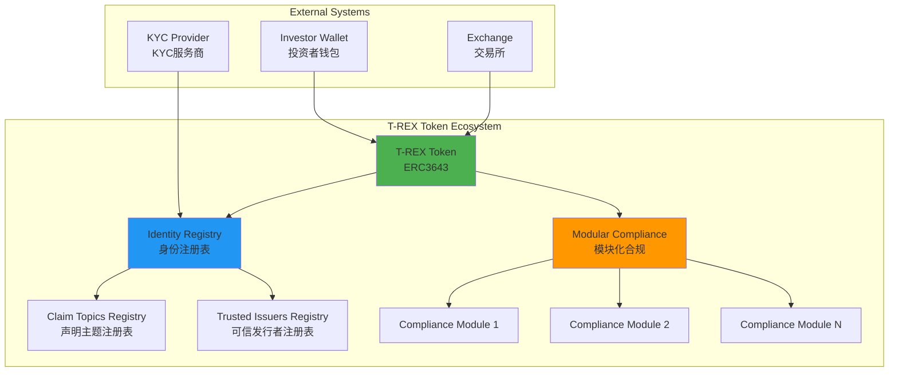
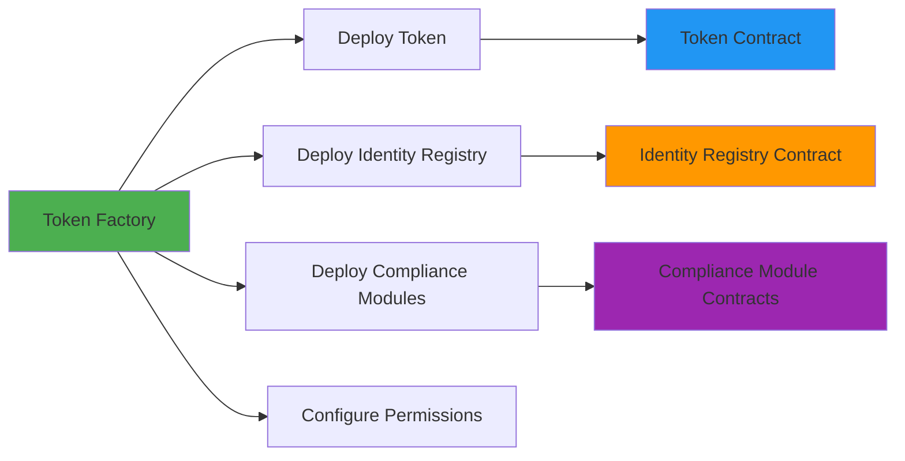
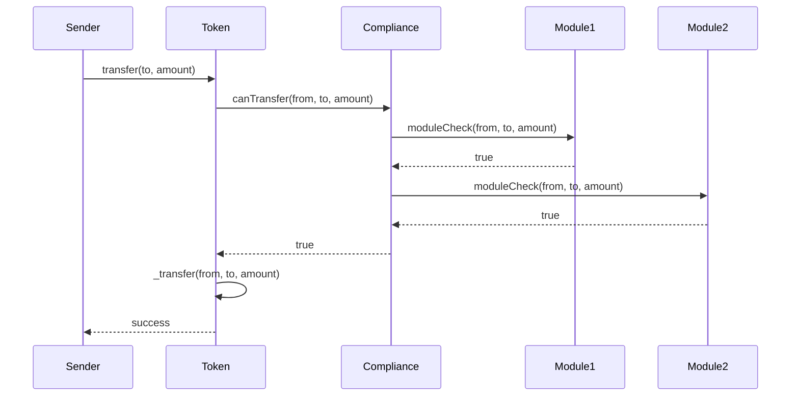
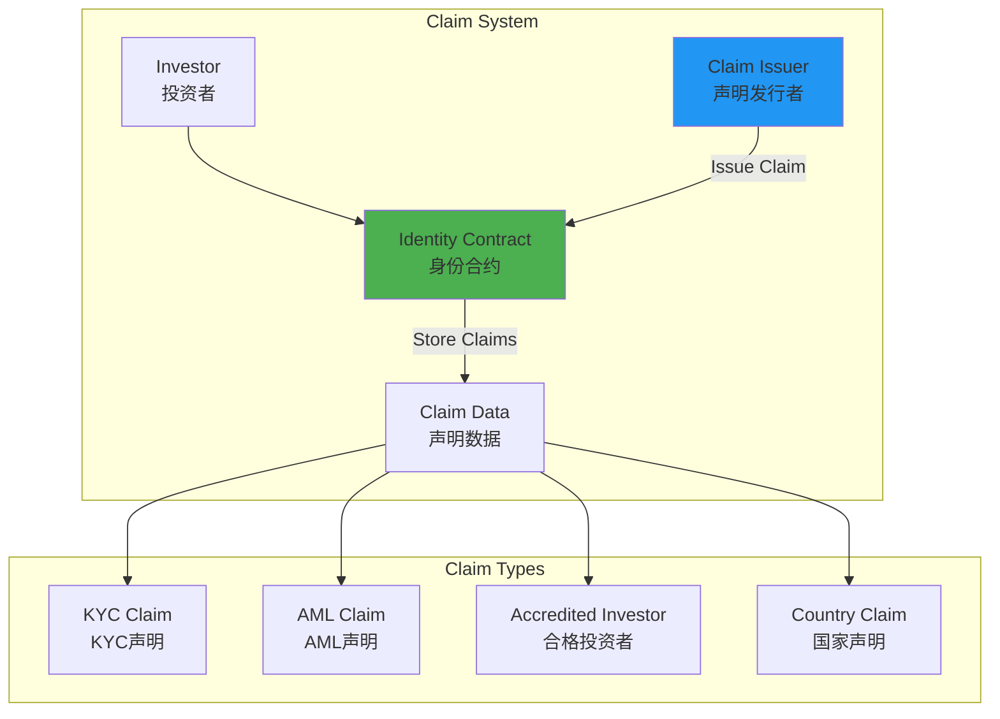
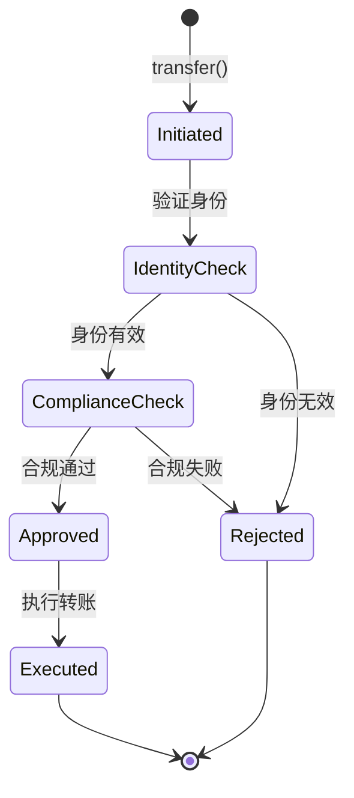
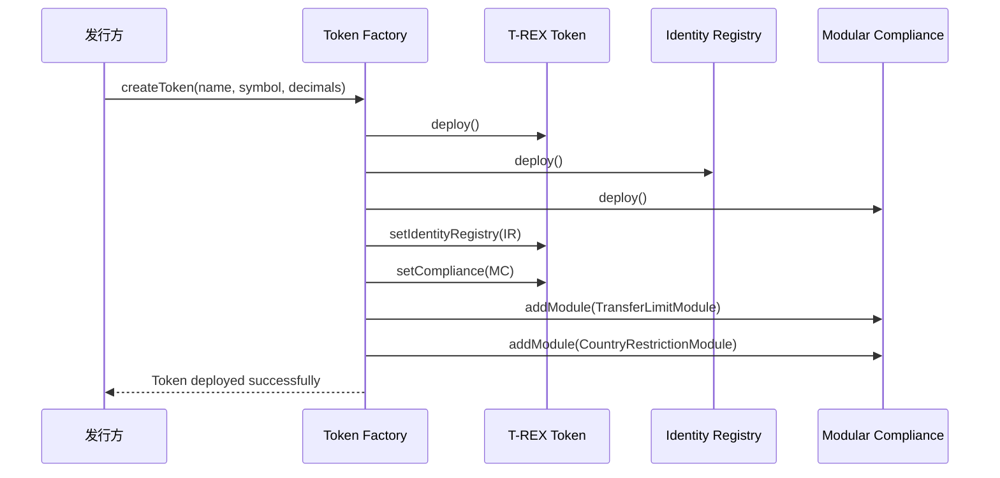
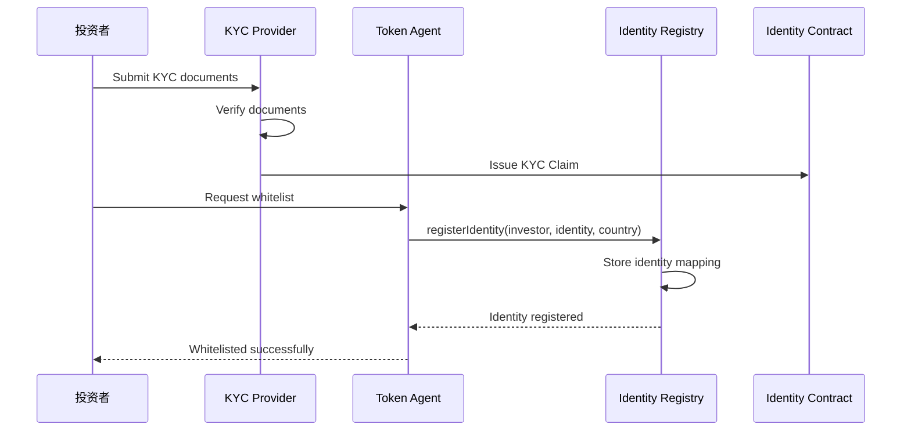
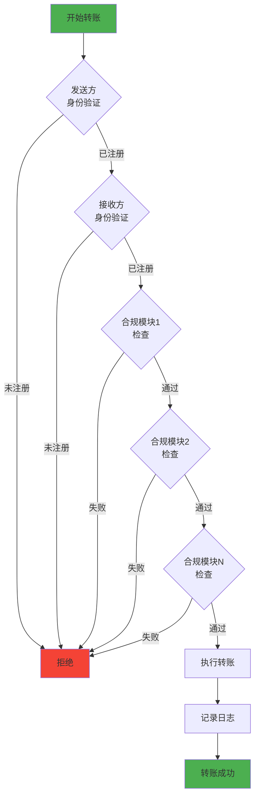
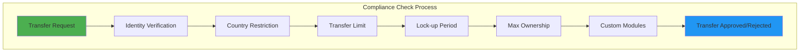
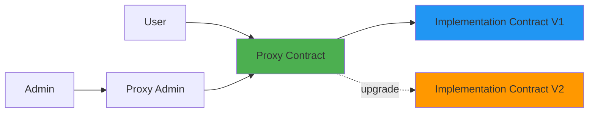

# Tokeny T-REX 技术架构分析

**文档版本**: v1.0  
**创建时间**: 2025-10-09 09:24:33 CST  
**文档类型**: 技术架构分析  
**标准**: ERC3643（安全代币标准）

---

## 📑 目录

1. [系统整体架构](#1-系统整体架构)
2. [核心模块详解](#2-核心模块详解)
3. [技术选型分析](#3-技术选型分析)
4. [数据流程](#4-数据流程)
5. [安全架构](#5-安全架构)

---

## 1. 系统整体架构

### 1.1 ERC3643 标准架构



### 1.2 核心组件说明

| 组件 | 职责 | 关键功能 |
|------|------|----------|
| **T-REX Token** | ERC3643代币合约 | 转账、铸币、销毁、合规检查 |
| **Identity Registry** | 身份注册表 | 管理投资者身份、验证状态 |
| **Claim Topics Registry** | 声明主题注册表 | 定义所需的KYC声明类型 |
| **Trusted Issuers Registry** | 可信发行者注册表 | 管理可信的KYC提供商 |
| **Modular Compliance** | 模块化合规系统 | 可插拔的合规规则模块 |

### 1.3 技术栈

**智能合约层**：
- Solidity 0.8.17+
- OpenZeppelin Contracts 4.x
- Hardhat开发框架
- Ethers.js 5.x

**前端层**：
- React 18.x
- TypeScript 4.x
- Web3.js / Ethers.js
- Material-UI

**后端层**：
- Node.js 18.x
- Express.js
- PostgreSQL
- Redis缓存

**区块链网络**：
- Ethereum Mainnet
- Polygon
- Avalanche
- 其他EVM兼容链

---

## 2. 核心模块详解

### 2.1 代币化引擎（T-REX Token Factory）

**功能**：
- 一键部署ERC3643代币
- 自动配置身份注册表
- 预设合规规则模块
- 生成代币管理界面

**架构图**：


**关键特性**：
- ✅ 5-10分钟完成部署
- ✅ 无需编写代码
- ✅ 自动生成管理界面
- ✅ 支持多链部署

### 2.2 合规框架（Modular Compliance System）

**设计理念**：
- 模块化：每个合规规则是独立的模块
- 可插拔：可以动态添加/移除合规模块
- 可组合：多个模块可以组合使用
- 可升级：模块可以独立升级

**合规模块类型**：

| 模块类型 | 功能 | 示例 |
|---------|------|------|
| **Transfer Limits** | 转账限制 | 每日转账上限、单笔转账上限 |
| **Country Restrictions** | 地域限制 | 禁止特定国家投资者 |
| **Investor Type** | 投资者类型 | 仅限合格投资者 |
| **Lock-up Period** | 锁定期 | 代币锁定6个月 |
| **Max Ownership** | 最大持有量 | 单个投资者最多持有10% |

**合规检查流程**：


### 2.3 身份管理（Identity Registry + Claim Issuers）

**身份注册表功能**：
- 存储投资者身份信息
- 关联投资者地址和身份合约
- 管理投资者国家/地区
- 跟踪验证状态

**声明（Claim）系统**：


**声明数据结构**：
```solidity
struct Claim {
    uint256 topic;        // 声明主题（如KYC、AML）
    uint256 scheme;       // 签名方案
    address issuer;       // 发行者地址
    bytes signature;      // 签名数据
    bytes data;          // 声明数据
    string uri;          // 数据URI
}
```

### 2.4 转账控制（Transfer Manager）

**转账验证流程**：
1. **发送方验证**
   - 检查发送方身份是否已注册
   - 检查发送方身份是否已验证
   - 检查发送方是否被冻结

2. **接收方验证**
   - 检查接收方身份是否已注册
   - 检查接收方身份是否已验证
   - 检查接收方国家是否被允许

3. **转账限制检查**
   - 检查是否在锁定期内
   - 检查是否超过转账限额
   - 检查接收方持有量是否超限

4. **合规模块检查**
   - 遍历所有已启用的合规模块
   - 每个模块返回true才允许转账

**转账状态机**：


---

## 3. 技术选型分析

### 3.1 为什么选择以太坊

**优势**：
- ✅ 最成熟的智能合约平台
- ✅ 最大的开发者社区
- ✅ 最丰富的工具生态
- ✅ 最高的安全性和去中心化程度

**考虑因素**：
- Gas费用较高 → 支持Layer 2和侧链
- 交易速度较慢 → 使用Polygon等高性能链
- 可扩展性限制 → 多链部署策略

### 3.2 为什么使用 ERC3643 标准

**ERC3643 vs ERC20**：

| 特性 | ERC20 | ERC3643 |
|------|-------|---------|
| 转账限制 | ❌ 无 | ✅ 内置合规检查 |
| 身份验证 | ❌ 无 | ✅ 强制KYC/AML |
| 地域限制 | ❌ 无 | ✅ 支持国家白名单 |
| 投资者分类 | ❌ 无 | ✅ 支持多层级分类 |
| 监管合规 | ❌ 不合规 | ✅ 符合全球监管 |

**ERC3643的核心优势**：
1. **合规性内置**：不是事后添加，而是标准的一部分
2. **模块化设计**：可以灵活配置合规规则
3. **行业标准**：被多个监管机构认可
4. **互操作性**：所有ERC3643代币可以互操作

### 3.3 模块化设计的优势

**传统方式 vs 模块化方式**：

**传统方式**：
```solidity
// 所有逻辑写在一个合约里
contract SecurityToken {
    function transfer(address to, uint256 amount) public {
        // 硬编码的合规检查
        require(isKYCVerified(msg.sender), "Sender not verified");
        require(isKYCVerified(to), "Receiver not verified");
        require(amount <= dailyLimit, "Exceeds daily limit");
        require(!isCountryBlocked(to), "Country blocked");
        // ... 更多硬编码规则
        _transfer(msg.sender, to, amount);
    }
}
```

**模块化方式**：
```solidity
// 合规逻辑分离到独立模块
contract ModularCompliance {
    IComplianceModule[] public modules;
    
    function canTransfer(address from, address to, uint256 amount) 
        public view returns (bool) {
        for (uint i = 0; i < modules.length; i++) {
            if (!modules[i].moduleCheck(from, to, amount)) {
                return false;
            }
        }
        return true;
    }
}

// 独立的合规模块
contract TransferLimitModule is IComplianceModule {
    function moduleCheck(address from, address to, uint256 amount) 
        public view returns (bool) {
        return amount <= dailyLimit[from];
    }
}
```

**模块化的优势**：
- ✅ 易于添加新规则
- ✅ 易于移除旧规则
- ✅ 易于升级单个模块
- ✅ 易于测试和审计
- ✅ 易于复用

---

## 4. 数据流程

### 4.1 代币发行流程



### 4.2 投资者注册流程



### 4.3 转账验证流程



### 4.4 合规检查流程



---

## 5. 安全架构

### 5.1 权限控制机制

**角色定义**：

| 角色 | 权限 | 职责 |
|------|------|------|
| **Owner** | 最高权限 | 合约所有者，可以执行所有操作 |
| **Agent** | 管理权限 | 管理投资者身份、铸币、销毁 |
| **Compliance Officer** | 合规权限 | 管理合规规则、添加/移除模块 |
| **Claim Issuer** | 发行权限 | 发行KYC/AML声明 |

**权限矩阵**：

| 操作 | Owner | Agent | Compliance Officer | Claim Issuer |
|------|-------|-------|-------------------|--------------|
| 部署合约 | ✅ | ❌ | ❌ | ❌ |
| 添加Agent | ✅ | ❌ | ❌ | ❌ |
| 注册身份 | ✅ | ✅ | ❌ | ❌ |
| 铸币 | ✅ | ✅ | ❌ | ❌ |
| 销毁 | ✅ | ✅ | ❌ | ❌ |
| 添加合规模块 | ✅ | ❌ | ✅ | ❌ |
| 发行声明 | ❌ | ❌ | ❌ | ✅ |

**权限控制实现**：
```solidity
// 使用OpenZeppelin的AccessControl
contract TREXToken is AccessControl {
    bytes32 public constant AGENT_ROLE = keccak256("AGENT_ROLE");
    bytes32 public constant COMPLIANCE_ROLE = keccak256("COMPLIANCE_ROLE");
    
    modifier onlyAgent() {
        require(hasRole(AGENT_ROLE, msg.sender), "Not an agent");
        _;
    }
    
    modifier onlyCompliance() {
        require(hasRole(COMPLIANCE_ROLE, msg.sender), "Not a compliance officer");
        _;
    }
}
```

### 5.2 多签机制

**关键操作需要多签**：
- 添加/移除Agent
- 添加/移除合规模块
- 升级合约
- 暂停/恢复合约

**多签实现**：
```solidity
// 使用Gnosis Safe多签钱包
contract TREXGovernance {
    address public gnosisSafe;
    
    modifier onlyMultisig() {
        require(msg.sender == gnosisSafe, "Only multisig");
        _;
    }
    
    function addAgent(address agent) external onlyMultisig {
        grantRole(AGENT_ROLE, agent);
    }
}
```

### 5.3 升级机制（Proxy Pattern）

**使用OpenZeppelin的TransparentUpgradeableProxy**：



**升级流程**：
1. 部署新的实现合约
2. 通过多签提案升级
3. 多签批准后执行升级
4. Proxy指向新实现合约
5. 数据保持不变（存储在Proxy中）

**数据迁移策略**：
- 使用Storage Gap预留升级空间
- 新版本不改变现有存储布局
- 只添加新的存储变量
- 使用初始化函数迁移数据

### 5.4 审计日志系统

**关键事件记录**：
```solidity
// 转账事件
event Transfer(address indexed from, address indexed to, uint256 value);

// 身份事件
event IdentityRegistered(address indexed identity, address indexed investor, uint16 country);
event IdentityRemoved(address indexed identity, address indexed investor);

// 合规事件
event ComplianceModuleAdded(address indexed module);
event ComplianceModuleRemoved(address indexed module);

// 权限事件
event AgentAdded(address indexed agent);
event AgentRemoved(address indexed agent);
```

**日志查询和分析**：
- 使用The Graph索引链上事件
- 提供实时监控仪表板
- 生成合规报告
- 异常行为告警

### 5.5 灾备方案

**合约暂停机制**：
```solidity
contract TREXToken is Pausable {
    function pause() external onlyOwner {
        _pause();
    }
    
    function unpause() external onlyOwner {
        _unpause();
    }
    
    function transfer(address to, uint256 amount) 
        public whenNotPaused returns (bool) {
        // 转账逻辑
    }
}
```

**紧急响应流程**：
1. 发现安全问题
2. 立即暂停合约
3. 评估影响范围
4. 制定修复方案
5. 部署修复版本
6. 恢复合约运行

---

## 📚 参考资源

- [ERC3643标准文档](https://erc3643.org)
- [Tokeny官方文档](https://docs.tokeny.com)
- [T-REX GitHub仓库](https://github.com/TokenySolutions/T-REX)
- [OpenZeppelin Contracts](https://docs.openzeppelin.com/contracts)

---

**文档维护**: RWA-HUSD技术团队  
**最后更新**: 2025-10-09 09:24:33 CST
