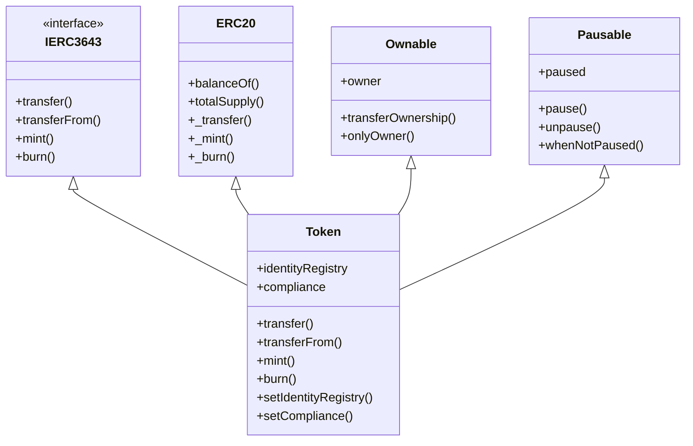
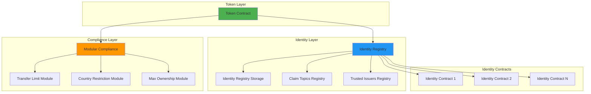
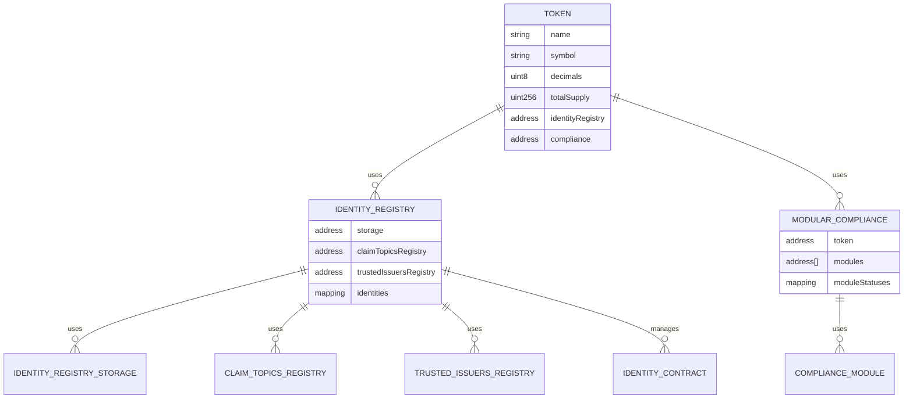

# Tokeny T-REX 核心合约分析

**文档版本**: v1.0  
**创建时间**: 2025-10-09 09:26:00 CST  
**Solidity版本**: 0.8.17+  
**标准**: ERC3643

---

## 📑 目录

1. [合约列表](#1-合约列表)
2. [合约架构](#2-合约架构)
3. [关键数据结构](#3-关键数据结构)
4. [主要接口](#4-主要接口)

---

## 1. 合约列表

### 1.1 核心合约

| 合约名称 | 地址示例 | 职责 | 代码行数 |
|---------|---------|------|---------|
| **Token.sol** | 0x1234...5678 | ERC3643代币合约 | ~500行 |
| **IdentityRegistry.sol** | 0x2345...6789 | 身份注册表 | ~300行 |
| **ClaimTopicsRegistry.sol** | 0x3456...789A | 声明主题注册表 | ~150行 |
| **TrustedIssuersRegistry.sol** | 0x4567...89AB | 可信发行者注册表 | ~200行 |
| **ModularCompliance.sol** | 0x5678...9ABC | 模块化合规合约 | ~400行 |
| **IdentityRegistryStorage.sol** | 0x6789...ABCD | 身份存储合约 | ~250行 |

### 1.2 合规模块合约

| 模块名称 | 职责 | 代码行数 |
|---------|------|---------|
| **TransferLimitModule.sol** | 转账限额检查 | ~200行 |
| **CountryRestrictionModule.sol** | 国家限制检查 | ~150行 |
| **MaxOwnershipModule.sol** | 最大持有量检查 | ~180行 |
| **LockupPeriodModule.sol** | 锁定期检查 | ~160行 |
| **InvestorTypeModule.sol** | 投资者类型检查 | ~140行 |

### 1.3 工厂合约

| 合约名称 | 职责 | 代码行数 |
|---------|------|---------|
| **TREXFactory.sol** | 代币工厂合约 | ~350行 |
| **IdentityFactory.sol** | 身份工厂合约 | ~200行 |
| **ClaimIssuer.sol** | 声明发行者合约 | ~250行 |

---

## 2. 合约架构

### 2.1 合约继承关系



### 2.2 合约间交互关系



### 2.3 数据依赖关系



---

## 3. 关键数据结构

### 3.1 Token.sol 数据结构

```solidity
// 代币基本信息
contract Token is IERC3643, ERC20, Ownable, Pausable {
    // 身份注册表地址
    IIdentityRegistry public identityRegistry;
    
    // 合规合约地址
    IModularCompliance public compliance;
    
    // 代币是否已冻结
    mapping(address => bool) private _frozen;
    
    // 部分冻结的代币数量
    mapping(address => uint256) private _frozenTokens;
    
    // 代币名称、符号、精度
    string private _name;
    string private _symbol;
    uint8 private _decimals;
}
```

### 3.2 IdentityRegistry.sol 数据结构

```solidity
contract IdentityRegistry is IIdentityRegistry, Ownable {
    // 身份存储合约
    IIdentityRegistryStorage public identityStorage;
    
    // 声明主题注册表
    IClaimTopicsRegistry public claimTopicsRegistry;
    
    // 可信发行者注册表
    ITrustedIssuersRegistry public trustedIssuersRegistry;
    
    // 投资者地址 => 身份合约地址
    mapping(address => IIdentity) private _identities;
    
    // 投资者地址 => 国家代码
    mapping(address => uint16) private _countries;
}
```

### 3.3 Identity Contract 数据结构

```solidity
// ERC734 + ERC735 标准
contract Identity is IIdentity {
    // 声明数据结构
    struct Claim {
        uint256 topic;        // 声明主题（如1=KYC, 2=AML）
        uint256 scheme;       // 签名方案（1=ECDSA, 2=RSA）
        address issuer;       // 发行者地址
        bytes signature;      // 签名数据
        bytes data;          // 声明数据
        string uri;          // 数据URI
    }
    
    // 密钥数据结构
    struct Key {
        uint256[] purposes;   // 密钥用途（1=管理, 2=操作, 3=声明）
        uint256 keyType;      // 密钥类型（1=ECDSA, 2=RSA）
        bytes32 key;         // 密钥哈希
    }
    
    // 声明ID => 声明数据
    mapping(bytes32 => Claim) private _claims;
    
    // 密钥哈希 => 密钥数据
    mapping(bytes32 => Key) private _keys;
    
    // 主题 => 声明ID列表
    mapping(uint256 => bytes32[]) private _claimsByTopic;
}
```

### 3.4 ModularCompliance.sol 数据结构

```solidity
contract ModularCompliance is IModularCompliance, Ownable {
    // 代币合约地址
    address public tokenBound;
    
    // 合规模块列表
    address[] private _modules;
    
    // 模块地址 => 是否启用
    mapping(address => bool) private _moduleStatuses;
    
    // 模块地址 => 模块索引
    mapping(address => uint256) private _moduleIndex;
}
```

### 3.5 Compliance Module 数据结构

```solidity
// 转账限额模块
contract TransferLimitModule is IComplianceModule {
    // 代币地址 => 投资者地址 => 每日限额
    mapping(address => mapping(address => uint256)) private _dailyLimits;
    
    // 代币地址 => 投资者地址 => 今日已转账金额
    mapping(address => mapping(address => uint256)) private _dailyTransferred;
    
    // 代币地址 => 投资者地址 => 最后转账日期
    mapping(address => mapping(address => uint256)) private _lastTransferDate;
}

// 国家限制模块
contract CountryRestrictionModule is IComplianceModule {
    // 代币地址 => 国家代码 => 是否被禁止
    mapping(address => mapping(uint16 => bool)) private _blockedCountries;
}

// 最大持有量模块
contract MaxOwnershipModule is IComplianceModule {
    // 代币地址 => 最大持有百分比（基点，10000=100%）
    mapping(address => uint256) private _maxOwnershipPercentage;
}
```

---

## 4. 主要接口

### 4.1 IERC3643 接口

```solidity
interface IERC3643 {
    // ========== 转账函数 ==========
    
    /**
     * @dev 转账代币
     * @param to 接收方地址
     * @param amount 转账数量
     * @return 是否成功
     */
    function transfer(address to, uint256 amount) external returns (bool);
    
    /**
     * @dev 授权转账
     * @param from 发送方地址
     * @param to 接收方地址
     * @param amount 转账数量
     * @return 是否成功
     */
    function transferFrom(address from, address to, uint256 amount) 
        external returns (bool);
    
    // ========== 铸币和销毁 ==========
    
    /**
     * @dev 铸造代币
     * @param to 接收方地址
     * @param amount 铸造数量
     */
    function mint(address to, uint256 amount) external;
    
    /**
     * @dev 销毁代币
     * @param from 持有者地址
     * @param amount 销毁数量
     */
    function burn(address from, uint256 amount) external;
    
    // ========== 冻结功能 ==========
    
    /**
     * @dev 冻结账户
     * @param account 账户地址
     */
    function freezeAccount(address account) external;
    
    /**
     * @dev 解冻账户
     * @param account 账户地址
     */
    function unfreezeAccount(address account) external;
    
    /**
     * @dev 部分冻结代币
     * @param account 账户地址
     * @param amount 冻结数量
     */
    function freezePartialTokens(address account, uint256 amount) external;
    
    // ========== 查询函数 ==========
    
    /**
     * @dev 检查账户是否被冻结
     * @param account 账户地址
     * @return 是否被冻结
     */
    function isFrozen(address account) external view returns (bool);
    
    /**
     * @dev 获取冻结的代币数量
     * @param account 账户地址
     * @return 冻结数量
     */
    function getFrozenTokens(address account) external view returns (uint256);
    
    // ========== 配置函数 ==========
    
    /**
     * @dev 设置身份注册表
     * @param registry 身份注册表地址
     */
    function setIdentityRegistry(address registry) external;
    
    /**
     * @dev 设置合规合约
     * @param compliance 合规合约地址
     */
    function setCompliance(address compliance) external;
}
```

### 4.2 IIdentityRegistry 接口

```solidity
interface IIdentityRegistry {
    // ========== 身份管理 ==========
    
    /**
     * @dev 注册身份
     * @param user 用户地址
     * @param identity 身份合约地址
     * @param country 国家代码
     */
    function registerIdentity(
        address user,
        IIdentity identity,
        uint16 country
    ) external;
    
    /**
     * @dev 删除身份
     * @param user 用户地址
     */
    function deleteIdentity(address user) external;
    
    /**
     * @dev 更新国家
     * @param user 用户地址
     * @param country 新国家代码
     */
    function updateCountry(address user, uint16 country) external;
    
    /**
     * @dev 更新身份
     * @param user 用户地址
     * @param identity 新身份合约地址
     */
    function updateIdentity(address user, IIdentity identity) external;
    
    // ========== 查询函数 ==========
    
    /**
     * @dev 获取身份合约
     * @param user 用户地址
     * @return 身份合约地址
     */
    function identity(address user) external view returns (IIdentity);
    
    /**
     * @dev 获取国家代码
     * @param user 用户地址
     * @return 国家代码
     */
    function investorCountry(address user) external view returns (uint16);
    
    /**
     * @dev 检查身份是否已验证
     * @param user 用户地址
     * @return 是否已验证
     */
    function isVerified(address user) external view returns (bool);
    
    // ========== 配置函数 ==========
    
    /**
     * @dev 设置身份存储合约
     * @param storage 存储合约地址
     */
    function setIdentityRegistryStorage(address storage) external;
    
    /**
     * @dev 设置声明主题注册表
     * @param registry 注册表地址
     */
    function setClaimTopicsRegistry(address registry) external;
    
    /**
     * @dev 设置可信发行者注册表
     * @param registry 注册表地址
     */
    function setTrustedIssuersRegistry(address registry) external;
}
```

### 4.3 IModularCompliance 接口

```solidity
interface IModularCompliance {
    // ========== 合规检查 ==========
    
    /**
     * @dev 检查转账是否合规
     * @param from 发送方地址
     * @param to 接收方地址
     * @param amount 转账数量
     * @return 是否合规
     */
    function canTransfer(address from, address to, uint256 amount) 
        external view returns (bool);
    
    /**
     * @dev 转账后的合规处理
     * @param from 发送方地址
     * @param to 接收方地址
     * @param amount 转账数量
     */
    function transferred(address from, address to, uint256 amount) external;
    
    /**
     * @dev 铸币后的合规处理
     * @param to 接收方地址
     * @param amount 铸造数量
     */
    function created(address to, uint256 amount) external;
    
    /**
     * @dev 销毁后的合规处理
     * @param from 持有者地址
     * @param amount 销毁数量
     */
    function destroyed(address from, uint256 amount) external;
    
    // ========== 模块管理 ==========
    
    /**
     * @dev 添加合规模块
     * @param module 模块地址
     */
    function addModule(address module) external;
    
    /**
     * @dev 移除合规模块
     * @param module 模块地址
     */
    function removeModule(address module) external;
    
    /**
     * @dev 获取所有模块
     * @return 模块地址列表
     */
    function getModules() external view returns (address[] memory);
    
    /**
     * @dev 检查模块是否已绑定
     * @param module 模块地址
     * @return 是否已绑定
     */
    function isModuleBound(address module) external view returns (bool);
    
    // ========== 配置函数 ==========
    
    /**
     * @dev 绑定代币合约
     * @param token 代币合约地址
     */
    function bindToken(address token) external;
    
    /**
     * @dev 解绑代币合约
     * @param token 代币合约地址
     */
    function unbindToken(address token) external;
}
```

### 4.4 IComplianceModule 接口

```solidity
interface IComplianceModule {
    /**
     * @dev 模块合规检查
     * @param from 发送方地址
     * @param to 接收方地址
     * @param amount 转账数量
     * @param compliance 合规合约地址
     * @return 是否通过检查
     */
    function moduleCheck(
        address from,
        address to,
        uint256 amount,
        address compliance
    ) external view returns (bool);
    
    /**
     * @dev 转账后的模块处理
     * @param from 发送方地址
     * @param to 接收方地址
     * @param amount 转账数量
     * @param compliance 合规合约地址
     */
    function moduleTransferAction(
        address from,
        address to,
        uint256 amount,
        address compliance
    ) external;
    
    /**
     * @dev 铸币后的模块处理
     * @param to 接收方地址
     * @param amount 铸造数量
     * @param compliance 合规合约地址
     */
    function moduleMintAction(
        address to,
        uint256 amount,
        address compliance
    ) external;
    
    /**
     * @dev 销毁后的模块处理
     * @param from 持有者地址
     * @param amount 销毁数量
     * @param compliance 合规合约地址
     */
    function moduleBurnAction(
        address from,
        uint256 amount,
        address compliance
    ) external;
    
    /**
     * @dev 获取模块名称
     * @return 模块名称
     */
    function name() external view returns (string memory);
}
```

### 4.5 事件定义

```solidity
// Token.sol 事件
event Transfer(address indexed from, address indexed to, uint256 value);
event Approval(address indexed owner, address indexed spender, uint256 value);
event AccountFrozen(address indexed account);
event AccountUnfrozen(address indexed account);
event TokensFrozen(address indexed account, uint256 amount);
event TokensUnfrozen(address indexed account, uint256 amount);
event IdentityRegistrySet(address indexed registry);
event ComplianceSet(address indexed compliance);

// IdentityRegistry.sol 事件
event IdentityRegistered(address indexed investor, IIdentity indexed identity);
event IdentityRemoved(address indexed investor, IIdentity indexed identity);
event IdentityUpdated(address indexed investor, IIdentity indexed oldIdentity, IIdentity indexed newIdentity);
event CountryUpdated(address indexed investor, uint16 indexed country);

// ModularCompliance.sol 事件
event ModuleAdded(address indexed module);
event ModuleRemoved(address indexed module);
event TokenBound(address indexed token);
event TokenUnbound(address indexed token);

// ComplianceModule 事件
event ComplianceCheckPassed(address indexed from, address indexed to, uint256 amount);
event ComplianceCheckFailed(address indexed from, address indexed to, uint256 amount, string reason);
```

### 4.6 修饰器定义

```solidity
// Token.sol 修饰器
modifier onlyAgent() {
    require(hasRole(AGENT_ROLE, msg.sender), "Not an agent");
    _;
}

modifier whenNotFrozen(address account) {
    require(!_frozen[account], "Account is frozen");
    _;
}

modifier whenNotPaused() {
    require(!paused(), "Contract is paused");
    _;
}

// IdentityRegistry.sol 修饰器
modifier onlyRegisteredIdentity(address user) {
    require(address(_identities[user]) != address(0), "Identity not registered");
    _;
}

// ModularCompliance.sol 修饰器
modifier onlyToken() {
    require(msg.sender == tokenBound, "Only token can call");
    _;
}

modifier onlyBoundCompliance(address compliance) {
    require(_moduleStatuses[compliance], "Module not bound");
    _;
}
```

---

## 📚 参考资源

- [T-REX GitHub - Token Contract](https://github.com/TokenySolutions/T-REX/blob/main/contracts/token/Token.sol)
- [T-REX GitHub - Identity Registry](https://github.com/TokenySolutions/T-REX/blob/main/contracts/registry/IdentityRegistry.sol)
- [T-REX GitHub - Modular Compliance](https://github.com/TokenySolutions/T-REX/blob/main/contracts/compliance/ModularCompliance.sol)
- [ERC3643 Standard](https://erc3643.org)
- [ERC734 Key Manager](https://github.com/ethereum/EIPs/issues/734)
- [ERC735 Claim Holder](https://github.com/ethereum/EIPs/issues/735)

---

**文档维护**: RWA-HUSD技术团队  
**最后更新**: 2025-10-09 09:26:00 CST
