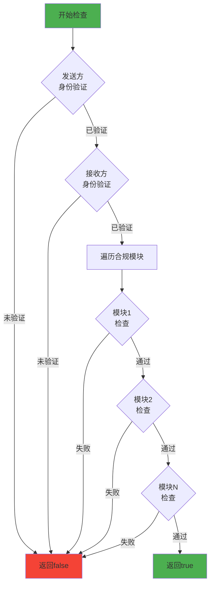
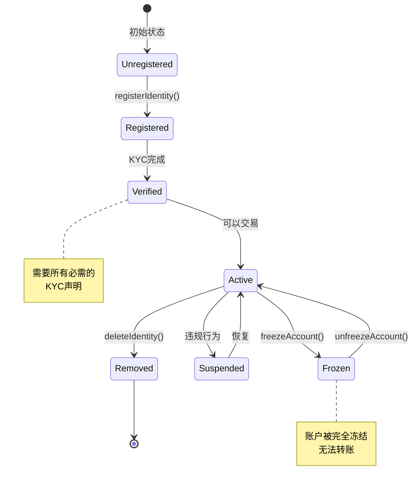

# Tokeny T-REX 实现细节分析

**文档版本**: v1.0  
**创建时间**: 2025-10-09 09:27:30 CST  
**Solidity版本**: 0.8.17+  
**代码来源**: [T-REX GitHub](https://github.com/TokenySolutions/T-REX)

---

## 📑 目录

1. [关键函数实现](#1-关键函数实现)
2. [状态管理](#2-状态管理)
3. [事件和错误处理](#3-事件和错误处理)
4. [权限控制](#4-权限控制)
5. [升级机制](#5-升级机制)
6. [Gas优化策略](#6-gas优化策略)

---

## 1. 关键函数实现

### 1.1 转账函数实现

#### transfer() 函数

```solidity
/**
 * @dev 转账代币（带合规检查）
 * @param to 接收方地址
 * @param amount 转账数量
 * @return 是否成功
 */
function transfer(address to, uint256 amount) 
    public 
    override 
    whenNotPaused 
    returns (bool) 
{
    // 1. 检查发送方是否被冻结
    require(!_frozen[msg.sender], "Sender account is frozen");
    
    // 2. 检查接收方是否被冻结
    require(!_frozen[to], "Receiver account is frozen");
    
    // 3. 检查发送方可用余额（总余额 - 冻结余额）
    require(
        balanceOf(msg.sender) - _frozenTokens[msg.sender] >= amount,
        "Insufficient unfrozen balance"
    );
    
    // 4. 调用合规检查
    require(
        compliance.canTransfer(msg.sender, to, amount),
        "Transfer not compliant"
    );
    
    // 5. 执行ERC20转账
    _transfer(msg.sender, to, amount);
    
    // 6. 通知合规合约转账已完成
    compliance.transferred(msg.sender, to, amount);
    
    return true;
}
```

**关键点分析**：
1. **多层验证**：冻结检查 → 余额检查 → 合规检查
2. **合规集成**：转账前检查 + 转账后通知
3. **Gas优化**：先检查便宜的条件（冻结状态），再检查昂贵的条件（合规）
4. **安全性**：使用require确保所有条件满足

#### transferFrom() 函数

```solidity
/**
 * @dev 授权转账（带合规检查）
 * @param from 发送方地址
 * @param to 接收方地址
 * @param amount 转账数量
 * @return 是否成功
 */
function transferFrom(address from, address to, uint256 amount)
    public
    override
    whenNotPaused
    returns (bool)
{
    // 1. 检查授权额度
    uint256 currentAllowance = allowance(from, msg.sender);
    require(currentAllowance >= amount, "Insufficient allowance");
    
    // 2. 检查发送方和接收方是否被冻结
    require(!_frozen[from], "Sender account is frozen");
    require(!_frozen[to], "Receiver account is frozen");
    
    // 3. 检查发送方可用余额
    require(
        balanceOf(from) - _frozenTokens[from] >= amount,
        "Insufficient unfrozen balance"
    );
    
    // 4. 调用合规检查
    require(
        compliance.canTransfer(from, to, amount),
        "Transfer not compliant"
    );
    
    // 5. 更新授权额度
    _approve(from, msg.sender, currentAllowance - amount);
    
    // 6. 执行转账
    _transfer(from, to, amount);
    
    // 7. 通知合规合约
    compliance.transferred(from, to, amount);
    
    return true;
}
```

### 1.2 合规检查实现

#### canTransfer() 函数（ModularCompliance.sol）

```solidity
/**
 * @dev 检查转账是否合规
 * @param from 发送方地址
 * @param to 接收方地址
 * @param amount 转账数量
 * @return 是否合规
 */
function canTransfer(address from, address to, uint256 amount)
    external
    view
    override
    returns (bool)
{
    // 1. 检查发送方身份是否已注册和验证
    if (!_isIdentityVerified(from)) {
        return false;
    }
    
    // 2. 检查接收方身份是否已注册和验证
    if (!_isIdentityVerified(to)) {
        return false;
    }
    
    // 3. 遍历所有已启用的合规模块
    for (uint256 i = 0; i < _modules.length; i++) {
        // 调用每个模块的检查函数
        if (!IComplianceModule(_modules[i]).moduleCheck(
            from, 
            to, 
            amount, 
            address(this)
        )) {
            return false;
        }
    }
    
    // 4. 所有检查通过
    return true;
}

/**
 * @dev 检查身份是否已验证
 * @param user 用户地址
 * @return 是否已验证
 */
function _isIdentityVerified(address user) private view returns (bool) {
    // 获取代币合约
    IToken token = IToken(tokenBound);
    
    // 获取身份注册表
    IIdentityRegistry registry = token.identityRegistry();
    
    // 检查身份是否已验证
    return registry.isVerified(user);
}
```

**合规检查流程图**：


### 1.3 身份验证实现

#### isVerified() 函数（IdentityRegistry.sol）

```solidity
/**
 * @dev 检查投资者身份是否已验证
 * @param user 投资者地址
 * @return 是否已验证
 */
function isVerified(address user) external view override returns (bool) {
    // 1. 检查身份是否已注册
    IIdentity identity = _identities[user];
    if (address(identity) == address(0)) {
        return false;
    }
    
    // 2. 获取所需的声明主题列表
    uint256[] memory requiredClaimTopics = claimTopicsRegistry.getClaimTopics();
    
    // 3. 检查每个所需的声明主题
    for (uint256 i = 0; i < requiredClaimTopics.length; i++) {
        // 获取该主题的声明ID列表
        bytes32[] memory claimIds = identity.getClaimIdsByTopic(requiredClaimTopics[i]);
        
        // 如果没有该主题的声明，返回false
        if (claimIds.length == 0) {
            return false;
        }
        
        // 检查是否有有效的声明
        bool hasValidClaim = false;
        for (uint256 j = 0; j < claimIds.length; j++) {
            // 获取声明数据
            (
                uint256 topic,
                uint256 scheme,
                address issuer,
                bytes memory signature,
                bytes memory data,
                string memory uri
            ) = identity.getClaim(claimIds[j]);
            
            // 检查发行者是否可信
            if (trustedIssuersRegistry.isTrustedIssuer(issuer)) {
                // 验证签名
                if (_verifyClaimSignature(identity, topic, scheme, issuer, signature, data)) {
                    hasValidClaim = true;
                    break;
                }
            }
        }
        
        // 如果没有有效的声明，返回false
        if (!hasValidClaim) {
            return false;
        }
    }
    
    // 4. 所有声明主题都有有效的声明
    return true;
}

/**
 * @dev 验证声明签名
 * @param identity 身份合约
 * @param topic 声明主题
 * @param scheme 签名方案
 * @param issuer 发行者地址
 * @param signature 签名数据
 * @param data 声明数据
 * @return 签名是否有效
 */
function _verifyClaimSignature(
    IIdentity identity,
    uint256 topic,
    uint256 scheme,
    address issuer,
    bytes memory signature,
    bytes memory data
) private pure returns (bool) {
    // 构造消息哈希
    bytes32 messageHash = keccak256(
        abi.encodePacked(address(identity), topic, data)
    );
    
    // 添加以太坊签名前缀
    bytes32 ethSignedMessageHash = keccak256(
        abi.encodePacked("\x19Ethereum Signed Message:\n32", messageHash)
    );
    
    // 恢复签名者地址
    address signer = _recoverSigner(ethSignedMessageHash, signature);
    
    // 检查签名者是否是发行者
    return signer == issuer;
}

/**
 * @dev 从签名中恢复签名者地址
 * @param messageHash 消息哈希
 * @param signature 签名数据
 * @return 签名者地址
 */
function _recoverSigner(bytes32 messageHash, bytes memory signature)
    private
    pure
    returns (address)
{
    require(signature.length == 65, "Invalid signature length");
    
    bytes32 r;
    bytes32 s;
    uint8 v;
    
    // 分解签名
    assembly {
        r := mload(add(signature, 32))
        s := mload(add(signature, 64))
        v := byte(0, mload(add(signature, 96)))
    }
    
    // 恢复地址
    return ecrecover(messageHash, v, r, s);
}
```

### 1.4 铸币和销毁实现

#### mint() 函数

```solidity
/**
 * @dev 铸造代币
 * @param to 接收方地址
 * @param amount 铸造数量
 */
function mint(address to, uint256 amount) 
    external 
    override 
    onlyAgent 
    whenNotPaused 
{
    // 1. 检查接收方是否被冻结
    require(!_frozen[to], "Receiver account is frozen");
    
    // 2. 检查接收方身份是否已验证
    require(
        identityRegistry.isVerified(to),
        "Receiver identity not verified"
    );
    
    // 3. 执行铸币
    _mint(to, amount);
    
    // 4. 通知合规合约
    compliance.created(to, amount);
    
    // 5. 触发事件
    emit Minted(to, amount);
}
```

#### burn() 函数

```solidity
/**
 * @dev 销毁代币
 * @param from 持有者地址
 * @param amount 销毁数量
 */
function burn(address from, uint256 amount)
    external
    override
    onlyAgent
    whenNotPaused
{
    // 1. 检查余额是否足够
    require(balanceOf(from) >= amount, "Insufficient balance");
    
    // 2. 检查可用余额（总余额 - 冻结余额）
    require(
        balanceOf(from) - _frozenTokens[from] >= amount,
        "Insufficient unfrozen balance"
    );
    
    // 3. 执行销毁
    _burn(from, amount);
    
    // 4. 通知合规合约
    compliance.destroyed(from, amount);
    
    // 5. 触发事件
    emit Burned(from, amount);
}
```

### 1.5 冻结功能实现

#### freezeAccount() 函数

```solidity
/**
 * @dev 冻结账户
 * @param account 账户地址
 */
function freezeAccount(address account) 
    external 
    override 
    onlyAgent 
{
    require(!_frozen[account], "Account already frozen");
    
    _frozen[account] = true;
    
    emit AccountFrozen(account);
}
```

#### freezePartialTokens() 函数

```solidity
/**
 * @dev 部分冻结代币
 * @param account 账户地址
 * @param amount 冻结数量
 */
function freezePartialTokens(address account, uint256 amount)
    external
    override
    onlyAgent
{
    // 1. 检查账户余额
    require(balanceOf(account) >= amount, "Insufficient balance");
    
    // 2. 检查冻结数量不超过余额
    require(
        _frozenTokens[account] + amount <= balanceOf(account),
        "Freeze amount exceeds balance"
    );
    
    // 3. 增加冻结数量
    _frozenTokens[account] += amount;
    
    // 4. 触发事件
    emit TokensFrozen(account, amount);
}
```

---

## 2. 状态管理

### 2.1 账户状态转换



### 2.2 代币状态管理

```solidity
// 代币状态枚举
enum TokenState {
    Active,      // 活跃状态，可以正常转账
    Paused,      // 暂停状态，所有转账被禁止
    Frozen,      // 冻结状态，特定账户被冻结
    Locked       // 锁定状态，在锁定期内
}

// 状态转换函数
function _updateTokenState(address account, TokenState newState) private {
    TokenState oldState = _tokenStates[account];
    
    // 验证状态转换是否合法
    require(_isValidStateTransition(oldState, newState), "Invalid state transition");
    
    // 更新状态
    _tokenStates[account] = newState;
    
    // 触发事件
    emit TokenStateChanged(account, oldState, newState);
}

// 验证状态转换
function _isValidStateTransition(TokenState from, TokenState to) 
    private 
    pure 
    returns (bool) 
{
    // Active可以转换到任何状态
    if (from == TokenState.Active) {
        return true;
    }
    
    // Paused只能转换到Active
    if (from == TokenState.Paused) {
        return to == TokenState.Active;
    }
    
    // Frozen只能转换到Active
    if (from == TokenState.Frozen) {
        return to == TokenState.Active;
    }
    
    // Locked只能转换到Active
    if (from == TokenState.Locked) {
        return to == TokenState.Active;
    }
    
    return false;
}
```

### 2.3 合规模块状态

```solidity
// 模块状态管理
contract ModularCompliance {
    // 模块状态枚举
    enum ModuleStatus {
        Inactive,    // 未激活
        Active,      // 已激活
        Suspended,   // 已暂停
        Deprecated   // 已废弃
    }
    
    // 模块地址 => 模块状态
    mapping(address => ModuleStatus) private _moduleStatuses;
    
    /**
     * @dev 更新模块状态
     * @param module 模块地址
     * @param newStatus 新状态
     */
    function updateModuleStatus(address module, ModuleStatus newStatus)
        external
        onlyOwner
    {
        ModuleStatus oldStatus = _moduleStatuses[module];
        
        // 验证状态转换
        require(_isValidModuleStatusTransition(oldStatus, newStatus), 
            "Invalid status transition");
        
        // 更新状态
        _moduleStatuses[module] = newStatus;
        
        // 触发事件
        emit ModuleStatusChanged(module, oldStatus, newStatus);
    }
}
```

---

## 3. 事件和错误处理

### 3.1 事件设计

```solidity
// ========== 转账相关事件 ==========

/**
 * @dev 转账事件
 * @param from 发送方地址
 * @param to 接收方地址
 * @param value 转账数量
 */
event Transfer(address indexed from, address indexed to, uint256 value);

/**
 * @dev 授权事件
 * @param owner 所有者地址
 * @param spender 授权者地址
 * @param value 授权数量
 */
event Approval(address indexed owner, address indexed spender, uint256 value);

// ========== 铸币和销毁事件 ==========

/**
 * @dev 铸币事件
 * @param to 接收方地址
 * @param amount 铸造数量
 */
event Minted(address indexed to, uint256 amount);

/**
 * @dev 销毁事件
 * @param from 持有者地址
 * @param amount 销毁数量
 */
event Burned(address indexed from, uint256 amount);

// ========== 冻结相关事件 ==========

/**
 * @dev 账户冻结事件
 * @param account 账户地址
 */
event AccountFrozen(address indexed account);

/**
 * @dev 账户解冻事件
 * @param account 账户地址
 */
event AccountUnfrozen(address indexed account);

/**
 * @dev 部分代币冻结事件
 * @param account 账户地址
 * @param amount 冻结数量
 */
event TokensFrozen(address indexed account, uint256 amount);

/**
 * @dev 部分代币解冻事件
 * @param account 账户地址
 * @param amount 解冻数量
 */
event TokensUnfrozen(address indexed account, uint256 amount);

// ========== 身份相关事件 ==========

/**
 * @dev 身份注册事件
 * @param investor 投资者地址
 * @param identity 身份合约地址
 * @param country 国家代码
 */
event IdentityRegistered(
    address indexed investor,
    address indexed identity,
    uint16 indexed country
);

/**
 * @dev 身份删除事件
 * @param investor 投资者地址
 * @param identity 身份合约地址
 */
event IdentityRemoved(
    address indexed investor,
    address indexed identity
);

// ========== 合规相关事件 ==========

/**
 * @dev 合规模块添加事件
 * @param module 模块地址
 */
event ModuleAdded(address indexed module);

/**
 * @dev 合规模块移除事件
 * @param module 模块地址
 */
event ModuleRemoved(address indexed module);

/**
 * @dev 合规检查失败事件
 * @param from 发送方地址
 * @param to 接收方地址
 * @param amount 转账数量
 * @param reason 失败原因
 */
event ComplianceCheckFailed(
    address indexed from,
    address indexed to,
    uint256 amount,
    string reason
);
```

### 3.2 自定义错误

```solidity
// Solidity 0.8.4+ 自定义错误（Gas优化）

// ========== 转账相关错误 ==========

/// @dev 账户被冻结
error AccountFrozen(address account);

/// @dev 余额不足
error InsufficientBalance(address account, uint256 required, uint256 available);

/// @dev 可用余额不足（扣除冻结部分）
error InsufficientUnfrozenBalance(address account, uint256 required, uint256 available);

/// @dev 转账不合规
error TransferNotCompliant(address from, address to, uint256 amount, string reason);

// ========== 身份相关错误 ==========

/// @dev 身份未注册
error IdentityNotRegistered(address investor);

/// @dev 身份未验证
error IdentityNotVerified(address investor);

/// @dev 身份已存在
error IdentityAlreadyExists(address investor);

// ========== 权限相关错误 ==========

/// @dev 不是Agent
error NotAnAgent(address caller);

/// @dev 不是Owner
error NotOwner(address caller);

/// @dev 不是合规官
error NotComplianceOfficer(address caller);

// ========== 合规模块相关错误 ==========

/// @dev 模块已绑定
error ModuleAlreadyBound(address module);

/// @dev 模块未绑定
error ModuleNotBound(address module);

/// @dev 模块检查失败
error ModuleCheckFailed(address module, string reason);

// 使用示例
function transfer(address to, uint256 amount) public returns (bool) {
    if (_frozen[msg.sender]) {
        revert AccountFrozen(msg.sender);
    }
    
    uint256 available = balanceOf(msg.sender) - _frozenTokens[msg.sender];
    if (available < amount) {
        revert InsufficientUnfrozenBalance(msg.sender, amount, available);
    }
    
    // ... 其他逻辑
}
```

### 3.3 错误处理策略

```solidity
/**
 * @dev 安全的转账函数（带错误处理）
 * @param to 接收方地址
 * @param amount 转账数量
 * @return success 是否成功
 * @return errorMessage 错误信息
 */
function safeTransfer(address to, uint256 amount)
    external
    returns (bool success, string memory errorMessage)
{
    try this.transfer(to, amount) returns (bool result) {
        return (result, "");
    } catch Error(string memory reason) {
        // 捕获require错误
        return (false, reason);
    } catch Panic(uint256 errorCode) {
        // 捕获panic错误（如除零、数组越界）
        return (false, string(abi.encodePacked("Panic: ", errorCode)));
    } catch (bytes memory lowLevelData) {
        // 捕获低级错误
        return (false, "Low-level error");
    }
}
```

---

## 4. 权限控制

### 4.1 基于角色的访问控制（RBAC）

```solidity
// 使用OpenZeppelin的AccessControl
import "@openzeppelin/contracts/access/AccessControl.sol";

contract TREXToken is AccessControl {
    // 定义角色
    bytes32 public constant AGENT_ROLE = keccak256("AGENT_ROLE");
    bytes32 public constant COMPLIANCE_ROLE = keccak256("COMPLIANCE_ROLE");
    bytes32 public constant FREEZER_ROLE = keccak256("FREEZER_ROLE");
    
    constructor() {
        // 部署者获得默认管理员角色
        _setupRole(DEFAULT_ADMIN_ROLE, msg.sender);
        
        // 部署者也是第一个Agent
        _setupRole(AGENT_ROLE, msg.sender);
    }
    
    /**
     * @dev 添加Agent
     * @param account 账户地址
     */
    function addAgent(address account) external onlyRole(DEFAULT_ADMIN_ROLE) {
        grantRole(AGENT_ROLE, account);
    }
    
    /**
     * @dev 移除Agent
     * @param account 账户地址
     */
    function removeAgent(address account) external onlyRole(DEFAULT_ADMIN_ROLE) {
        revokeRole(AGENT_ROLE, account);
    }
    
    /**
     * @dev 铸币（仅Agent）
     */
    function mint(address to, uint256 amount) 
        external 
        onlyRole(AGENT_ROLE) 
    {
        _mint(to, amount);
    }
    
    /**
     * @dev 冻结账户（仅Freezer）
     */
    function freezeAccount(address account) 
        external 
        onlyRole(FREEZER_ROLE) 
    {
        _frozen[account] = true;
    }
}
```

### 4.2 权限矩阵实现

```solidity
/**
 * @dev 权限矩阵合约
 */
contract PermissionMatrix {
    // 操作类型枚举
    enum Operation {
        TRANSFER,
        MINT,
        BURN,
        FREEZE,
        UNFREEZE,
        ADD_AGENT,
        REMOVE_AGENT,
        ADD_MODULE,
        REMOVE_MODULE
    }
    
    // 角色 => 操作 => 是否允许
    mapping(bytes32 => mapping(Operation => bool)) private _permissions;
    
    constructor() {
        // 配置Owner权限（所有操作）
        _permissions[DEFAULT_ADMIN_ROLE][Operation.TRANSFER] = true;
        _permissions[DEFAULT_ADMIN_ROLE][Operation.MINT] = true;
        _permissions[DEFAULT_ADMIN_ROLE][Operation.BURN] = true;
        _permissions[DEFAULT_ADMIN_ROLE][Operation.FREEZE] = true;
        _permissions[DEFAULT_ADMIN_ROLE][Operation.UNFREEZE] = true;
        _permissions[DEFAULT_ADMIN_ROLE][Operation.ADD_AGENT] = true;
        _permissions[DEFAULT_ADMIN_ROLE][Operation.REMOVE_AGENT] = true;
        _permissions[DEFAULT_ADMIN_ROLE][Operation.ADD_MODULE] = true;
        _permissions[DEFAULT_ADMIN_ROLE][Operation.REMOVE_MODULE] = true;
        
        // 配置Agent权限
        _permissions[AGENT_ROLE][Operation.MINT] = true;
        _permissions[AGENT_ROLE][Operation.BURN] = true;
        _permissions[AGENT_ROLE][Operation.FREEZE] = true;
        _permissions[AGENT_ROLE][Operation.UNFREEZE] = true;
        
        // 配置Compliance Officer权限
        _permissions[COMPLIANCE_ROLE][Operation.ADD_MODULE] = true;
        _permissions[COMPLIANCE_ROLE][Operation.REMOVE_MODULE] = true;
    }
    
    /**
     * @dev 检查权限
     * @param role 角色
     * @param operation 操作
     * @return 是否有权限
     */
    function hasPermission(bytes32 role, Operation operation)
        public
        view
        returns (bool)
    {
        return _permissions[role][operation];
    }
    
    /**
     * @dev 权限检查修饰器
     * @param operation 操作类型
     */
    modifier requirePermission(Operation operation) {
        bool hasPermission = false;
        
        // 检查用户的所有角色
        if (hasRole(DEFAULT_ADMIN_ROLE, msg.sender)) {
            hasPermission = _permissions[DEFAULT_ADMIN_ROLE][operation];
        } else if (hasRole(AGENT_ROLE, msg.sender)) {
            hasPermission = _permissions[AGENT_ROLE][operation];
        } else if (hasRole(COMPLIANCE_ROLE, msg.sender)) {
            hasPermission = _permissions[COMPLIANCE_ROLE][operation];
        }
        
        require(hasPermission, "Insufficient permission");
        _;
    }
}
```

---

## 5. 升级机制

### 5.1 透明代理模式

```solidity
// 使用OpenZeppelin的TransparentUpgradeableProxy

/**
 * @dev 代理合约部署
 */
function deployProxy() external returns (address) {
    // 1. 部署实现合约
    TREXTokenV1 implementation = new TREXTokenV1();
    
    // 2. 准备初始化数据
    bytes memory initData = abi.encodeWithSelector(
        TREXTokenV1.initialize.selector,
        "T-REX Token",
        "TREX",
        18
    );
    
    // 3. 部署代理合约
    TransparentUpgradeableProxy proxy = new TransparentUpgradeableProxy(
        address(implementation),
        msg.sender,  // ProxyAdmin
        initData
    );
    
    return address(proxy);
}

/**
 * @dev 升级实现合约
 * @param proxy 代理合约地址
 * @param newImplementation 新实现合约地址
 */
function upgrade(address proxy, address newImplementation)
    external
    onlyOwner
{
    // 通过ProxyAdmin升级
    ITransparentUpgradeableProxy(proxy).upgradeTo(newImplementation);
}
```

### 5.2 存储布局管理

```solidity
/**
 * @dev V1版本存储布局
 */
contract TREXTokenV1 {
    // ========== V1 Storage ==========
    string private _name;
    string private _symbol;
    uint8 private _decimals;
    uint256 private _totalSupply;
    mapping(address => uint256) private _balances;
    mapping(address => mapping(address => uint256)) private _allowances;
    
    IIdentityRegistry public identityRegistry;
    IModularCompliance public compliance;
    
    mapping(address => bool) private _frozen;
    mapping(address => uint256) private _frozenTokens;
    
    // ========== Storage Gap ==========
    // 预留50个存储槽位用于未来升级
    uint256[50] private __gap;
}

/**
 * @dev V2版本存储布局（添加新功能）
 */
contract TREXTokenV2 is TREXTokenV1 {
    // ========== V2 New Storage ==========
    // 新增：代币锁定期
    mapping(address => uint256) private _lockupPeriod;
    
    // 新增：代币解锁时间
    mapping(address => uint256) private _unlockTime;
    
    // ========== Storage Gap ==========
    // 减少gap以容纳新变量
    uint256[48] private __gap;
}
```

### 5.3 数据迁移策略

```solidity
/**
 * @dev 数据迁移合约
 */
contract DataMigration {
    /**
     * @dev 迁移用户数据
     * @param oldToken 旧代币合约
     * @param newToken 新代币合约
     * @param users 用户地址列表
     */
    function migrateUsers(
        address oldToken,
        address newToken,
        address[] calldata users
    ) external onlyOwner {
        ITREXToken old = ITREXToken(oldToken);
        ITREXToken new = ITREXToken(newToken);
        
        for (uint256 i = 0; i < users.length; i++) {
            address user = users[i];
            
            // 1. 迁移余额
            uint256 balance = old.balanceOf(user);
            if (balance > 0) {
                new.mint(user, balance);
            }
            
            // 2. 迁移冻结状态
            if (old.isFrozen(user)) {
                new.freezeAccount(user);
            }
            
            // 3. 迁移冻结代币数量
            uint256 frozenTokens = old.getFrozenTokens(user);
            if (frozenTokens > 0) {
                new.freezePartialTokens(user, frozenTokens);
            }
        }
    }
}
```

---

## 6. Gas优化策略

### 6.1 存储优化

```solidity
// ❌ 不优化的写法
contract BadExample {
    uint256 public value1;  // 占用1个slot
    uint8 public value2;    // 占用1个slot（浪费）
    uint256 public value3;  // 占用1个slot
}

// ✅ 优化的写法
contract GoodExample {
    uint256 public value1;  // slot 0
    uint256 public value3;  // slot 1
    uint8 public value2;    // slot 2（与其他小类型打包）
}

// ✅ 更好的优化
contract BetterExample {
    // 将多个小类型打包到一个slot
    uint128 public value1;  // slot 0 (前128位)
    uint128 public value2;  // slot 0 (后128位)
    uint256 public value3;  // slot 1
}
```

### 6.2 循环优化

```solidity
// ❌ 不优化的写法
function badLoop(address[] memory users) public {
    for (uint256 i = 0; i < users.length; i++) {
        // 每次循环都读取users.length（昂贵）
        processUser(users[i]);
    }
}

// ✅ 优化的写法
function goodLoop(address[] memory users) public {
    uint256 length = users.length;  // 只读取一次
    for (uint256 i = 0; i < length; i++) {
        processUser(users[i]);
    }
}

// ✅ 更好的优化（使用unchecked）
function betterLoop(address[] memory users) public {
    uint256 length = users.length;
    for (uint256 i = 0; i < length;) {
        processUser(users[i]);
        unchecked { i++; }  // 跳过溢出检查
    }
}
```

### 6.3 短路评估

```solidity
// ✅ 利用短路评估优化
function optimizedCheck(address user) public view returns (bool) {
    // 先检查便宜的条件
    if (_frozen[user]) {
        return false;
    }
    
    // 再检查昂贵的条件
    if (!identityRegistry.isVerified(user)) {
        return false;
    }
    
    // 最后检查最昂贵的条件
    if (!compliance.canTransfer(msg.sender, user, 0)) {
        return false;
    }
    
    return true;
}
```

### 6.4 批量操作

```solidity
/**
 * @dev 批量转账（Gas优化）
 * @param recipients 接收方地址列表
 * @param amounts 转账数量列表
 */
function batchTransfer(
    address[] calldata recipients,
    uint256[] calldata amounts
) external {
    require(recipients.length == amounts.length, "Length mismatch");
    
    uint256 length = recipients.length;
    uint256 totalAmount = 0;
    
    // 1. 先计算总金额
    for (uint256 i = 0; i < length;) {
        totalAmount += amounts[i];
        unchecked { i++; }
    }
    
    // 2. 一次性检查余额
    require(balanceOf(msg.sender) >= totalAmount, "Insufficient balance");
    
    // 3. 执行批量转账
    for (uint256 i = 0; i < length;) {
        _transfer(msg.sender, recipients[i], amounts[i]);
        unchecked { i++; }
    }
}
```

---

## 📚 参考资源

- [T-REX GitHub Repository](https://github.com/TokenySolutions/T-REX)
- [OpenZeppelin Contracts](https://docs.openzeppelin.com/contracts)
- [Solidity Gas Optimization](https://github.com/iskdrews/awesome-solidity-gas-optimization)
- [ERC3643 Standard](https://erc3643.org)

---

**文档维护**: RWA-HUSD技术团队  
**最后更新**: 2025-10-09 09:27:30 CST
