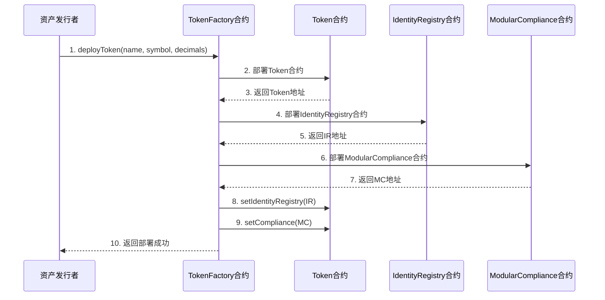
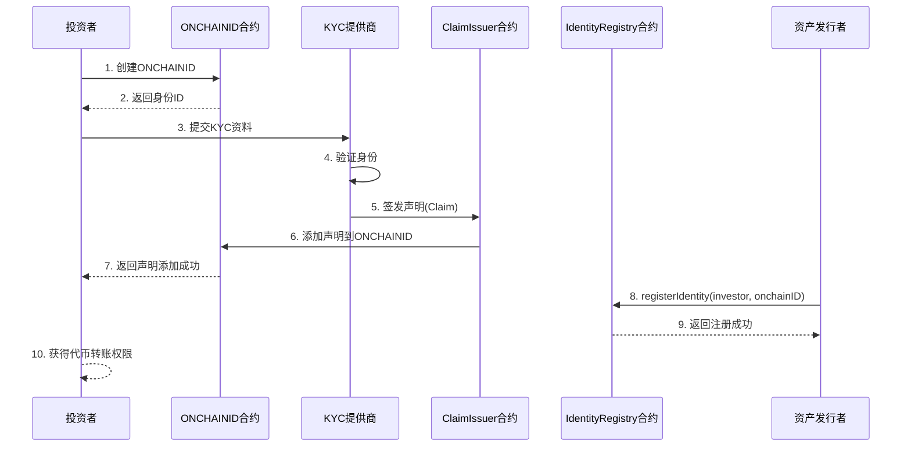
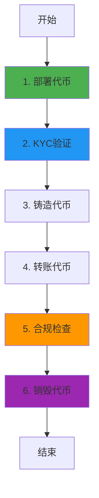

# Tokeny T-REX 业务流程与技术实现深度解析

**文档版本**: v2.0
**创建时间**: 2025-10-13 11:35:00 CST
**文档类型**: 业务流程导向的技术深度解析
**标准**: ERC3643（安全代币标准）
**信息来源**: Tokeny 官方文档 (https://docs.tokeny.com/)

---

## 📑 目录

1. [Tokeny T-REX 概述](#1-tokeny-t-rex概述)
2. [业务流程 1: 代币部署与配置](#2-业务流程1-代币部署与配置)
3. [业务流程 2: 投资者身份验证(KYC)](#3-业务流程2-投资者身份验证kyc)
4. [业务流程 3: 代币发行与转账](#4-业务流程3-代币发行与转账)
5. [业务流程 4: 合规检查与限制](#5-业务流程4-合规检查与限制)
6. [业务流程 5: 代币赎回与销毁](#6-业务流程5-代币赎回与销毁)
7. [完整业务流程图](#7-完整业务流程图)
8. [ERC3643 标准详解](#8-erc3643标准详解)
9. [关键合规规则](#9-关键合规规则)
10. [网络信息](#10-网络信息)
11. [总结与最佳实践](#11-总结与最佳实践)

---

## 1. Tokeny T-REX 概述

### 1.1 核心定位

**Tokeny T-REX 是一个基于 ERC3643 标准的安全代币(Security Token)发行平台**,为资产发行者提供完整的合规代币化解决方案,支持全球监管要求。

**核心价值主张**:

-   **ERC3643 标准**: 首个专为安全代币设计的以太坊标准
-   **模块化合规**: 可插拔的合规规则模块,适应不同监管要求
-   **身份管理**: 链上身份验证和 KYC 管理
-   **全球部署**: 支持多个 EVM 兼容链

---

### 1.2 ERC3643 架构

Tokeny T-REX 采用**ERC3643 标准架构**:

-   **T-REX Token**: ERC3643 代币合约
-   **Identity Registry**: 身份注册表
-   **Claim Topics Registry**: 声明主题注册表
-   **Trusted Issuers Registry**: 可信发行者注册表
-   **Modular Compliance**: 模块化合规系统

**核心合约**:

-   Token, IdentityRegistry, ClaimTopicsRegistry, TrustedIssuersRegistry, ModularCompliance

---

## 2. 业务流程 1: 代币部署与配置

### 2.1 流程概述

代币部署是 Tokeny T-REX 业务流程的起点,由资产发行者(Issuer)发起,通过 TokenFactory 合约部署一个新的 ERC3643 代币。

**涉及的合约**: TokenFactory, Token, IdentityRegistry, ModularCompliance

**核心步骤**:

1. 发行者调用 TokenFactory.deployToken()部署代币
2. TokenFactory 部署 Token 合约
3. TokenFactory 部署 IdentityRegistry 合约
4. TokenFactory 部署 ModularCompliance 合约
5. 配置代币参数(名称、符号、总供应量)

---

### 2.2 详细流程图



---

### 2.3 TokenFactory 合约详解

**职责**: 代币工厂合约,用于部署 ERC3643 代币

**核心方法**:

```solidity
/**
 * @dev 部署新代币
 * @param name 代币名称
 * @param symbol 代币符号
 * @param decimals 小数位数
 * @param onchainID 发行者链上身份ID
 */
function deployToken(
    string memory name,
    string memory symbol,
    uint8 decimals,
    address onchainID
) external returns (address tokenAddress) {
    // 1. 部署Token合约
    Token token = new Token(name, symbol, decimals, onchainID);

    // 2. 部署IdentityRegistry合约
    IdentityRegistry ir = new IdentityRegistry(
        address(trustedIssuersRegistry),
        address(claimTopicsRegistry),
        address(identityStorage)
    );

    // 3. 部署ModularCompliance合约
    ModularCompliance mc = new ModularCompliance();

    // 4. 配置Token
    token.setIdentityRegistry(address(ir));
    token.setCompliance(address(mc));

    // 5. 转移所有权给发行者
    token.transferOwnership(msg.sender);
    ir.transferOwnership(msg.sender);
    mc.transferOwnership(msg.sender);

    // 6. 触发事件
    emit TokenDeployed(address(token), msg.sender);

    return address(token);
}
```

---

### 2.4 代码示例

#### 2.4.1 部署代币(TypeScript)

```typescript
async function deploySecurityToken(
    factoryContract: ethers.Contract,
    tokenConfig: {
        name: string;
        symbol: string;
        decimals: number;
        onchainID: string;
    }
) {
    try {
        // 1. 部署代币
        console.log("Deploying security token...");
        const tx = await factoryContract.deployToken(
            tokenConfig.name,
            tokenConfig.symbol,
            tokenConfig.decimals,
            tokenConfig.onchainID
        );

        const receipt = await tx.wait();
        console.log("✅ Token deployed");

        // 2. 获取代币地址
        const event = receipt.events.find((e) => e.event === "TokenDeployed");
        const tokenAddress = event.args.tokenAddress;

        return {
            tokenAddress,
            name: tokenConfig.name,
            symbol: tokenConfig.symbol,
            status: "deployed",
        };
    } catch (error) {
        console.error("Error deploying token:", error);
        throw error;
    }
}
```

---

## 3. 业务流程 2: 投资者身份验证(KYC)

### 3.1 流程概述

投资者身份验证是 Tokeny T-REX 的核心功能,通过链上身份(ONCHAINID)和声明(Claims)实现 KYC 验证。

**涉及的合约**: IdentityRegistry, ClaimIssuer, ONCHAINID

**核心步骤**:

1. 投资者创建 ONCHAINID(链上身份)
2. KYC 提供商验证投资者身份
3. KYC 提供商签发声明(Claim)到投资者的 ONCHAINID
4. 发行者将投资者添加到 IdentityRegistry
5. 投资者获得代币转账权限

---

### 3.2 详细流程图



---

### 3.3 IdentityRegistry 合约详解

**职责**: 身份注册表,管理投资者身份和验证状态

**数据结构**:

```solidity
struct Identity {
    address onchainID;
    uint16 country;
    bool verified;
}

// 投资者地址 => 身份信息
mapping(address => Identity) public identities;

// 国家代码 => 投资者数量
mapping(uint16 => uint256) public investorCountByCountry;
```

**核心方法**:

```solidity
/**
 * @dev 注册投资者身份
 * @param investor 投资者地址
 * @param onchainID 链上身份地址
 * @param country 国家代码
 */
function registerIdentity(
    address investor,
    address onchainID,
    uint16 country
) external onlyAgent {
    require(identities[investor].onchainID == address(0), "Already registered");

    // 1. 验证ONCHAINID有效性
    require(_isValidIdentity(onchainID), "Invalid identity");

    // 2. 注册身份
    identities[investor] = Identity({
        onchainID: onchainID,
        country: country,
        verified: true
    });

    // 3. 更新统计
    investorCountByCountry[country]++;

    // 4. 触发事件
    emit IdentityRegistered(investor, onchainID);
}
```

---

### 3.3 代码示例

#### 3.3.1 投资者 KYC 与身份注册(TypeScript)

```typescript
import { ethers } from "ethers";

/**
 * 投资者KYC与身份注册完整流程
 */
async function registerInvestorWithKYC(
    registryContract: ethers.Contract,
    investorData: {
        wallet: string;
        onchainID: string; // ONCHAINID地址
        country: number; // ISO 3166-1 country code
        claims: Array<{
            topic: number; // Claim topic (e.g., 1 = KYC)
            issuer: string; // Trusted issuer address
            signature: string; // Claim signature
            data: string; // Claim data
        }>;
    }
) {
    try {
        console.log("🔐 开始投资者KYC与身份注册...");
        console.log("投资者钱包:", investorData.wallet);
        console.log("ONCHAINID:", investorData.onchainID);

        // 1. 验证ONCHAINID
        console.log("\n步骤1: 验证ONCHAINID...");
        const identityContract = new ethers.Contract(
            investorData.onchainID,
            ONCHAINID_ABI,
            provider
        );
        const owner = await identityContract.owner();

        if (owner.toLowerCase() !== investorData.wallet.toLowerCase()) {
            throw new Error("ONCHAINID所有者与投资者钱包不匹配");
        }
        console.log("✅ ONCHAINID验证通过");

        // 2. 添加Claims到ONCHAINID
        console.log("\n步骤2: 添加Claims到ONCHAINID...");
        for (const claim of investorData.claims) {
            console.log(`  添加Claim: Topic ${claim.topic}`);

            const tx = await identityContract.addClaim(
                claim.topic,
                1, // scheme (ECDSA)
                claim.issuer,
                claim.signature,
                claim.data,
                ""
            );

            await tx.wait();
            console.log(`  ✅ Claim ${claim.topic} 添加成功`);
        }

        // 3. 注册投资者到IdentityRegistry
        console.log("\n步骤3: 注册投资者到IdentityRegistry...");
        const tx = await registryContract.registerInvestor(
            investorData.wallet,
            investorData.onchainID,
            investorData.country
        );

        console.log("交易哈希:", tx.hash);
        const receipt = await tx.wait();
        console.log("✅ 投资者注册成功!");

        // 4. 验证注册结果
        console.log("\n步骤4: 验证注册结果...");
        const isVerified = await registryContract.isVerified(investorData.wallet);
        const registeredIdentity = await registryContract.identity(investorData.wallet);
        const investorCountry = await registryContract.investorCountry(investorData.wallet);

        console.log("\n📊 注册结果:");
        console.log("验证状态:", isVerified);
        console.log("ONCHAINID:", registeredIdentity);
        console.log("国家代码:", investorCountry);

        return {
            wallet: investorData.wallet,
            onchainID: investorData.onchainID,
            verified: isVerified,
            country: investorCountry,
            registrationTime: new Date().toISOString(),
        };
    } catch (error) {
        console.error("❌ 投资者注册失败:", error);
        throw error;
    }
}

// 使用示例
async function main() {
    const provider = new ethers.providers.JsonRpcProvider("https://mainnet.infura.io/v3/YOUR_KEY");
    const wallet = new ethers.Wallet("YOUR_PRIVATE_KEY", provider);
    const registryContract = new ethers.Contract(
        IDENTITY_REGISTRY_ADDRESS,
        IdentityRegistryABI,
        wallet
    );

    const result = await registerInvestorWithKYC(registryContract, {
        wallet: "0x1234567890123456789012345678901234567890",
        onchainID: "0xABCDEF1234567890ABCDEF1234567890ABCDEF12",
        country: 840, // 美国
        claims: [
            {
                topic: 1, // KYC Claim
                issuer: "0xTRUSTED_ISSUER_ADDRESS",
                signature: "0xSIGNATURE_DATA",
                data: "0xCLAIM_DATA",
            },
        ],
    });

    console.log("\n🎉 投资者KYC与身份注册完成!");
    console.log("验证状态:", result.verified);
}
```

---

## 4. 业务流程 3: 代币发行与转账

### 4.1 流程概述

代币发行与转账是 Tokeny T-REX 的核心业务流程,所有转账都需要通过合规检查。

**涉及的合约**: Token, ModularCompliance, IdentityRegistry

**核心步骤**:

1. 发行者调用 Token.mint()铸造代币
2. 投资者调用 Token.transfer()转账代币
3. Token 合约调用 ModularCompliance.canTransfer()检查合规
4. 合规检查通过后执行转账

---

### 4.2 Token 合约详解

**核心方法**:

```solidity
/**
 * @dev 转账代币(带合规检查)
 * @param to 接收者地址
 * @param amount 转账金额
 */
function transfer(address to, uint256 amount) public override returns (bool) {
    // 1. 合规检查
    require(compliance.canTransfer(msg.sender, to, amount), "Transfer not compliant");

    // 2. 身份验证
    require(identityRegistry.isVerified(msg.sender), "Sender not verified");
    require(identityRegistry.isVerified(to), "Receiver not verified");

    // 3. 执行转账
    _transfer(msg.sender, to, amount);

    // 4. 更新合规状态
    compliance.transferred(msg.sender, to, amount);

    return true;
}
```

---

## 5. 业务流程 4: 合规检查与限制

### 5.1 流程概述

合规检查是 Tokeny T-REX 的核心特性,通过模块化合规系统实现灵活的合规规则。

**涉及的合约**: ModularCompliance, ComplianceModule

**常见合规规则**:

-   国家限制(CountryRestrictionModule)
-   投资者数量限制(MaxInvestorsModule)
-   持仓限制(MaxBalanceModule)
-   转账限制(TransferLimitModule)

---

### 5.2 ModularCompliance 合约详解

**核心方法**:

```solidity
/**
 * @dev 检查转账是否合规
 * @param from 发送者地址
 * @param to 接收者地址
 * @param amount 转账金额
 */
function canTransfer(
    address from,
    address to,
    uint256 amount
) external view returns (bool) {
    // 遍历所有合规模块
    for (uint i = 0; i < modules.length; i++) {
        if (!modules[i].moduleCheck(from, to, amount, address(this))) {
            return false;
        }
    }
    return true;
}
```

---

## 6. 业务流程 5: 代币赎回与销毁

### 6.1 流程概述

代币赎回与销毁是投资者退出的流程。

**核心步骤**:

1. 投资者提交赎回请求
2. 发行者批准赎回
3. 发行者调用 Token.burn()销毁代币
4. 发行者向投资者支付对应资产

---

## 7. 完整业务流程图



---

## 8. ERC3643 标准详解

### 8.1 核心接口

```solidity
interface IERC3643 {
    // 身份验证
    function identityRegistry() external view returns (address);

    // 合规检查
    function compliance() external view returns (address);

    // 转账(带合规检查)
    function transfer(address to, uint256 amount) external returns (bool);

    // 强制转账(仅代理)
    function forcedTransfer(address from, address to, uint256 amount) external;

    // 冻结/解冻
    function freeze(address account) external;
    function unfreeze(address account) external;
}
```

---

## 9. 关键合规规则

### 9.1 国家限制

```solidity
// 禁止特定国家的投资者
function addCountryRestriction(uint16 country) external;
```

### 9.2 投资者数量限制

```solidity
// 限制最大投资者数量
function setMaxInvestors(uint256 max) external;
```

### 9.3 持仓限制

```solidity
// 限制单个投资者最大持仓
function setMaxBalance(uint256 max) external;
```

---

## 10. 网络信息

### 10.1 支持的网络

-   **Ethereum Mainnet**: Chain ID 1
-   **Polygon**: Chain ID 137
-   **Avalanche C-Chain**: Chain ID 43114
-   **BSC**: Chain ID 56

---

## 11. 总结与最佳实践

### 11.1 核心特点

1. **ERC3643 标准**: 专为安全代币设计
2. **模块化合规**: 灵活的合规规则
3. **链上身份**: ONCHAINID 身份管理
4. **全球部署**: 支持多链

### 11.2 开发最佳实践

1. **代币部署**: 使用 TokenFactory 统一部署
2. **KYC 管理**: 使用可信的 KYC 提供商
3. **合规配置**: 根据监管要求配置合规模块
4. **Gas 优化**: 使用批量操作减少 Gas 成本

### 11.3 常见问题 FAQ

**Q: ERC3643 与 ERC20 的区别?**
A: ERC3643 在 ERC20 基础上增加了身份验证和合规检查。

**Q: 如何添加新的合规规则?**
A: 开发新的 ComplianceModule 并添加到 ModularCompliance。

**Q: 代币可以在 DEX 交易吗?**
A: 可以,但需要 DEX 支持 ERC3643 标准。

---

## 📚 参考资源

-   **官方文档**: https://docs.tokeny.com/
-   **GitHub**: https://github.com/TokenySolutions/T-REX
-   **ERC3643 标准**: https://eips.ethereum.org/EIPS/eip-3643

---

**文档结束**
