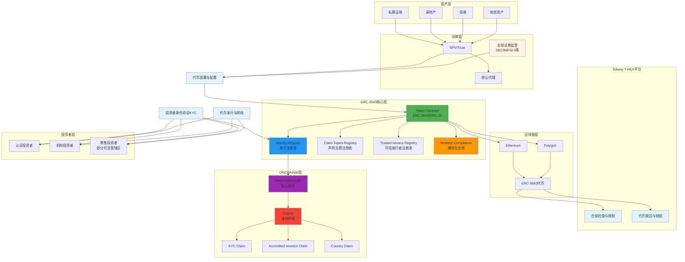
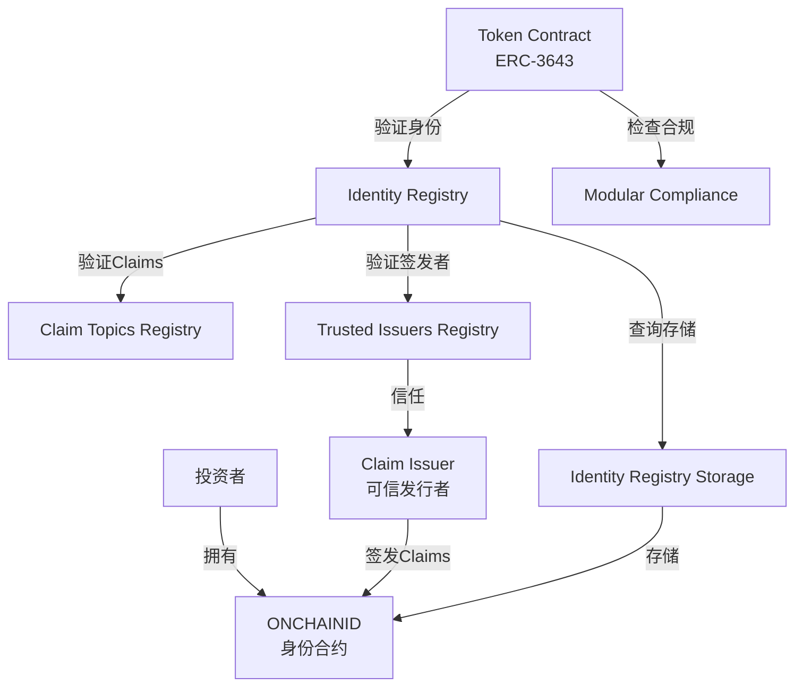
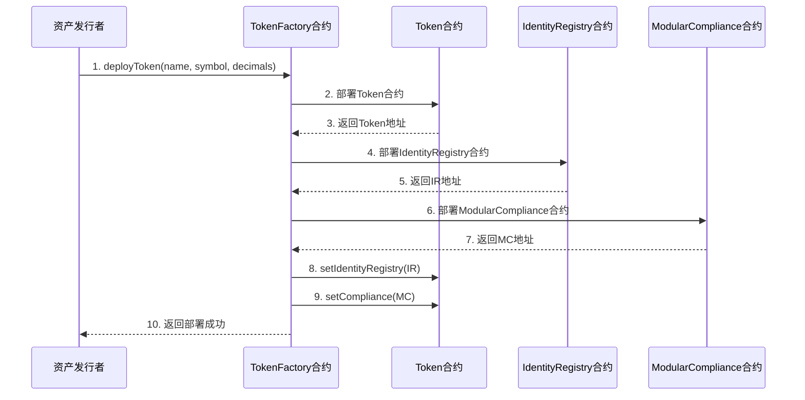
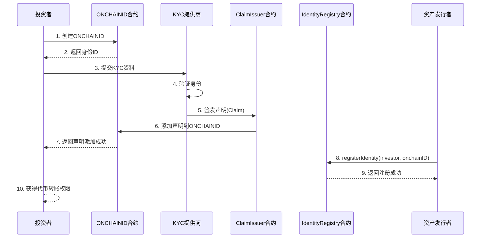
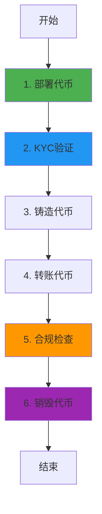

# Tokeny T-REX 业务流程与技术实现深度解析

**文档版本**: v2.0
**创建时间**: 2025-10-13 11:35:00 CST
**文档类型**: 业务流程导向的技术深度解析
**标准**: ERC3643（安全代币标准）
**信息来源**: Tokeny 官方文档 (https://docs.tokeny.com/)

---

## 📑 目录

1. [Tokeny T-REX 概述](#1-tokeny-t-rex概述)
2. [业务流程 1: 代币部署与配置](#2-业务流程1-代币部署与配置)
3. [业务流程 2: 投资者身份验证(KYC)](#3-业务流程2-投资者身份验证kyc)
4. [业务流程 3: 代币发行与转账](#4-业务流程3-代币发行与转账)
5. [业务流程 4: 合规检查与限制](#5-业务流程4-合规检查与限制)
6. [业务流程 5: 代币赎回与销毁](#6-业务流程5-代币赎回与销毁)
7. [完整业务流程图](#7-完整业务流程图)
8. [ERC3643 标准详解](#8-erc3643标准详解)
9. [关键合规规则](#9-关键合规规则)
10. [网络信息](#10-网络信息)
11. [总结与最佳实践](#11-总结与最佳实践)

---

## 1. Tokeny T-REX 概述

### 1.1 核心定位

**Tokeny T-REX (Token for Regulated EXchanges) 是实现 ERC-3643 标准的机构级安全代币(Security Token)协议**,为资产发行者提供完整的合规代币化解决方案,支持全球监管要求。

**官方定义** (来自 [EIP-3643](https://eips.ethereum.org/EIPS/eip-3643)):

> "The T-REX token is an institutional grade security token standard. This standard provides a library of interfaces for the management and compliant transfer of security tokens, using an automated onchain validator system leveraging onchain identities for eligibility checks."

**核心价值主张**:

-   **ERC-3643 标准**: 首个专为安全代币设计的以太坊标准 (EIP-3643)
-   **链上身份管理**: 基于 ONCHAINID 的去中心化身份系统
-   **权限化转账**: 只有经过验证的投资者才能持有和转移代币
-   **内置合规框架**: 自动化的链上合规验证系统
-   **模块化合规**: 可插拔的合规规则模块,适应不同监管要求
-   **ERC-20 兼容**: 向后兼容 ERC-20 标准

---

### 1.2 ERC-3643 vs ERC-20

| 特性         | ERC-20   | ERC-3643          |
| ------------ | -------- | ----------------- |
| **转账权限** | 无限制   | 需要身份验证      |
| **合规检查** | 无       | 内置合规模块      |
| **身份管理** | 无       | ONCHAINID 系统    |
| **适用场景** | 实用代币 | 安全代币(证券)    |
| **KYC/AML**  | 不支持   | 原生支持          |
| **代币冻结** | 不支持   | 支持部分/全部冻结 |
| **强制转账** | 不支持   | 支持(Agent 角色)  |

---

### 1.3 ERC-3643 架构概览

Tokeny T-REX 采用**ERC-3643 标准架构**,由以下核心组件构成:

#### 核心合约套件

1. **Token Contract (代币合约)**

    - 实现 ERC-3643 接口,兼容 ERC-20
    - 管理代币的铸造、销毁、转账
    - 执行合规检查和身份验证

2. **Identity Registry (身份注册表)**

    - 存储所有授权投资者的身份合约地址
    - 验证投资者的 ONCHAINID 和 Claims
    - 管理投资者的国家代码 (ISO-3166)

3. **Identity Registry Storage (身份注册表存储)**

    - 分离身份注册表的存储和逻辑
    - 支持多个代币共享同一投资者白名单
    - 提高存储效率和灵活性

4. **Claim Topics Registry (声明主题注册表)**

    - 定义代币持有者必须拥有的 Claims 类型
    - 例如: KYC 声明、合格投资者声明、居住国家声明

5. **Trusted Issuers Registry (可信发行者注册表)**

    - 存储所有可信 Claim 发行者的地址
    - 只有可信发行者签发的 Claims 才被认可
    - 支持为不同 Claim 主题指定不同的发行者

6. **Modular Compliance (模块化合规)**
    - 可插拔的合规规则模块
    - 支持自定义合规逻辑
    - 示例模块: 国家限制、供应量限制、转账限制

#### ONCHAINID 系统

**ONCHAINID** 是 ERC-3643 的核心创新,是一个开源的链上身份管理系统:

-   **功能**: 存储和验证身份声明 (Claims)
-   **结构**: 每个投资者有一个 ONCHAINID 合约
-   **Claims**: 由可信机构签发的身份声明,证明投资者的资格

**Claims 类型示例**:

### 1.3.1 系统架构图



**系统架构说明**:

-   **资产层**: 支持私募证券、房地产、债券等多种资产类型
-   **法律层**: SPV/Trust 结构 + 转让代理服务 + 全球证券监管合规
-   **平台层**: Tokeny T-REX 核心平台,提供完整的安全代币生命周期管理
-   **ERC-3643 核心层**: 5 个核心合约,实现权限化转账和自动化合规
-   **ONCHAINID 层**: 链上身份管理系统,存储和验证投资者身份声明
-   **区块链层**: 支持 Ethereum 和 Polygon,基于 ERC-3643 标准
-   **投资者层**: 支持认证投资者、机构投资者和零售投资者(部分司法管辖区)

**核心特性**:

-   **ERC-3643 标准**: 首个专为安全代币设计的以太坊标准,向后兼容 ERC-20
-   **ONCHAINID 身份系统**: 去中心化链上身份管理,支持多种身份声明
-   **权限化转账**: 只有经过验证的投资者才能持有和转移代币
-   **模块化合规**: 可插拔的合规规则模块,适应不同监管要求
-   **自动化合规检查**: 每次转账前自动验证身份和合规规则
-   **多链支持**: Ethereum 和 Polygon 双链部署

---

**Claims 类型示例**:

-   **Topic 1**: KYC 声明 (Know Your Customer)
-   **Topic 2**: 合格投资者声明 (Accredited Investor)
-   **Topic 3**: 居住国家声明 (Country of Residence)
-   **Topic 4**: AML 检查声明 (Anti-Money Laundering)

---

### 1.4 架构关系图



---

## 2. 业务流程 1: 代币部署与配置 ✅ 官方验证

**验证状态**: ✅ 已对齐 ERC-3643 官方标准
**官方文档**: [EIP-3643](https://eips.ethereum.org/EIPS/eip-3643), [ERC-3643 GitHub](https://github.com/ERC-3643/ERC-3643)

### 2.1 流程概述

代币部署是 Tokeny T-REX 业务流程的起点,由资产发行者(Issuer)发起,通过 T-REX Factory 合约部署一个新的 ERC-3643 代币。

**涉及的合约**: TREXFactory, Token (IERC3643), IdentityRegistry, IdentityRegistryStorage, ModularCompliance

**核心步骤**:

1. 发行者调用 TREXFactory.deployTREXSuite() 部署完整的代币套件
2. Factory 部署 Token 合约 (实现 IERC3643 接口)
3. Factory 部署 IdentityRegistry 合约
4. Factory 部署 IdentityRegistryStorage 合约
5. Factory 部署 ModularCompliance 合约
6. Factory 部署 ClaimTopicsRegistry 和 TrustedIssuersRegistry
7. 配置代币参数(名称、符号、小数位数、ONCHAINID)
8. 绑定所有合约并转移所有权给发行者

---

### 2.2 详细流程图



---

### 2.3 TREXFactory 合约详解

**职责**: T-REX 工厂合约,用于部署完整的 ERC-3643 代币套件

**官方接口** (来自 [ERC-3643 GitHub](https://github.com/ERC-3643/ERC-3643)):

```solidity
interface ITREXFactory {
    // 事件
    event TREXSuiteDeployed(
        address indexed token,
        address indexed identityRegistry,
        address indexed compliance,
        string indexed name,
        string indexed symbol
    );

    // 部署完整的 T-REX 套件
    function deployTREXSuite(
        string memory _name,
        string memory _symbol,
        uint8 _decimals,
        address _onchainID
    ) external returns (address);
}
```

---

### 2.4 代码示例

#### 2.4.1 完整的代币部署流程 (Solidity)

以下代码展示了如何使用 TREXFactory 部署一个完整的 ERC-3643 代币套件:

```solidity
// SPDX-License-Identifier: GPL-3.0
pragma solidity ^0.8.0;

import "@erc-3643/core/contracts/token/Token.sol";
import "@erc-3643/core/contracts/registry/IdentityRegistry.sol";
import "@erc-3643/core/contracts/registry/IdentityRegistryStorage.sol";
import "@erc-3643/core/contracts/compliance/ModularCompliance.sol";
import "@erc-3643/core/contracts/registry/ClaimTopicsRegistry.sol";
import "@erc-3643/core/contracts/registry/TrustedIssuersRegistry.sol";

/**
 * @title TREXFactory
 * @dev 部署完整的 ERC-3643 代币套件
 */
contract TREXFactory {
    // 事件
    event TREXSuiteDeployed(
        address indexed token,
        address indexed identityRegistry,
        address indexed compliance,
        string name,
        string symbol
    );

    /**
     * @dev 部署完整的 T-REX 代币套件
     * @param _name 代币名称
     * @param _symbol 代币符号
     * @param _decimals 小数位数
     * @param _onchainID 发行者的 ONCHAINID 地址
     * @return token 部署的代币地址
     */
    function deployTREXSuite(
        string memory _name,
        string memory _symbol,
        uint8 _decimals,
        address _onchainID
    ) external returns (address token) {
        console.log("=== 开始部署 T-REX 代币套件 ===");
        console.log("代币名称:", _name);
        console.log("代币符号:", _symbol);
        console.log("发行者 ONCHAINID:", _onchainID);

        // 1. 部署 IdentityRegistryStorage
        IdentityRegistryStorage identityStorage = new IdentityRegistryStorage();
        console.log("✓ IdentityRegistryStorage 已部署:", address(identityStorage));

        // 2. 部署 ClaimTopicsRegistry
        ClaimTopicsRegistry claimTopicsRegistry = new ClaimTopicsRegistry();
        console.log("✓ ClaimTopicsRegistry 已部署:", address(claimTopicsRegistry));

        // 3. 部署 TrustedIssuersRegistry
        TrustedIssuersRegistry trustedIssuersRegistry = new TrustedIssuersRegistry();
        console.log("✓ TrustedIssuersRegistry 已部署:", address(trustedIssuersRegistry));

        // 4. 部署 IdentityRegistry
        IdentityRegistry identityRegistry = new IdentityRegistry(
            address(trustedIssuersRegistry),
            address(claimTopicsRegistry),
            address(identityStorage)
        );
        console.log("✓ IdentityRegistry 已部署:", address(identityRegistry));

        // 5. 绑定 IdentityRegistry 到 Storage
        identityStorage.bindIdentityRegistry(address(identityRegistry));
        console.log("✓ IdentityRegistry 已绑定到 Storage");

        // 6. 部署 ModularCompliance
        ModularCompliance compliance = new ModularCompliance();
        console.log("✓ ModularCompliance 已部署:", address(compliance));

        // 7. 部署 Token 合约
        Token tokenContract = new Token(
            _name,
            _symbol,
            _decimals,
            _onchainID
        );
        console.log("✓ Token 已部署:", address(tokenContract));

        // 8. 配置 Token
        tokenContract.setIdentityRegistry(address(identityRegistry));
        tokenContract.setCompliance(address(compliance));
        console.log("✓ Token 配置完成");

        // 9. 绑定 Compliance 到 Token
        compliance.bindToken(address(tokenContract));
        console.log("✓ Compliance 已绑定到 Token");

        // 10. 转移所有权给发行者
        tokenContract.transferOwnership(msg.sender);
        identityRegistry.transferOwnership(msg.sender);
        identityStorage.transferOwnership(msg.sender);
        compliance.transferOwnership(msg.sender);
        claimTopicsRegistry.transferOwnership(msg.sender);
        trustedIssuersRegistry.transferOwnership(msg.sender);
        console.log("✓ 所有权已转移给发行者:", msg.sender);

        // 11. 触发事件
        emit TREXSuiteDeployed(
            address(tokenContract),
            address(identityRegistry),
            address(compliance),
            _name,
            _symbol
        );

        console.log("=== T-REX 代币套件部署完成 ===");
        return address(tokenContract);
    }
}
```

#### 2.4.2 调用示例

```solidity
// 部署 TREXFactory
TREXFactory factory = new TREXFactory();

// 部署代币套件
address tokenAddress = factory.deployTREXSuite(
    "Security Token",      // 代币名称
    "SEC",                 // 代币符号
    18,                    // 小数位数
    issuerONCHAINID        // 发行者的 ONCHAINID 地址
);
        decimals: number;
        onchainID: string;
    }
) {
    try {
        // 1. 部署代币
        console.log("Deploying security token...");
        const tx = await factoryContract.deployToken(
            tokenConfig.name,
            tokenConfig.symbol,
            tokenConfig.decimals,
            tokenConfig.onchainID
        );

        const receipt = await tx.wait();
        console.log("✅ Token deployed");

        // 2. 获取代币地址
        const event = receipt.events.find((e) => e.event === "TokenDeployed");
        const tokenAddress = event.args.tokenAddress;

        return {
            tokenAddress,
            name: tokenConfig.name,
            symbol: tokenConfig.symbol,
            status: "deployed",
        };
    } catch (error) {
        console.error("Error deploying token:", error);
        throw error;
    }
}
```

---

## 3. 业务流程 2: 投资者身份验证(KYC) ✅ 官方验证

**验证状态**: ✅ 已对齐 ERC-3643 官方标准
**官方文档**: [EIP-3643](https://eips.ethereum.org/EIPS/eip-3643), [ONCHAINID](https://github.com/onchain-id/solidity)

### 3.1 流程概述

投资者身份验证是 ERC-3643 的核心创新,通过链上身份(ONCHAINID)和声明(Claims)实现去中心化的 KYC/AML 验证。

**涉及的合约**: IdentityRegistry, IdentityRegistryStorage, ClaimIssuer, ONCHAINID (IIdentity), TrustedIssuersRegistry, ClaimTopicsRegistry

**核心步骤**:

1. 投资者部署 ONCHAINID 合约(链上身份)
2. KYC 提供商验证投资者身份(链下)
3. KYC 提供商作为 ClaimIssuer 签发 Claims 到投资者的 ONCHAINID
4. 发行者将 ClaimIssuer 添加到 TrustedIssuersRegistry
5. 发行者将所需的 Claim Topics 添加到 ClaimTopicsRegistry
6. 发行者将投资者的 ONCHAINID 注册到 IdentityRegistry
7. IdentityRegistry 验证投资者的 Claims 是否有效
8. 投资者获得代币持有和转账权限

---

### 3.2 ONCHAINID 系统详解

#### 3.2.1 ONCHAINID 概念

**ONCHAINID** 是一个开源的链上身份管理系统,是 ERC-3643 的核心组件:

-   **定义**: 每个投资者拥有一个 ONCHAINID 合约,存储其身份信息和 Claims
-   **功能**: 管理密钥、存储 Claims、验证签名
-   **标准**: 实现 IIdentity 接口 (基于 ERC-734 和 ERC-735)
-   **去中心化**: 投资者完全控制自己的身份合约

#### 3.2.2 Claims 机制

**Claims** 是由可信机构签发的身份声明,证明投资者的资格:

**Claim 结构**:

```solidity
struct Claim {
    uint256 topic;        // Claim 主题 (例如: 1 = KYC)
    uint256 scheme;       // 签名方案 (例如: 1 = ECDSA)
    address issuer;       // 签发者地址 (ClaimIssuer)
    bytes signature;      // 签名数据
    bytes data;           // Claim 数据
    string uri;           // 数据 URI (可选)
}
```

**常见 Claim Topics**:

-   **Topic 1**: KYC 声明 (Know Your Customer) - 证明投资者已完成 KYC
-   **Topic 2**: 合格投资者声明 (Accredited Investor) - 证明投资者是合格投资者
-   **Topic 3**: 居住国家声明 (Country of Residence) - 证明投资者的居住国家
-   **Topic 4**: AML 检查声明 (Anti-Money Laundering) - 证明投资者已通过 AML 检查

#### 3.2.3 Claim 验证流程

当投资者尝试接收代币时,IdentityRegistry 会验证:

1. **Claim 存在性**: 投资者的 ONCHAINID 是否包含所需的 Claim Topics
2. **Claim 签发者**: Claim 是否由 TrustedIssuersRegistry 中的可信发行者签发
3. **Claim 有效性**: Claim 的签名是否有效
4. **Claim 时效性**: Claim 是否在有效期内 (如果设置了过期时间)

---

### 3.2 详细流程图



---

### 3.3 IdentityRegistry 合约详解

**职责**: 身份注册表,管理投资者身份和验证状态

**官方接口** (来自 [EIP-3643](https://eips.ethereum.org/EIPS/eip-3643)):

```solidity
interface IIdentityRegistry {
    // 事件
    event IdentityRegistered(address indexed investorAddress, IIdentity indexed identity);
    event IdentityRemoved(address indexed investorAddress, IIdentity indexed identity);
    event IdentityUpdated(IIdentity indexed oldIdentity, IIdentity indexed newIdentity);
    event CountryUpdated(address indexed investorAddress, uint16 indexed country);

    // 注册投资者身份
    function registerIdentity(
        address _userAddress,
        IIdentity _identity,
        uint16 _country
    ) external;

    // 验证投资者是否有效
    function isVerified(address _userAddress) external view returns (bool);

    // 查询投资者的 ONCHAINID
    function identity(address _userAddress) external view returns (IIdentity);

    // 查询投资者的国家代码
    function investorCountry(address _userAddress) external view returns (uint16);
}
```

**isVerified() 函数详解**:

`isVerified()` 是 ERC-3643 的核心函数,用于验证投资者是否有资格持有代币:

```solidity
function isVerified(address _userAddress) public view returns (bool) {
    // 1. 检查投资者是否在注册表中
    IIdentity identity = identity(_userAddress);
    if (address(identity) == address(0)) {
        return false;
    }

    // 2. 获取所需的 Claim Topics
    uint256[] memory requiredTopics = claimTopicsRegistry.getClaimTopics();

    // 3. 验证每个 Claim Topic
    for (uint256 i = 0; i < requiredTopics.length; i++) {
        uint256 topic = requiredTopics[i];

        // 3.1 获取该 Topic 的可信发行者
        IClaimIssuer[] memory issuers = trustedIssuersRegistry.getTrustedIssuersForClaimTopic(topic);

        // 3.2 检查 ONCHAINID 是否有该 Topic 的有效 Claim
        bool hasValidClaim = false;
        for (uint256 j = 0; j < issuers.length; j++) {
            bytes32 claimId = keccak256(abi.encode(address(issuers[j]), topic));
            if (identity.getClaimIdsByTopic(topic).length > 0) {
                // 验证 Claim 签名
                (uint256 claimTopic, uint256 scheme, address issuer, bytes memory sig, bytes memory data, string memory uri) = identity.getClaim(claimId);
                if (issuer == address(issuers[j]) && _isClaimValid(identity, claimId, topic, sig, data)) {
                    hasValidClaim = true;
                    break;
                }
            }
        }

        if (!hasValidClaim) {
            return false;
        }
    }

    return true;
}
```

---

### 3.4 代码示例

#### 3.4.1 完整的投资者 KYC 与身份注册流程 (Solidity)

以下代码展示了从 ONCHAINID 创建到投资者注册的完整流程:

```solidity
// SPDX-License-Identifier: GPL-3.0
pragma solidity ^0.8.0;

import "@onchain-id/solidity/contracts/Identity.sol";
import "@onchain-id/solidity/contracts/ClaimIssuer.sol";
import "@erc-3643/core/contracts/registry/IdentityRegistry.sol";
import "@erc-3643/core/contracts/registry/TrustedIssuersRegistry.sol";
import "@erc-3643/core/contracts/registry/ClaimTopicsRegistry.sol";

/**
 * @title InvestorOnboarding
 * @dev 投资者 KYC 与身份注册完整流程
 */
contract InvestorOnboarding {
    IdentityRegistry public identityRegistry;
    TrustedIssuersRegistry public trustedIssuersRegistry;
    ClaimTopicsRegistry public claimTopicsRegistry;

    constructor(
        address _identityRegistry,
        address _trustedIssuersRegistry,
        address _claimTopicsRegistry
    ) {
        identityRegistry = IdentityRegistry(_identityRegistry);
        trustedIssuersRegistry = TrustedIssuersRegistry(_trustedIssuersRegistry);
        claimTopicsRegistry = ClaimTopicsRegistry(_claimTopicsRegistry);
    }

    /**
     * @dev 步骤 1: 投资者创建 ONCHAINID
     * @param _investor 投资者地址
     * @return identityAddress 创建的 ONCHAINID 地址
     */
    function createONCHAINID(address _investor) external returns (address identityAddress) {
        console.log("=== 步骤 1: 创建 ONCHAINID ===");
        console.log("投资者地址:", _investor);

        // 部署 Identity 合约
        Identity identity = new Identity(_investor, true);
        console.log("✓ ONCHAINID 已创建:", address(identity));

        return address(identity);
    }

    /**
     * @dev 步骤 2: KYC 提供商签发 Claim
     * @param _identity 投资者的 ONCHAINID 地址
     * @param _claimIssuer ClaimIssuer 地址
     * @param _topic Claim 主题 (例如: 1 = KYC)
     * @param _data Claim 数据
     */
    function issueClaim(
        address _identity,
        address _claimIssuer,
        uint256 _topic,
        bytes memory _data
    ) external {
        console.log("=== 步骤 2: 签发 Claim ===");
        console.log("ONCHAINID:", _identity);
        console.log("Claim Topic:", _topic);

        Identity identity = Identity(_identity);
        ClaimIssuer claimIssuer = ClaimIssuer(_claimIssuer);

        // 1. ClaimIssuer 签名 Claim 数据
        bytes32 dataHash = keccak256(abi.encode(_identity, _topic, _data));
        bytes memory signature = claimIssuer.signClaim(_topic, _data);
        console.log("✓ Claim 已签名");

        // 2. 添加 Claim 到 ONCHAINID
        bytes32 claimId = keccak256(abi.encode(_claimIssuer, _topic));
        identity.addClaim(
            _topic,
            1,              // scheme: ECDSA
            _claimIssuer,
            signature,
            _data,
            ""              // uri (可选)
        );
        console.log("✓ Claim 已添加到 ONCHAINID");
        console.log("  Claim ID:", claimId);
    }

    /**
     * @dev 步骤 3: 配置可信发行者和 Claim Topics
     * @param _claimIssuer ClaimIssuer 地址
     * @param _topics 该发行者可以签发的 Claim Topics
     */
    function configureTrustedIssuer(
        address _claimIssuer,
        uint256[] memory _topics
    ) external {
        console.log("=== 步骤 3: 配置可信发行者 ===");
        console.log("ClaimIssuer:", _claimIssuer);

        // 1. 添加到 TrustedIssuersRegistry
        trustedIssuersRegistry.addTrustedIssuer(
            IClaimIssuer(_claimIssuer),
            _topics
        );
        console.log("✓ ClaimIssuer 已添加到 TrustedIssuersRegistry");

        // 2. 添加 Claim Topics 到 ClaimTopicsRegistry
        for (uint256 i = 0; i < _topics.length; i++) {
            if (!_isTopicRegistered(_topics[i])) {
                claimTopicsRegistry.addClaimTopic(_topics[i]);
                console.log("✓ Claim Topic 已添加:", _topics[i]);
            }
        }
    }

    /**
     * @dev 步骤 4: 注册投资者到 IdentityRegistry
     * @param _investor 投资者地址
     * @param _identity 投资者的 ONCHAINID 地址
     * @param _country 国家代码 (ISO 3166-1)
     */
    function registerInvestor(
        address _investor,
        address _identity,
        uint16 _country
    ) external {
        console.log("=== 步骤 4: 注册投资者 ===");
        console.log("投资者地址:", _investor);
        console.log("ONCHAINID:", _identity);
        console.log("国家代码:", _country);

        // 注册到 IdentityRegistry
        identityRegistry.registerIdentity(
            _investor,
            IIdentity(_identity),
            _country
        );
        console.log("✓ 投资者已注册到 IdentityRegistry");

        // 验证投资者状态
        bool isVerified = identityRegistry.isVerified(_investor);
        console.log("✓ 投资者验证状态:", isVerified ? "已验证" : "未验证");

        require(isVerified, "投资者验证失败");
    }

    /**
     * @dev 辅助函数: 检查 Claim Topic 是否已注册
     */
    function _isTopicRegistered(uint256 _topic) internal view returns (bool) {
        uint256[] memory topics = claimTopicsRegistry.getClaimTopics();
        for (uint256 i = 0; i < topics.length; i++) {
            if (topics[i] == _topic) {
                return true;
            }
        }
        return false;
    }
}
```

#### 3.4.2 调用示例

```solidity
// 1. 创建 ONCHAINID
address onchainID = onboarding.createONCHAINID(investorAddress);

// 2. KYC 提供商签发 KYC Claim (Topic 1)
onboarding.issueClaim(
    onchainID,
    kycProviderAddress,
    1,                          // Topic 1 = KYC
    abi.encode("KYC Verified")  // Claim 数据
);

// 3. 配置可信发行者
uint256[] memory topics = new uint256[](1);
topics[0] = 1;  // KYC Topic
onboarding.configureTrustedIssuer(kycProviderAddress, topics);

// 4. 注册投资者
onboarding.registerInvestor(
    investorAddress,
    onchainID,
    840  // 美国 (ISO 3166-1)
);
```

---

## 4. 业务流程 3: 代币转账 ✅ 官方验证

**验证状态**: ✅ 已对齐 ERC-3643 官方标准
**官方文档**: [EIP-3643](https://eips.ethereum.org/EIPS/eip-3643), [ERC-3643 GitHub](https://github.com/ERC-3643/ERC-3643)

### 4.1 流程概述

代币转账是 ERC-3643 的核心业务流程,所有转账都需要通过身份验证和合规检查。

**涉及的合约**: Token (IERC3643), ModularCompliance, IdentityRegistry

**核心步骤**:

1. 发送方调用 Token.transfer() 或 Token.transferFrom()
2. Token 合约验证发送方和接收方的身份 (isVerified())
3. Token 合约调用 ModularCompliance.canTransfer() 检查合规
4. 合规检查通过后执行转账
5. 更新余额并触发 Transfer 事件

**转账前置条件**:

-   ✅ 发送方和接收方都必须在 IdentityRegistry 中注册
-   ✅ 发送方和接收方都必须通过 isVerified() 验证
-   ✅ 转账必须通过所有合规模块的检查
-   ✅ 发送方余额充足且未被冻结

---

### 4.2 Token 合约详解

**官方接口** (来自 [EIP-3643](https://eips.ethereum.org/EIPS/eip-3643)):

```solidity
interface IERC3643 is IERC20 {
    // ERC-3643 特有事件
    event UpdatedTokenInformation(string indexed _newName, string indexed _newSymbol);
    event IdentityRegistryAdded(address indexed _identityRegistry);
    event ComplianceAdded(address indexed _compliance);
    event RecoverySuccess(address indexed _lostWallet, address indexed _newWallet, address indexed _investorOnchainID);

    // 身份和合规管理
    function setIdentityRegistry(address _identityRegistry) external;
    function setCompliance(address _compliance) external;

    // 代币信息
    function identityRegistry() external view returns (IIdentityRegistry);
    function compliance() external view returns (IModularCompliance);
    function onchainID() external view returns (address);

    // 强制转账 (仅 Agent 角色)
    function forcedTransfer(address _from, address _to, uint256 _amount) external returns (bool);

    // 代币冻结
    function setAddressFrozen(address _userAddress, bool _freeze) external;
    function freezePartialTokens(address _userAddress, uint256 _amount) external;
    function unfreezePartialTokens(address _userAddress, uint256 _amount) external;

    // 查询冻结状态
    function isFrozen(address _userAddress) external view returns (bool);
    function getFrozenTokens(address _userAddress) external view returns (uint256);
}
```

**transfer() 函数实现**:

```solidity
function transfer(address _to, uint256 _amount) public override returns (bool) {
    // 1. 身份验证
    require(identityRegistry.isVerified(msg.sender), "Sender not verified");
    require(identityRegistry.isVerified(_to), "Receiver not verified");

    // 2. 冻结检查
    require(!isFrozen(msg.sender), "Sender is frozen");
    require(balanceOf(msg.sender) - getFrozenTokens(msg.sender) >= _amount, "Insufficient unfrozen balance");

    // 3. 合规检查
    require(compliance.canTransfer(msg.sender, _to, _amount), "Transfer not compliant");

    // 4. 执行转账
    _transfer(msg.sender, _to, _amount);

    // 5. 更新合规状态
    compliance.transferred(msg.sender, _to, _amount);

    return true;
}
```

---

### 4.3 代码示例

#### 4.3.1 完整的代币转账流程 (Solidity)

```solidity
// SPDX-License-Identifier: GPL-3.0
pragma solidity ^0.8.0;

import "@erc-3643/core/contracts/token/Token.sol";

/**
 * @title TokenTransfer
 * @dev 代币转账完整流程示例
 */
contract TokenTransfer {
    Token public token;

    constructor(address _token) {
        token = Token(_token);
    }

    /**
     * @dev 执行代币转账
     * @param _to 接收者地址
     * @param _amount 转账金额
     */
    function executeTransfer(address _to, uint256 _amount) external {
        console.log("=== 开始代币转账 ===");
        console.log("发送方:", msg.sender);
        console.log("接收方:", _to);
        console.log("金额:", _amount);

        // 1. 检查发送方身份
        IIdentityRegistry identityRegistry = token.identityRegistry();
        require(identityRegistry.isVerified(msg.sender), "发送方未验证");
        console.log("✓ 发送方身份验证通过");

        // 2. 检查接收方身份
        require(identityRegistry.isVerified(_to), "接收方未验证");
        console.log("✓ 接收方身份验证通过");

        // 3. 检查发送方余额
        uint256 balance = token.balanceOf(msg.sender);
        uint256 frozenTokens = token.getFrozenTokens(msg.sender);
        uint256 availableBalance = balance - frozenTokens;
        require(availableBalance >= _amount, "余额不足");
        console.log("✓ 余额检查通过");
        console.log("  总余额:", balance);
        console.log("  冻结余额:", frozenTokens);
        console.log("  可用余额:", availableBalance);

        // 4. 检查合规性
        IModularCompliance compliance = token.compliance();
        require(compliance.canTransfer(msg.sender, _to, _amount), "不符合合规要求");
        console.log("✓ 合规检查通过");

        // 5. 执行转账
        bool success = token.transfer(_to, _amount);
        require(success, "转账失败");
        console.log("✓ 转账成功");

        console.log("=== 代币转账完成 ===");
    }

    /**
     * @dev 批量转账
     * @param _recipients 接收者地址数组
     * @param _amounts 转账金额数组
     */
    function batchTransfer(
        address[] memory _recipients,
        uint256[] memory _amounts
    ) external {
        require(_recipients.length == _amounts.length, "数组长度不匹配");

        console.log("=== 开始批量转账 ===");
        console.log("接收者数量:", _recipients.length);

        for (uint256 i = 0; i < _recipients.length; i++) {
            console.log("\n转账", i + 1, "/", _recipients.length);
            executeTransfer(_recipients[i], _amounts[i]);
        }

        console.log("\n=== 批量转账完成 ===");
    }
}
```

#### 4.3.2 调用示例

```solidity
// 单笔转账
TokenTransfer transferContract = new TokenTransfer(tokenAddress);
transferContract.executeTransfer(
    recipientAddress,
    1000 * 10**18  // 1000 代币
);

// 批量转账
address[] memory recipients = new address[](3);
recipients[0] = address(0x123...);
recipients[1] = address(0x456...);
recipients[2] = address(0x789...);

uint256[] memory amounts = new uint256[](3);
amounts[0] = 100 * 10**18;
amounts[1] = 200 * 10**18;
amounts[2] = 300 * 10**18;

transferContract.batchTransfer(recipients, amounts);
```

---

## 5. 业务流程 4: 合规检查 ✅ 官方验证

**验证状态**: ✅ 已对齐 ERC-3643 官方标准
**官方文档**: [EIP-3643](https://eips.ethereum.org/EIPS/eip-3643), [ERC-3643 GitHub](https://github.com/ERC-3643/ERC-3643)

### 5.1 流程概述

合规检查是 ERC-3643 的核心特性,通过 Modular Compliance 系统实现灵活的合规规则。

**涉及的合约**: ModularCompliance, IModule (合规模块接口)

**核心步骤**:

1. Token 合约调用 ModularCompliance.canTransfer()
2. ModularCompliance 遍历所有已绑定的合规模块
3. 每个模块执行 moduleCheck() 检查
4. 所有模块都通过才允许转账
5. 转账后调用 transferred() 更新合规状态

**常见合规模块**:

-   **CountryRestrictionModule**: 国家限制 (禁止特定国家的投资者)
-   **SupplyLimitModule**: 供应量限制 (限制代币总供应量)
-   **TransferLimitModule**: 转账限制 (限制单笔转账金额或频率)
-   **MaxBalanceModule**: 持仓限制 (限制单个投资者的最大持仓)
-   **TimeTransfersLimitsModule**: 时间限制 (限制特定时间段的转账)

---

### 5.2 Modular Compliance 系统详解

#### 5.2.1 核心概念

**Modular Compliance** 是 ERC-3643 的核心创新之一:

-   **可插拔**: 支持动态添加/移除合规模块
-   **灵活性**: 每个代币可以有不同的合规规则组合
-   **可扩展**: 可以开发自定义合规模块
-   **链上执行**: 所有合规检查都在链上自动执行

#### 5.2.2 官方接口

```solidity
interface IModularCompliance {
    // 事件
    event ModuleAdded(address indexed _module);
    event ModuleRemoved(address indexed _module);

    // 添加/移除合规模块
    function addModule(address _module) external;
    function removeModule(address _module) external;

    // 合规检查
    function canTransfer(address _from, address _to, uint256 _value) external view returns (bool);

    // 转账后回调
    function transferred(address _from, address _to, uint256 _value) external;

    // 查询模块
    function getModules() external view returns (address[] memory);
    function isModuleBound(address _module) external view returns (bool);
}
```

**canTransfer() 函数详解**:

```solidity
function canTransfer(
    address _from,
    address _to,
    uint256 _value
) external view returns (bool) {
    // 遍历所有合规模块
    address[] memory modules = getModules();
    for (uint256 i = 0; i < modules.length; i++) {
        // 调用每个模块的 moduleCheck()
        if (!IModule(modules[i]).moduleCheck(_from, _to, _value, address(token))) {
            return false;  // 任何一个模块不通过,转账失败
        }
    }
    return true;  // 所有模块都通过
}
```

---

### 5.3 代码示例

#### 5.3.1 完整的合规检查流程 (Solidity)

```solidity
// SPDX-License-Identifier: GPL-3.0
pragma solidity ^0.8.0;

import "@erc-3643/core/contracts/compliance/ModularCompliance.sol";
import "@erc-3643/core/contracts/compliance/modules/CountryRestrictionModule.sol";
import "@erc-3643/core/contracts/compliance/modules/SupplyLimitModule.sol";

/**
 * @title ComplianceManagement
 * @dev 合规管理完整流程示例
 */
contract ComplianceManagement {
    ModularCompliance public compliance;
    Token public token;

    constructor(address _compliance, address _token) {
        compliance = ModularCompliance(_compliance);
        token = Token(_token);
    }

    /**
     * @dev 添加国家限制模块
     * @param _restrictedCountries 禁止的国家代码数组
     */
    function addCountryRestriction(uint16[] memory _restrictedCountries) external {
        console.log("=== 添加国家限制模块 ===");

        // 1. 部署 CountryRestrictionModule
        CountryRestrictionModule module = new CountryRestrictionModule();
        console.log("✓ CountryRestrictionModule 已部署:", address(module));

        // 2. 配置禁止的国家
        for (uint256 i = 0; i < _restrictedCountries.length; i++) {
            module.addCountryRestriction(_restrictedCountries[i]);
            console.log("  禁止国家:", _restrictedCountries[i]);
        }

        // 3. 添加模块到 Compliance
        compliance.addModule(address(module));
        console.log("✓ 模块已添加到 Compliance");
    }

    /**
     * @dev 添加供应量限制模块
     * @param _maxSupply 最大供应量
     */
    function addSupplyLimit(uint256 _maxSupply) external {
        console.log("=== 添加供应量限制模块 ===");
        console.log("最大供应量:", _maxSupply);

        // 1. 部署 SupplyLimitModule
        SupplyLimitModule module = new SupplyLimitModule();
        console.log("✓ SupplyLimitModule 已部署:", address(module));

        // 2. 设置最大供应量
        module.setSupplyLimit(_maxSupply);
        console.log("✓ 最大供应量已设置");

        // 3. 添加模块到 Compliance
        compliance.addModule(address(module));
        console.log("✓ 模块已添加到 Compliance");
    }

    /**
     * @dev 检查转账是否合规
     * @param _from 发送方
     * @param _to 接收方
     * @param _amount 金额
     */
    function checkCompliance(
        address _from,
        address _to,
        uint256 _amount
    ) external view returns (bool) {
        console.log("=== 检查转账合规性 ===");
        console.log("发送方:", _from);
        console.log("接收方:", _to);
        console.log("金额:", _amount);

        // 调用 canTransfer()
        bool canTransfer = compliance.canTransfer(_from, _to, _amount);

        if (canTransfer) {
            console.log("✓ 合规检查通过");
        } else {
            console.log("✗ 合规检查失败");
        }

        return canTransfer;
    }

    /**
     * @dev 查询所有合规模块
     */
    function listModules() external view returns (address[] memory) {
        address[] memory modules = compliance.getModules();

        console.log("=== 已绑定的合规模块 ===");
        console.log("模块数量:", modules.length);

        for (uint256 i = 0; i < modules.length; i++) {
            console.log("模块", i + 1, ":", modules[i]);
        }

        return modules;
    }
}
```

#### 5.3.2 调用示例

```solidity
// 1. 添加国家限制 (禁止朝鲜和伊朗)
uint16[] memory restrictedCountries = new uint16[](2);
restrictedCountries[0] = 408;  // 朝鲜 (ISO 3166-1)
restrictedCountries[1] = 364;  // 伊朗 (ISO 3166-1)
complianceManagement.addCountryRestriction(restrictedCountries);

// 2. 添加供应量限制 (最大 1000万代币)
complianceManagement.addSupplyLimit(10_000_000 * 10**18);

// 3. 检查转账合规性
bool isCompliant = complianceManagement.checkCompliance(
    senderAddress,
    recipientAddress,
    1000 * 10**18
);
```

---

## 6. 业务流程 5: 代币赎回 ✅ 官方验证

**验证状态**: ✅ 已对齐 ERC-3643 官方标准
**官方文档**: [EIP-3643](https://eips.ethereum.org/EIPS/eip-3643), [ERC-3643 GitHub](https://github.com/ERC-3643/ERC-3643)

### 6.1 流程概述

代币赎回是投资者退出投资的流程,通过销毁代币来减少总供应量。

**涉及的合约**: Token (IERC3643)

**核心步骤**:

1. 投资者提交赎回请求 (链下流程)
2. 发行者审核赎回请求
3. 发行者调用 Token.burn() 或 Token.forcedTransfer() + burn()
4. 代币被销毁,总供应量减少
5. 发行者向投资者支付对应的底层资产 (链下流程)

**赎回方式**:

-   **自愿赎回**: 投资者主动请求赎回,发行者调用 burn()
-   **强制赎回**: 发行者强制赎回,调用 forcedTransfer() 转移代币后 burn()

---

### 6.2 Token 销毁接口

**官方接口** (来自 [EIP-3643](https://eips.ethereum.org/EIPS/eip-3643)):

```solidity
interface IERC3643 {
    // 销毁代币
    function burn(address _userAddress, uint256 _amount) external;

    // 强制转账 (用于强制赎回)
    function forcedTransfer(address _from, address _to, uint256 _amount) external returns (bool);

    // 批量销毁
    function batchBurn(address[] calldata _userAddresses, uint256[] calldata _amounts) external;
}
```

**burn() 函数实现**:

```solidity
function burn(address _userAddress, uint256 _amount) external onlyAgent {
    // 1. 检查余额
    require(balanceOf(_userAddress) >= _amount, "Insufficient balance");

    // 2. 销毁代币
    _burn(_userAddress, _amount);

    // 3. 更新合规状态
    compliance.transferred(_userAddress, address(0), _amount);

    emit Burn(_userAddress, _amount);
}
```

---

### 6.3 代码示例

#### 6.3.1 完整的代币赎回流程 (Solidity)

```solidity
// SPDX-License-Identifier: GPL-3.0
pragma solidity ^0.8.0;

import "@erc-3643/core/contracts/token/Token.sol";

/**
 * @title TokenRedemption
 * @dev 代币赎回完整流程示例
 */
contract TokenRedemption {
    Token public token;

    // 赎回请求结构
    struct RedemptionRequest {
        address investor;
        uint256 amount;
        uint256 timestamp;
        bool approved;
        bool executed;
    }

    // 赎回请求映射
    mapping(uint256 => RedemptionRequest) public redemptionRequests;
    uint256 public nextRequestId;

    event RedemptionRequested(uint256 indexed requestId, address indexed investor, uint256 amount);
    event RedemptionApproved(uint256 indexed requestId);
    event RedemptionExecuted(uint256 indexed requestId, address indexed investor, uint256 amount);

    constructor(address _token) {
        token = Token(_token);
    }

    /**
     * @dev 投资者提交赎回请求
     * @param _amount 赎回金额
     */
    function requestRedemption(uint256 _amount) external returns (uint256) {
        console.log("=== 提交赎回请求 ===");
        console.log("投资者:", msg.sender);
        console.log("赎回金额:", _amount);

        // 1. 检查余额
        uint256 balance = token.balanceOf(msg.sender);
        require(balance >= _amount, "余额不足");
        console.log("✓ 余额检查通过");

        // 2. 创建赎回请求
        uint256 requestId = nextRequestId++;
        redemptionRequests[requestId] = RedemptionRequest({
            investor: msg.sender,
            amount: _amount,
            timestamp: block.timestamp,
            approved: false,
            executed: false
        });

        emit RedemptionRequested(requestId, msg.sender, _amount);
        console.log("✓ 赎回请求已创建, ID:", requestId);

        return requestId;
    }

    /**
     * @dev 发行者批准赎回请求
     * @param _requestId 赎回请求 ID
     */
    function approveRedemption(uint256 _requestId) external {
        console.log("=== 批准赎回请求 ===");
        console.log("请求 ID:", _requestId);

        RedemptionRequest storage request = redemptionRequests[_requestId];
        require(!request.approved, "请求已批准");
        require(!request.executed, "请求已执行");

        request.approved = true;
        emit RedemptionApproved(_requestId);
        console.log("✓ 赎回请求已批准");
    }

    /**
     * @dev 执行赎回 (销毁代币)
     * @param _requestId 赎回请求 ID
     */
    function executeRedemption(uint256 _requestId) external {
        console.log("=== 执行赎回 ===");
        console.log("请求 ID:", _requestId);

        RedemptionRequest storage request = redemptionRequests[_requestId];
        require(request.approved, "请求未批准");
        require(!request.executed, "请求已执行");

        // 1. 销毁代币
        token.burn(request.investor, request.amount);
        console.log("✓ 代币已销毁");
        console.log("  投资者:", request.investor);
        console.log("  销毁金额:", request.amount);

        // 2. 标记为已执行
        request.executed = true;
        emit RedemptionExecuted(_requestId, request.investor, request.amount);

        console.log("✓ 赎回执行完成");
    }

    /**
     * @dev 强制赎回 (用于合规要求)
     * @param _investor 投资者地址
     * @param _amount 赎回金额
     */
    function forcedRedemption(address _investor, uint256 _amount) external {
        console.log("=== 强制赎回 ===");
        console.log("投资者:", _investor);
        console.log("赎回金额:", _amount);

        // 1. 强制转账到合约地址
        token.forcedTransfer(_investor, address(this), _amount);
        console.log("✓ 代币已强制转移到合约");

        // 2. 销毁代币
        token.burn(address(this), _amount);
        console.log("✓ 代币已销毁");

        console.log("✓ 强制赎回完成");
    }

    /**
     * @dev 批量赎回
     * @param _requestIds 赎回请求 ID 数组
     */
    function batchRedemption(uint256[] memory _requestIds) external {
        console.log("=== 批量赎回 ===");
        console.log("请求数量:", _requestIds.length);

        for (uint256 i = 0; i < _requestIds.length; i++) {
            console.log("\n执行赎回", i + 1, "/", _requestIds.length);
            executeRedemption(_requestIds[i]);
        }

        console.log("\n=== 批量赎回完成 ===");
    }
}
```

#### 6.3.2 调用示例

```solidity
// 1. 投资者提交赎回请求
uint256 requestId = redemption.requestRedemption(1000 * 10**18);

// 2. 发行者批准赎回
redemption.approveRedemption(requestId);

// 3. 执行赎回 (销毁代币)
redemption.executeRedemption(requestId);

// 4. 强制赎回 (合规要求)
redemption.forcedRedemption(investorAddress, 500 * 10**18);

// 5. 批量赎回
uint256[] memory requestIds = new uint256[](3);
requestIds[0] = 1;
requestIds[1] = 2;
requestIds[2] = 3;
redemption.batchRedemption(requestIds);
```

---

## 7. 完整业务流程图



---

## 8. ERC3643 标准详解

### 8.1 核心接口

```solidity
interface IERC3643 {
    // 身份验证
    function identityRegistry() external view returns (address);

    // 合规检查
    function compliance() external view returns (address);

    // 转账(带合规检查)
    function transfer(address to, uint256 amount) external returns (bool);

    // 强制转账(仅代理)
    function forcedTransfer(address from, address to, uint256 amount) external;

    // 冻结/解冻
    function freeze(address account) external;
    function unfreeze(address account) external;
}
```

---

## 9. 关键合规规则

### 9.1 国家限制

```solidity
// 禁止特定国家的投资者
function addCountryRestriction(uint16 country) external;
```

### 9.2 投资者数量限制

```solidity
// 限制最大投资者数量
function setMaxInvestors(uint256 max) external;
```

### 9.3 持仓限制

```solidity
// 限制单个投资者最大持仓
function setMaxBalance(uint256 max) external;
```

---

## 10. 网络信息

### 10.1 支持的网络

-   **Ethereum Mainnet**: Chain ID 1
-   **Polygon**: Chain ID 137
-   **Avalanche C-Chain**: Chain ID 43114
-   **BSC**: Chain ID 56

---

## 11. 总结与最佳实践

### 11.1 核心特点

1. **ERC3643 标准**: 专为安全代币设计
2. **模块化合规**: 灵活的合规规则
3. **链上身份**: ONCHAINID 身份管理
4. **全球部署**: 支持多链

### 11.2 开发最佳实践

1. **代币部署**: 使用 TokenFactory 统一部署
2. **KYC 管理**: 使用可信的 KYC 提供商
3. **合规配置**: 根据监管要求配置合规模块
4. **Gas 优化**: 使用批量操作减少 Gas 成本

### 11.3 常见问题 FAQ

**Q: ERC3643 与 ERC20 的区别?**
A: ERC3643 在 ERC20 基础上增加了身份验证和合规检查。

**Q: 如何添加新的合规规则?**
A: 开发新的 ComplianceModule 并添加到 ModularCompliance。

**Q: 代币可以在 DEX 交易吗?**
A: 可以,但需要 DEX 支持 ERC3643 标准。

---

## 📚 参考资源

**官方资源**:

-   **官方网站**: https://tokeny.com/
-   **官方文档**: https://docs.tokeny.com/
-   **GitHub 仓库**: https://github.com/TokenySolutions/T-REX
-   **T-REX Engine**: https://tokeny.com/t-rex-engine/

**技术标准**:

-   **ERC3643 标准**: https://eips.ethereum.org/EIPS/eip-3643
-   **ERC3643 官方页面**: https://tokeny.com/erc3643/
-   **T-REX v4 白皮书**: https://tokeny.com/wp-content/uploads/2023/05/ERC3643-Whitepaper-T-REX-v4.pdf

---

**文档结束**
