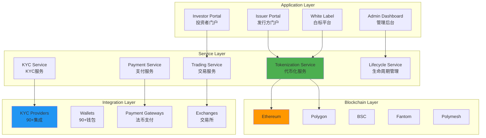
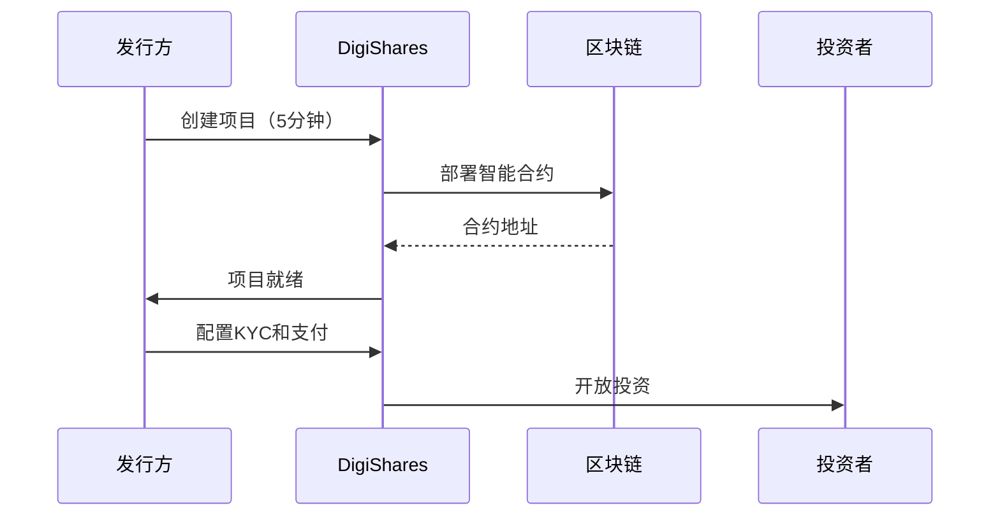
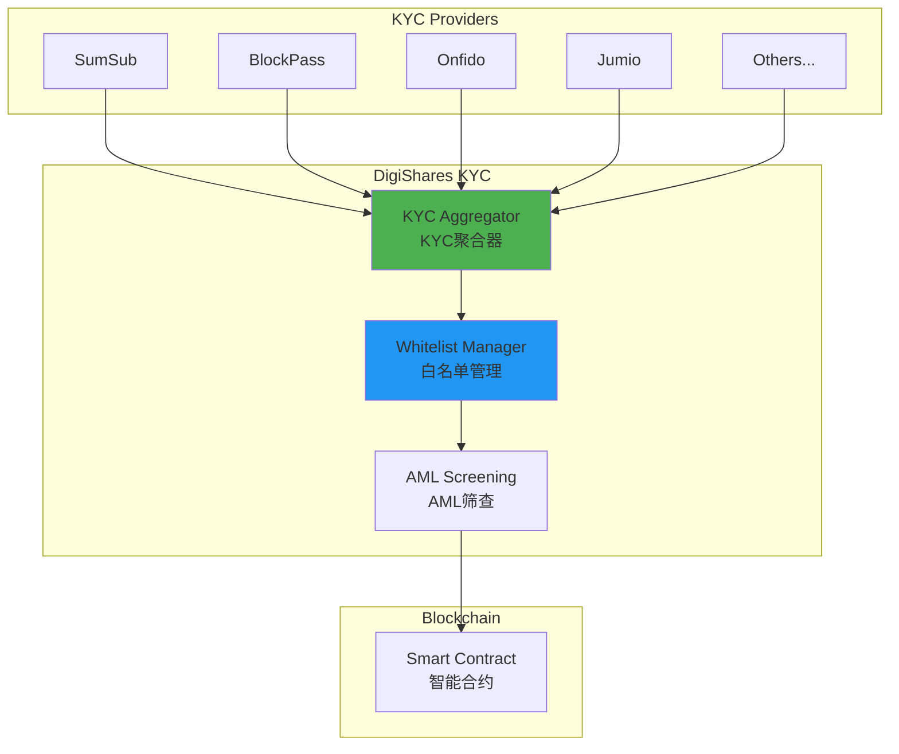
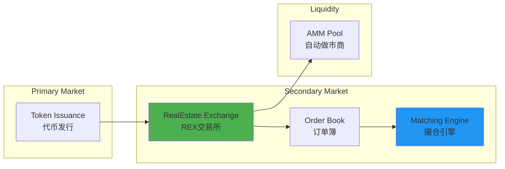
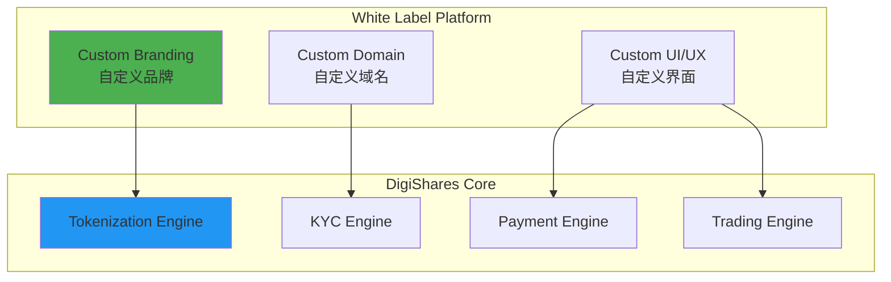

# DigiShares 技术架构分析

**文档版本**: v1.0  
**创建时间**: 2025-10-09 10:48:00 CST  
**文档类型**: 技术架构分析  
**定位**: 端到端RWA代币化平台

---

## 📑 目录

1. [系统整体架构](#1-系统整体架构)
2. [核心模块详解](#2-核心模块详解)
3. [技术选型分析](#3-技术选型分析)
4. [集成生态](#4-集成生态)
5. [白标解决方案](#5-白标解决方案)

---

## 1. 系统整体架构

### 1.1 DigiShares 整体架构



### 1.2 核心组件说明

| 组件 | 职责 | 关键功能 |
|------|------|----------|
| **Tokenization Service** | 代币化服务 | 智能合约部署、代币铸造、分发 |
| **KYC Service** | KYC服务 | 身份验证、AML筛查、白名单 |
| **Payment Service** | 支付服务 | 法币支付、加密货币支付 |
| **Trading Service** | 交易服务 | 一级市场、二级市场、REX交易所 |
| **Lifecycle Service** | 生命周期管理 | 分红、赎回、公司行动 |

### 1.3 技术栈

**区块链层**：
- Ethereum（主网）
- Polygon（Layer 2）
- BSC（币安智能链）
- Fantom（高性能）
- Polymesh（专用证券链）

**后端层**：
- Node.js 18.x
- NestJS
- PostgreSQL
- MongoDB
- Redis

**前端层**：
- React 18.x
- TypeScript
- Next.js
- Material-UI

---

## 2. 核心模块详解

### 2.1 Tokenization Service（代币化服务）

**5-10分钟快速部署**：


**支持的资产类型**：
- 房地产（Real Estate）
- 私募股权（Private Equity）
- 艺术品（Art）
- 债券（Bonds）
- 基金（Funds）
- 商品（Commodities）

**代币配置**：
```typescript
interface TokenizationConfig {
    assetType: AssetType;
    tokenName: string;
    tokenSymbol: string;
    totalSupply: number;
    blockchain: 'Ethereum' | 'Polygon' | 'BSC' | 'Fantom' | 'Polymesh';
    tokenStandard: 'ERC20' | 'ERC1400' | 'ERC3643';
    compliance: {
        requireKYC: boolean;
        jurisdictions: string[];
        lockupPeriod?: number;
        transferRestrictions?: string[];
    };
    economics: {
        pricePerToken: number;
        minInvestment: number;
        maxInvestment?: number;
        dividendFrequency?: 'monthly' | 'quarterly' | 'annually';
    };
}
```

### 2.2 KYC Service（KYC服务）

**90+集成**：


**KYC流程**：
1. 投资者选择KYC提供商
2. 完成身份验证
3. AML筛查
4. 添加到白名单
5. 链上验证

### 2.3 Payment Service（支付服务）

**支持的支付方式**：

| 支付方式 | 提供商 | 手续费 | 到账时间 |
|---------|--------|--------|---------|
| **信用卡** | Stripe | 2.9% + $0.30 | 即时 |
| **银行转账** | Dwolla | $0.25 | 1-3天 |
| **加密货币** | Coinbase Commerce | 1% | 即时 |
| **PayPal** | PayPal | 2.9% + $0.30 | 即时 |
| **SEPA** | Stripe | 0.8% | 1-2天 |

**支付流程**：
```solidity
contract PaymentProcessor {
    function processPayment(
        address investor,
        uint256 amount,
        PaymentMethod method
    ) external returns (uint256 paymentId) {
        // 1. 验证投资者
        require(isWhitelisted(investor), "Not whitelisted");
        
        // 2. 处理支付
        if (method == PaymentMethod.Crypto) {
            _processCryptoPayment(investor, amount);
        } else {
            _processFiatPayment(investor, amount, method);
        }
        
        // 3. 铸造代币
        _mintTokens(investor, amount);
        
        emit PaymentProcessed(investor, amount, method);
        
        return paymentId;
    }
}
```

### 2.4 Trading Service（交易服务）

**RealEstate.Exchange (REX)**：


**REX特点**：
- 集中订单簿
- 实时价格发现
- 高流动性
- 低交易费用（0.5%）

---

## 3. 技术选型分析

### 3.1 多链支持策略

**为什么支持5条链**：

| 区块链 | 优势 | 使用场景 |
|--------|------|---------|
| **Ethereum** | 最成熟、最安全 | 高价值资产 |
| **Polygon** | 低Gas、高速 | 零售投资者 |
| **BSC** | 低成本、高速 | 亚洲市场 |
| **Fantom** | 极低Gas、极快 | 小额交易 |
| **Polymesh** | 专用证券链 | 合规优先 |

### 3.2 固定费用模型

**订阅层级**：

| 层级 | 年费 | 功能 | 适用对象 |
|------|------|------|---------|
| **Starter** | $5,000 | 基础功能、1个项目 | 小型发行方 |
| **Professional** | $15,000 | 高级功能、5个项目 | 中型发行方 |
| **Enterprise** | $50,000+ | 全功能、无限项目 | 大型机构 |

**无交易费**：
- 固定年费
- 无交易佣金
- 无隐藏费用

---

## 4. 集成生态

### 4.1 90+集成

**KYC/AML集成**：
- SumSub
- BlockPass
- Onfido
- Jumio
- Chainalysis

**钱包集成（90+）**：
- MetaMask
- WalletConnect
- Coinbase Wallet
- Trust Wallet
- Ledger

**支付集成**：
- Stripe
- Dwolla
- Coinbase Commerce
- PayPal
- SEPA

**电子签名**：
- DocuSign
- Dropbox Sign
- Adobe Sign

**托管服务**：
- Fireblocks
- Copper
- Anchorage

---

## 5. 白标解决方案

### 5.1 白标架构



### 5.2 白标特点

**完全定制**：
- ✅ 自定义品牌
- ✅ 自定义域名
- ✅ 自定义UI/UX
- ✅ 自定义功能

**快速部署**：
- 1-2周上线
- 无需技术团队
- 全程支持

---

## 📚 参考资源

- [DigiShares官网](https://digishares.io)
- [DigiShares文档](https://docs.digishares.io)
- [REX交易所](https://realestate.exchange)

---

**文档维护**: RWA-HUSD技术团队  
**最后更新**: 2025-10-09 10:48:00 CST
