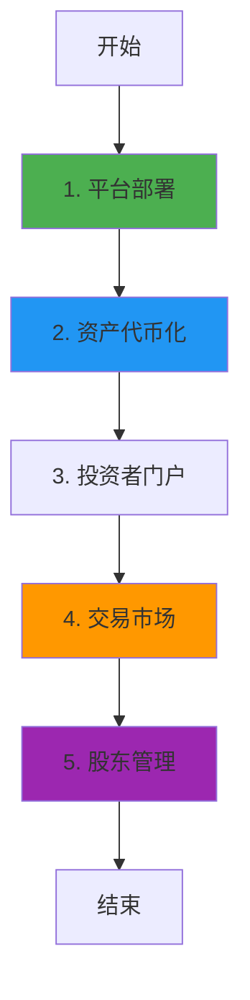

# DigiShares 业务流程与技术实现深度解析

**文档版本**: v2.0  
**创建时间**: 2025-10-13 12:30:00 CST  
**文档类型**: 业务流程导向的技术深度解析  
**定位**: 欧洲领先的证券代币化 SaaS 平台  
**信息来源**: DigiShares 官方文档 (https://digishares.io/)

---

## 📑 目录

1. [DigiShares 概述](#1-digishares概述)
2. [业务流程 1: 平台部署](#2-业务流程1-平台部署)
3. [业务流程 2: 资产代币化](#3-业务流程2-资产代币化)
4. [业务流程 3: 投资者门户](#4-业务流程3-投资者门户)
5. [业务流程 4: 交易市场](#5-业务流程4-交易市场)
6. [业务流程 5: 股东管理](#6-业务流程5-股东管理)
7. [完整业务流程图](#7-完整业务流程图)
8. [白标解决方案](#8-白标解决方案)
9. [合规模块](#9-合规模块)
10. [网络信息](#10-网络信息)
11. [总结与最佳实践](#11-总结与最佳实践)

---

## 1. DigiShares 概述

### 1.1 核心定位

**DigiShares 是欧洲领先的证券代币化 SaaS 平台**,为企业提供完整的白标解决方案,快速部署自己的证券代币化平台。

**核心价值主张**:

-   **快速部署**: 2-4 周即可上线自己的平台
-   **白标解决方案**: 完全定制化的品牌和功能
-   **全模块覆盖**: 发行、交易、股东管理、合规
-   **欧洲合规**: 符合 MiFID II、GDPR 等欧洲监管

---

### 1.2 核心架构

DigiShares 采用**模块化 SaaS 架构**:

-   **Issuance Module**: 发行模块
-   **Investor Portal**: 投资者门户
-   **Trading Module**: 交易模块
-   **Shareholder Module**: 股东管理模块
-   **Compliance Module**: 合规模块

**核心合约**: DSToken, DSRegistry, DSCompliance, DSMarketplace

---

## 2. 业务流程 1: 平台部署

### 2.1 流程概述

平台部署是 DigiShares 的起点,为客户快速部署白标平台。

**核心步骤**:

1. 客户签署服务协议
2. 配置平台参数(品牌、域名、功能模块)
3. 部署基础设施
4. 配置智能合约
5. 上线运营

---

### 2.2 平台配置

**可配置项**:

-   **品牌**: Logo、颜色、字体
-   **域名**: 自定义域名
-   **功能模块**: 选择需要的模块
-   **区块链**: 选择部署的区块链
-   **合规规则**: 配置 KYC/AML 规则

---

## 3. 业务流程 2: 资产代币化

### 3.1 流程概述

资产代币化是 DigiShares 的核心功能,支持多种资产类型。

**核心步骤**:

1. 创建发行项目
2. 配置资产参数
3. 部署智能合约
4. 设置认购条款
5. 开启认购

---

### 3.2 DSToken 合约详解

**核心方法**:

```solidity
/**
 * @dev 部署证券代币
 * @param name 证券名称
 * @param symbol 代币符号
 * @param totalSupply 总供应量
 */
function deploySecurityToken(
    string memory name,
    string memory symbol,
    uint256 totalSupply
) external onlyIssuer returns (address tokenAddress) {
    // 1. 部署ERC20代币
    DSToken token = new DSToken(name, symbol, totalSupply);

    // 2. 配置发行者
    token.setIssuer(msg.sender);

    // 3. 配置合规模块
    token.setCompliance(address(complianceModule));

    // 4. 注册到注册表
    registry.registerToken(address(token), msg.sender);

    return address(token);
}
```

---

## 4. 业务流程 3: 投资者门户

### 4.1 流程概述

投资者门户是投资者参与的主要界面。

**核心功能**:

-   注册与 KYC
-   浏览投资机会
-   提交认购订单
-   查看持仓
-   接收分红

---

## 5. 业务流程 4: 交易市场

### 5.1 流程概述

交易市场支持一级市场认购和二级市场交易。

**核心步骤**:

1. 投资者提交买单/卖单
2. 合规检查
3. 订单匹配
4. 执行交易
5. 结算

---

### 5.2 DSMarketplace 合约详解

**核心方法**:

```solidity
/**
 * @dev 创建卖单
 * @param token 代币地址
 * @param amount 出售数量
 * @param price 单价
 */
function createSellOrder(
    address token,
    uint256 amount,
    uint256 price
) external {
    // 1. 验证余额
    require(DSToken(token).balanceOf(msg.sender) >= amount, "Insufficient balance");

    // 2. 锁定代币
    DSToken(token).transferFrom(msg.sender, address(this), amount);

    // 3. 创建订单
    orders[nextOrderId] = Order({
        seller: msg.sender,
        token: token,
        amount: amount,
        price: price,
        status: OrderStatus.Open
    });

    // 4. 触发事件
    emit SellOrderCreated(nextOrderId, msg.sender, token, amount, price);

    nextOrderId++;
}
```

---

### 5.3 代码示例

#### 5.3.1 创建和匹配订单完整流程(TypeScript)

```typescript
import { ethers } from "ethers";

/**
 * 创建和匹配订单完整流程
 */
async function createAndMatchOrder(
    marketplaceContract: ethers.Contract,
    orderData: {
        tokenAddress: string;
        orderType: "buy" | "sell";
        amount: bigint;
        price: bigint; // USDC per token
    }
) {
    try {
        console.log("📝 开始创建订单...");
        console.log("订单类型:", orderData.orderType);
        console.log("代币:", orderData.tokenAddress);
        console.log("数量:", orderData.amount.toString());
        console.log("单价:", ethers.utils.formatUnits(orderData.price, 6), "USDC");

        if (orderData.orderType === "sell") {
            // 1. 创建卖单
            console.log("\n步骤1: 创建卖单...");
            const tokenContract = new ethers.Contract(orderData.tokenAddress, DSTokenABI, signer);

            // 批准代币转账
            const approveTx = await tokenContract.approve(
                marketplaceContract.address,
                orderData.amount
            );
            await approveTx.wait();

            // 创建卖单
            const tx = await marketplaceContract.createSellOrder(
                orderData.tokenAddress,
                orderData.amount,
                orderData.price
            );

            const receipt = await tx.wait();
            const event = receipt.events.find((e) => e.event === "SellOrderCreated");
            const orderId = event.args.orderId;

            console.log("✅ 卖单创建成功");
            console.log("订单ID:", orderId.toString());

            return { orderId: orderId.toString(), orderType: "sell" };
        } else {
            // 2. 创建买单并自动匹配
            console.log("\n步骤1: 创建买单...");
            const usdcContract = new ethers.Contract(USDC_ADDRESS, ERC20ABI, signer);

            // 批准USDC转账
            const totalPrice = orderData.amount * orderData.price;
            const approveTx = await usdcContract.approve(marketplaceContract.address, totalPrice);
            await approveTx.wait();

            // 创建买单
            const tx = await marketplaceContract.createBuyOrder(
                orderData.tokenAddress,
                orderData.amount,
                orderData.price
            );

            const receipt = await tx.wait();
            console.log("✅ 买单创建并匹配成功");

            return { orderType: "buy", matched: true };
        }
    } catch (error) {
        console.error("❌ 订单创建失败:", error);
        throw error;
    }
}
```

---

## 6. 业务流程 5: 股东管理

### 6.1 流程概述

股东管理包括股东名册、分红、投票等功能。

**核心功能**:

-   股东名册管理
-   分红分配
-   股东投票
-   公司行动

---

## 7. 完整业务流程图



---

## 8. 白标解决方案

### 8.1 完全定制化

DigiShares 提供完全定制化的白标解决方案:

**定制化内容**:

-   **品牌**: 完全自定义的品牌形象
-   **功能**: 选择需要的功能模块
-   **集成**: 与现有系统集成
-   **合规**: 配置符合当地监管的规则

### 8.2 部署模式

**SaaS 模式**:

-   共享基础设施
-   快速部署(2-4 周)
-   低成本

**私有部署**:

-   独立基础设施
-   完全控制
-   高安全性

---

## 9. 合规模块

### 9.1 欧洲合规

DigiShares 符合欧洲主要监管要求:

**支持的监管框架**:

-   **MiFID II**: 金融工具市场指令
-   **GDPR**: 通用数据保护条例
-   **AML5**: 反洗钱指令
-   **Prospectus Regulation**: 招股说明书条例

### 9.2 合规检查

```solidity
function checkCompliance(
    address from,
    address to,
    uint256 amount
) public view returns (bool) {
    // 1. 检查KYC状态
    require(registry.isVerified(from), "Sender not verified");
    require(registry.isVerified(to), "Receiver not verified");

    // 2. 检查白名单
    require(whitelist[from] && whitelist[to], "Not whitelisted");

    // 3. 检查投资限额
    require(balanceOf(to) + amount <= investmentLimit[to], "Exceeds limit");

    return true;
}
```

---

## 10. 网络信息

### 10.1 支持的网络

-   **Ethereum Mainnet**: Chain ID 1
-   **Polygon**: Chain ID 137
-   **Binance Smart Chain**: Chain ID 56
-   **Avalanche**: Chain ID 43114

---

## 11. 总结与最佳实践

### 11.1 核心特点

1. **快速部署**: 2-4 周上线
2. **白标解决方案**: 完全定制化
3. **全模块覆盖**: 发行、交易、管理
4. **欧洲合规**: 符合 MiFID II、GDPR

### 11.2 开发最佳实践

1. **平台配置**: 根据业务需求选择功能模块
2. **品牌定制**: 打造独特的品牌形象
3. **合规配置**: 严格遵守当地监管要求
4. **用户体验**: 提供友好的投资者门户

### 11.3 常见问题 FAQ

**Q: DigiShares 与 InvestaX 的区别?**
A: DigiShares 专注于欧洲市场,InvestaX 专注于亚洲市场。

**Q: 部署需要多长时间?**
A: SaaS 模式 2-4 周,私有部署 4-8 周。

**Q: 支持哪些资产类型?**
A: 房地产、私募股权、债券、基金等。

---

## 📚 参考资源

**官方资源**:

-   **官方网站**: https://digishares.io/ (官方主站)
-   **资产代币化指南**: https://digishares.io/asset-tokenization-on-the-blockchain/ (技术指南)
-   **房地产代币化报告**: https://digishares.io/real-estate-tokenization-reports/ (行业报告)
-   **LinkedIn**: https://www.linkedin.com/company/digishares (官方 LinkedIn)

**监管资源**:

-   **EU MiCA 法规**: https://eur-lex.europa.eu/ (欧盟加密资产市场法规)
-   **GDPR**: https://gdpr.eu/ (通用数据保护条例)

---

**文档结束**
