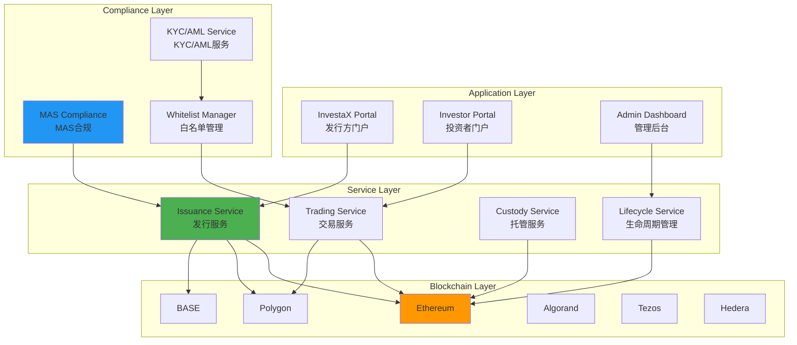
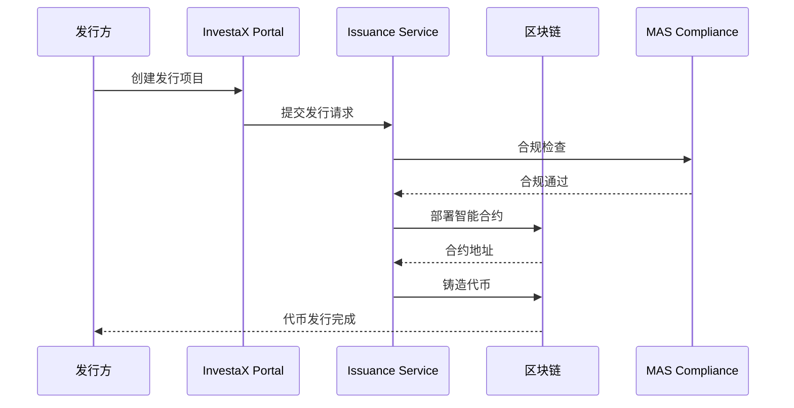
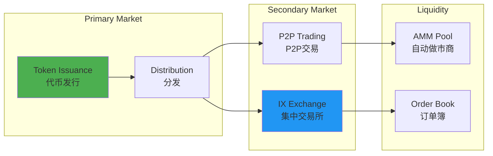
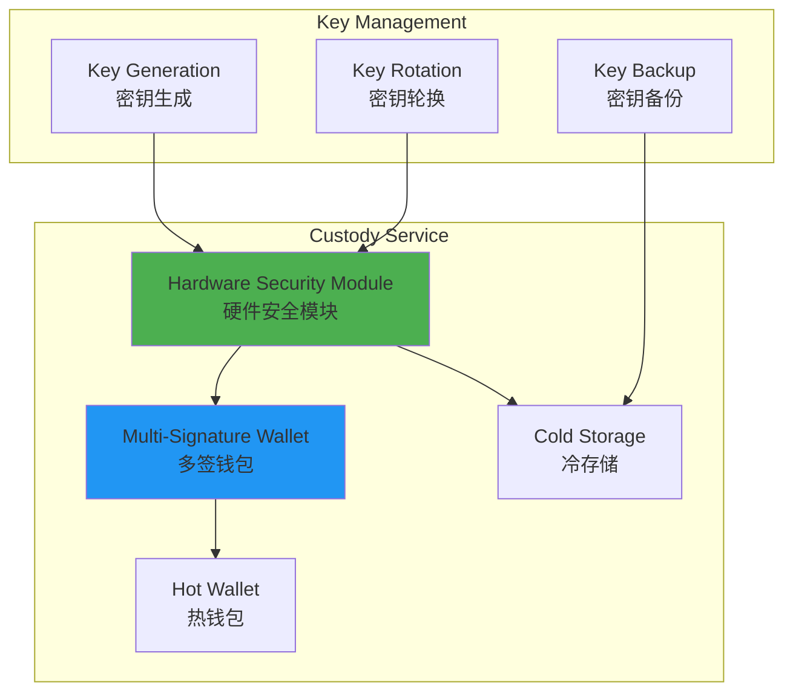
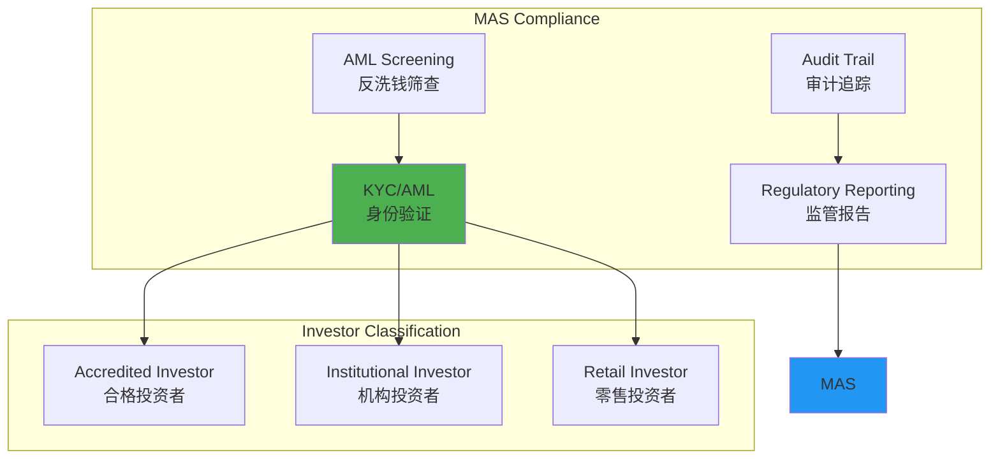
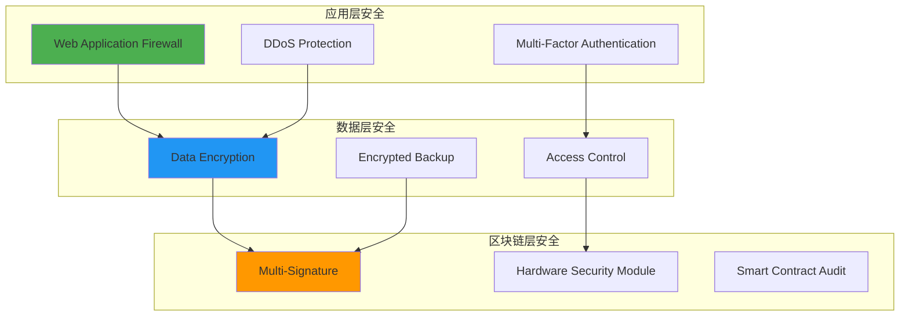

# InvestaX 技术架构分析

**文档版本**: v1.0  
**创建时间**: 2025-10-09 10:30:32 CST  
**文档类型**: 技术架构分析  
**定位**: MAS持牌RWA代币化SaaS平台

---

## 📑 目录

1. [系统整体架构](#1-系统整体架构)
2. [核心模块详解](#2-核心模块详解)
3. [技术选型分析](#3-技术选型分析)
4. [合规架构](#4-合规架构)
5. [安全架构](#5-安全架构)

---

## 1. 系统整体架构

### 1.1 InvestaX 整体架构



### 1.2 核心组件说明

| 组件 | 职责 | 关键功能 |
|------|------|----------|
| **Issuance Service** | 代币发行服务 | 智能合约部署、代币铸造、分发 |
| **Trading Service** | 交易服务 | 一级市场、二级市场、IX Exchange |
| **Custody Service** | 托管服务 | 资产托管、密钥管理、安全存储 |
| **Lifecycle Service** | 生命周期管理 | 分红、赎回、公司行动 |
| **MAS Compliance** | MAS合规 | 监管报告、合规检查、审计 |

### 1.3 技术栈

**区块链层**：
- Ethereum（主网）
- Polygon（Layer 2）
- BASE（Coinbase L2）
- Algorand（高性能）
- Tezos（治理）
- Hedera（企业级）

**后端层**：
- Node.js 18.x
- Express.js
- PostgreSQL
- Redis
- RabbitMQ

**前端层**：
- React 18.x
- TypeScript
- Material-UI
- Web3.js

---

## 2. 核心模块详解

### 2.1 Issuance Service（发行服务）

**发行流程**：


**支持的代币标准**：
- ERC20（Ethereum、Polygon、BASE）
- ASA（Algorand Standard Asset）
- FA2（Tezos）
- HTS（Hedera Token Service）

**发行配置**：
```typescript
interface IssuanceConfig {
    tokenName: string;
    tokenSymbol: string;
    totalSupply: number;
    blockchain: 'Ethereum' | 'Polygon' | 'BASE' | 'Algorand' | 'Tezos' | 'Hedera';
    compliance: {
        requireKYC: boolean;
        accreditedOnly: boolean;
        jurisdictions: string[];
        lockupPeriod?: number;
    };
    economics: {
        pricePerToken: number;
        minInvestment: number;
        maxInvestment?: number;
        dividendFrequency?: 'monthly' | 'quarterly' | 'annually';
    };
}
```

### 2.2 Trading Service（交易服务）

**交易架构**：


**IX Exchange特点**：
- 集中订单簿
- 实时价格发现
- 高流动性
- 低交易费用

### 2.3 Custody Service（托管服务）

**托管架构**：


**安全措施**：
- ✅ HSM硬件加密
- ✅ 多签钱包（2/3或3/5）
- ✅ 冷热钱包分离
- ✅ 定期密钥轮换
- ✅ 灾备恢复机制

### 2.4 Lifecycle Service（生命周期管理）

**生命周期事件**：

| 事件类型 | 描述 | 频率 | 自动化 |
|---------|------|------|--------|
| **Dividend** | 分红支付 | 月度/季度 | ✅ 自动 |
| **Redemption** | 代币赎回 | 按需 | ⚙️ 半自动 |
| **Corporate Action** | 公司行动 | 按需 | ⚙️ 半自动 |
| **Voting** | 投票治理 | 按需 | ✅ 自动 |
| **Reporting** | 合规报告 | 月度 | ✅ 自动 |

**分红流程**：
```solidity
// 分红智能合约（简化）
contract DividendDistributor {
    mapping(address => uint256) public dividends;
    
    function distributeDividends(
        address[] memory holders,
        uint256[] memory amounts
    ) external onlyAdmin {
        require(holders.length == amounts.length, "Length mismatch");
        
        for (uint256 i = 0; i < holders.length; i++) {
            dividends[holders[i]] += amounts[i];
        }
        
        emit DividendsDistributed(holders, amounts);
    }
    
    function claimDividend() external {
        uint256 amount = dividends[msg.sender];
        require(amount > 0, "No dividends");
        
        dividends[msg.sender] = 0;
        payable(msg.sender).transfer(amount);
        
        emit DividendClaimed(msg.sender, amount);
    }
}
```

---

## 3. 技术选型分析

### 3.1 多链支持策略

**为什么支持6条链**：

| 区块链 | 优势 | 使用场景 |
|--------|------|---------|
| **Ethereum** | 最成熟、最安全 | 高价值资产 |
| **Polygon** | 低Gas、高速 | 零售投资者 |
| **BASE** | Coinbase支持 | 美国市场 |
| **Algorand** | 高性能、低成本 | 大规模发行 |
| **Tezos** | 链上治理 | 治理代币 |
| **Hedera** | 企业级、合规 | 机构客户 |

**跨链桥接**：
- 使用LayerZero或Wormhole
- 支持资产跨链转移
- 统一流动性池

### 3.2 SaaS订阅模型

**订阅层级**：

| 层级 | 月费 | 功能 | 适用对象 |
|------|------|------|---------|
| **Starter** | $999 | 基础发行、5个项目 | 小型发行方 |
| **Professional** | $2,999 | 无限项目、高级功能 | 中型发行方 |
| **Enterprise** | 定制 | 全功能、专属支持 | 大型机构 |

**收费模式**：
- 固定月费（无交易费）
- 按项目数量计费
- 按交易量计费（可选）

---

## 4. 合规架构

### 4.1 MAS合规框架

**MAS许可证**：
- CMS100635（资本市场服务许可）
- 允许运营数字证券平台
- 受MAS监管和审计

**合规要求**：


### 4.2 KYC/AML流程

**KYC提供商集成**：
- Onfido
- Jumio
- Sumsub
- Chainalysis（链上分析）

**验证流程**：
1. 身份文档上传
2. 人脸识别验证
3. 地址证明验证
4. AML筛查（制裁名单、PEP）
5. 风险评分
6. 人工审核（高风险）

---

## 5. 安全架构

### 5.1 多层安全防护



### 5.2 审计和认证

**安全审计**：
- ✅ SOC 2 Type II认证
- ✅ ISO 27001认证
- ✅ 智能合约审计（Certik、OpenZeppelin）
- ✅ 渗透测试（年度）

---

## 📚 参考资源

- [InvestaX官网](https://investax.io)
- [MAS官网](https://www.mas.gov.sg)
- [InvestaX文档](https://docs.investax.io)

---

**文档维护**: RWA-HUSD技术团队  
**最后更新**: 2025-10-09 10:30:32 CST
