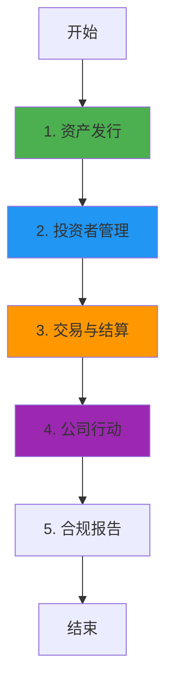

# InvestaX 业务流程与技术实现深度解析

**文档版本**: v2.0  
**创建时间**: 2025-10-13 12:25:00 CST  
**文档类型**: 业务流程导向的技术深度解析  
**定位**: 企业级数字证券 SaaS 平台  
**信息来源**: InvestaX 官方文档 (https://investax.io/)

---

## 📑 目录

1. [InvestaX 概述](#1-investax概述)
2. [业务流程 1: 资产发行](#2-业务流程1-资产发行)
3. [业务流程 2: 投资者管理](#3-业务流程2-投资者管理)
4. [业务流程 3: 交易与结算](#4-业务流程3-交易与结算)
5. [业务流程 4: 公司行动](#5-业务流程4-公司行动)
6. [业务流程 5: 合规报告](#6-业务流程5-合规报告)
7. [完整业务流程图](#7-完整业务流程图)
8. [多租户架构](#8-多租户架构)
9. [合规框架](#9-合规框架)
10. [网络信息](#10-网络信息)
11. [总结与最佳实践](#11-总结与最佳实践)

---

## 1. InvestaX 概述

### 1.1 核心定位

**InvestaX 是一个企业级数字证券 SaaS 平台**,为金融机构提供完整的资产代币化、发行、交易和管理解决方案。

**核心价值主张**:

-   **白标解决方案**: 金融机构可快速部署自己的数字证券平台
-   **全流程覆盖**: 从资产发行到交易结算的完整流程
-   **多租户架构**: 支持多个机构独立运营
-   **全球合规**: 符合 MAS、SEC 等全球监管要求

---

### 1.2 核心架构

InvestaX 采用**多租户 SaaS + 区块链**架构:

-   **Tenant Management**: 租户管理
-   **Asset Issuance**: 资产发行
-   **Investor Portal**: 投资者门户
-   **Trading Engine**: 交易引擎
-   **Compliance Module**: 合规模块

**核心合约**: IXToken, IXRegistry, IXCompliance, IXTrading

---

## 2. 业务流程 1: 资产发行

### 2.1 流程概述

资产发行是 InvestaX 的核心功能,支持多种资产类型的代币化。

**核心步骤**:

1. 机构创建发行项目
2. 配置资产参数(类型、规模、合规要求)
3. 部署智能合约
4. 开启认购
5. 分配代币

---

### 2.2 IXToken 合约详解

**核心方法**:

```solidity
/**
 * @dev 部署资产代币
 * @param name 资产名称
 * @param symbol 代币符号
 * @param totalSupply 总供应量
 * @param assetType 资产类型
 */
function deployAssetToken(
    string memory name,
    string memory symbol,
    uint256 totalSupply,
    AssetType assetType
) external onlyTenant returns (address tokenAddress) {
    // 1. 部署代币合约
    IXToken token = new IXToken(name, symbol, totalSupply);

    // 2. 配置租户信息
    token.setTenant(msg.sender);

    // 3. 配置合规规则
    token.setCompliance(address(complianceModule));

    // 4. 注册到注册表
    registry.registerToken(address(token), assetType, msg.sender);

    return address(token);
}
```

---

## 3. 业务流程 2: 投资者管理

### 3.1 流程概述

投资者管理包括 KYC、白名单管理、投资限额等。

**核心步骤**:

1. 投资者提交 KYC 申请
2. 第三方 KYC 提供商验证
3. 机构审核投资者资格
4. 添加到白名单
5. 设置投资限额

---

### 3.2 IXRegistry 合约详解

**核心方法**:

```solidity
/**
 * @dev 添加投资者到白名单
 * @param investor 投资者地址
 * @param tier 投资者等级
 * @param limit 投资限额
 */
function addInvestor(
    address investor,
    uint8 tier,
    uint256 limit
) external onlyTenant {
    // 1. 验证KYC状态
    require(kycProvider.isVerified(investor), "KYC not verified");

    // 2. 添加到白名单
    whitelist[msg.sender][investor] = true;

    // 3. 设置投资者等级
    investorTier[investor] = tier;

    // 4. 设置投资限额
    investmentLimit[investor] = limit;

    // 5. 触发事件
    emit InvestorAdded(msg.sender, investor, tier, limit);
}
```

---

## 4. 业务流程 3: 交易与结算

### 4.1 流程概述

交易与结算支持一级市场认购和二级市场交易。

**核心步骤**:

1. 投资者提交订单
2. 合规检查
3. 匹配订单
4. 执行交易
5. 结算(DVP)

---

### 4.2 IXTrading 合约详解

**核心方法**:

```solidity
/**
 * @dev 执行交易(DVP)
 * @param token 代币地址
 * @param buyer 买家地址
 * @param seller 卖家地址
 * @param amount 交易数量
 * @param price 交易价格
 */
function executeTrade(
    address token,
    address buyer,
    address seller,
    uint256 amount,
    uint256 price
) external onlyOperator {
    // 1. 合规检查
    require(compliance.canTransfer(seller, buyer, amount), "Not compliant");

    // 2. DVP结算
    // 2.1 转移代币
    IXToken(token).transferFrom(seller, buyer, amount);

    // 2.2 转移资金
    usdc.transferFrom(buyer, seller, price);

    // 3. 触发事件
    emit TradeExecuted(token, buyer, seller, amount, price);
}
```

---

### 4.3 代码示例

#### 4.3.1 DVP 交易执行完整流程(TypeScript)

```typescript
import { ethers } from "ethers";

/**
 * DVP(Delivery vs Payment)交易执行完整流程
 */
async function executeDVPTrade(
    tradingContract: ethers.Contract,
    tradeData: {
        tokenAddress: string;
        buyer: string;
        seller: string;
        amount: bigint;
        price: bigint; // USDC
    }
) {
    try {
        console.log("💱 开始执行DVP交易...");
        console.log("代币:", tradeData.tokenAddress);
        console.log("买家:", tradeData.buyer);
        console.log("卖家:", tradeData.seller);
        console.log("数量:", tradeData.amount.toString());
        console.log("价格:", ethers.utils.formatUnits(tradeData.price, 6), "USDC");

        // 1. 合规检查
        console.log("\n步骤1: 合规检查...");
        const complianceContract = new ethers.Contract(
            COMPLIANCE_ADDRESS,
            IXComplianceABI,
            provider
        );
        const canTransfer = await complianceContract.canTransfer(
            tradeData.seller,
            tradeData.buyer,
            tradeData.amount
        );

        if (!canTransfer) {
            throw new Error("合规检查失败");
        }
        console.log("✅ 合规检查通过");

        // 2. 批准代币转账(卖家)
        console.log("\n步骤2: 批准代币转账...");
        const tokenContract = new ethers.Contract(tradeData.tokenAddress, IXTokenABI, sellerSigner);
        const approveTx1 = await tokenContract.approve(tradingContract.address, tradeData.amount);
        await approveTx1.wait();
        console.log("✅ 代币批准成功");

        // 3. 批准USDC转账(买家)
        console.log("\n步骤3: 批准USDC转账...");
        const usdcContract = new ethers.Contract(USDC_ADDRESS, ERC20ABI, buyerSigner);
        const approveTx2 = await usdcContract.approve(tradingContract.address, tradeData.price);
        await approveTx2.wait();
        console.log("✅ USDC批准成功");

        // 4. 执行DVP交易
        console.log("\n步骤4: 执行DVP交易...");
        const tx = await tradingContract.executeTrade(
            tradeData.tokenAddress,
            tradeData.buyer,
            tradeData.seller,
            tradeData.amount,
            tradeData.price
        );

        console.log("交易哈希:", tx.hash);
        const receipt = await tx.wait();
        console.log("✅ DVP交易执行成功!");

        // 5. 验证交易结果
        console.log("\n步骤5: 验证交易结果...");
        const buyerBalance = await tokenContract.balanceOf(tradeData.buyer);
        const sellerBalance = await tokenContract.balanceOf(tradeData.seller);

        console.log("\n📊 交易结果:");
        console.log("买家代币余额:", buyerBalance.toString());
        console.log("卖家代币余额:", sellerBalance.toString());

        return {
            tokenAddress: tradeData.tokenAddress,
            buyer: tradeData.buyer,
            seller: tradeData.seller,
            amount: tradeData.amount.toString(),
            price: ethers.utils.formatUnits(tradeData.price, 6),
            timestamp: new Date().toISOString(),
        };
    } catch (error) {
        console.error("❌ DVP交易执行失败:", error);
        throw error;
    }
}
```

---

## 5. 业务流程 4: 公司行动

### 5.1 流程概述

公司行动包括分红、股票拆分、投票等。

**支持的公司行动**:

-   现金分红
-   股票分红
-   股票拆分
-   股东投票

---

## 6. 业务流程 5: 合规报告

### 6.1 流程概述

合规报告自动生成监管要求的报告。

**报告类型**:

-   股东名册
-   交易记录
-   KYC/AML 报告
-   税务报告

---

## 7. 完整业务流程图



---

## 8. 多租户架构

### 8.1 租户隔离

InvestaX 采用多租户架构,每个机构独立运营:

**数据隔离**:

-   每个租户有独立的数据库 schema
-   智能合约级别的租户隔离
-   独立的用户管理

**代码示例**:

```solidity
modifier onlyTenant() {
    require(tenants[msg.sender].active, "Not a valid tenant");
    _;
}

modifier onlyTenantAsset(address token) {
    require(registry.getTenant(token) == msg.sender, "Not your asset");
    _;
}
```

---

## 9. 合规框架

### 9.1 全球合规

InvestaX 支持多个司法管辖区的合规要求:

**支持的监管框架**:

-   **MAS (新加坡)**: 数字支付代币法案
-   **SEC (美国)**: Reg D/S/A+
-   **FCA (英国)**: 金融行为监管局
-   **FINMA (瑞士)**: 瑞士金融市场监管局

### 9.2 合规检查

```solidity
function checkCompliance(
    address from,
    address to,
    uint256 amount
) public view returns (bool) {
    // 1. 检查白名单
    require(whitelist[from] && whitelist[to], "Not whitelisted");

    // 2. 检查投资限额
    require(balanceOf(to) + amount <= investmentLimit[to], "Exceeds limit");

    // 3. 检查锁定期
    require(block.timestamp >= lockupEnd[from], "Lockup period");

    return true;
}
```

---

## 10. 网络信息

### 10.1 支持的网络

-   **Ethereum Mainnet**: Chain ID 1
-   **Polygon**: Chain ID 137
-   **Avalanche**: Chain ID 43114

---

## 11. 总结与最佳实践

### 11.1 核心特点

1. **白标解决方案**: 快速部署自己的平台
2. **多租户架构**: 支持多机构运营
3. **全流程覆盖**: 发行、交易、结算、报告
4. **全球合规**: 符合多个司法管辖区要求

### 11.2 开发最佳实践

1. **租户管理**: 严格的租户隔离和权限控制
2. **投资者管理**: 完善的 KYC 和白名单机制
3. **交易结算**: 使用 DVP 确保交易安全
4. **合规报告**: 自动化生成监管报告

### 11.3 常见问题 FAQ

**Q: InvestaX 与 Securitize 的区别?**
A: InvestaX 是 SaaS 平台,Securitize 是自营平台。

**Q: 如何成为 InvestaX 的租户?**
A: 联系 InvestaX 商务团队,签署服务协议。

**Q: 支持哪些资产类型?**
A: 房地产、私募股权、债券、基金等。

---

## 📚 参考资源

-   **官方网站**: https://investax.io/
-   **文档**: https://docs.investax.io/
-   **API**: https://api.investax.io/

---

**文档结束**
