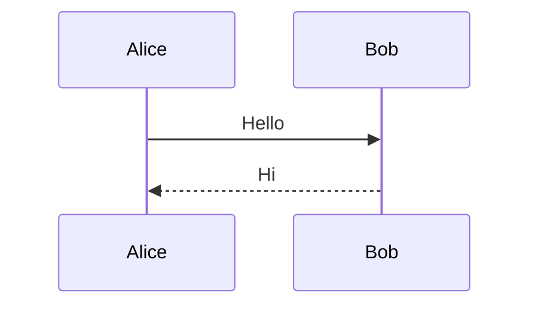
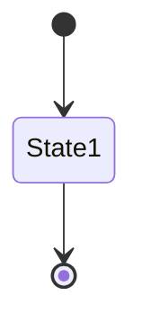
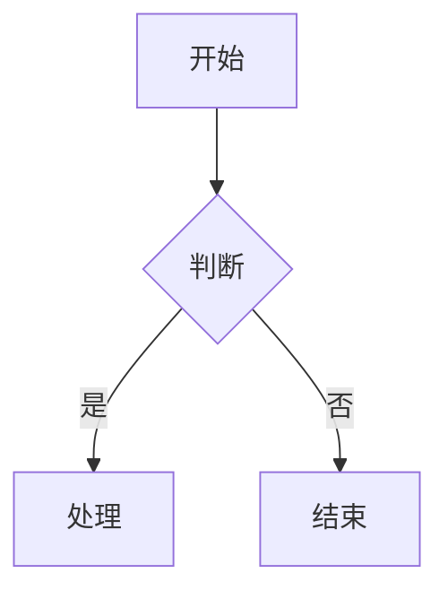

# [004] Mermaid图表预览指南

**文档编号**: [004]  
**创建时间**: 2025-10-09 10:50:19 CST  
**文档类型**: 使用指南  
**目标**: 解决Mermaid图表预览问题

---

## 📊 问题描述

**症状**: 在VS Code中预览Markdown文档时，Mermaid图表只显示代码语法，不显示渲染后的图表。

**影响范围**: 所有包含Mermaid图表的文档（约50+个图表）

---

## ✅ 已安装的插件

### 1. bierner.markdown-mermaid
- **版本**: v1.29.0
- **安装时间**: 2025-10-09 10:55:00 CST
- **功能**: 为VS Code内置Markdown预览添加Mermaid支持

### 2. shd101wyy.markdown-preview-enhanced
- **版本**: v0.8.19
- **安装时间**: 2025-10-09 10:50:00 CST
- **功能**: 增强的Markdown预览，原生支持Mermaid

---

## 🛠️ 解决方案

### 方案1：重启VS Code（必须）

**步骤**：
1. **完全关闭VS Code**
   - Mac: `Cmd+Q`
   - Windows: `Alt+F4`
   - 或者：菜单 → 退出

2. **重新打开VS Code**
   ```bash
   code /Users/liudong/web3-material/personal/rwa-husd/rwa-husd-docs
   ```

3. **测试预览**
   - 打开任意文档（如 `product-analysis/RWA-Protocols/Tokeny-T-REX/architecture.md`）
   - 使用快捷键预览

---

### 方案2：使用Markdown Preview Enhanced（推荐）

**使用步骤**：

#### 方法A：右键菜单
1. 在VS Code中打开Markdown文档
2. 右键点击编辑器
3. 选择 **"Markdown Preview Enhanced: Open Preview"**
4. 或选择 **"Markdown Preview Enhanced: Open Preview to the Side"**（分屏预览）

#### 方法B：快捷键
- **Mac**: `Cmd+K` 然后 `V`
- **Windows**: `Ctrl+K` 然后 `V`

#### 方法C：命令面板
1. 打开命令面板：`Cmd+Shift+P`（Mac）或 `Ctrl+Shift+P`（Windows）
2. 输入 "Markdown Preview Enhanced"
3. 选择 "Open Preview" 或 "Open Preview to the Side"

---

### 方案3：使用VS Code内置预览

**使用步骤**：

1. 打开Markdown文档
2. 使用快捷键：
   - **Mac**: `Cmd+Shift+V`
   - **Windows**: `Ctrl+Shift+V`
3. 或点击右上角的预览图标 📖

**注意**: 需要重启VS Code后才能生效

---

## 🎯 推荐使用方式

### 日常使用：Markdown Preview Enhanced

**优势**：
- ✅ 更强大的功能
- ✅ 更好的渲染效果
- ✅ 支持导出PDF/HTML
- ✅ 支持更多图表类型
- ✅ 实时预览

**使用方式**：
```
1. 打开文档
2. 右键 → "Markdown Preview Enhanced: Open Preview to the Side"
3. 享受分屏预览
```

### 快速查看：VS Code内置预览

**优势**：
- ✅ 快速启动
- ✅ 轻量级
- ✅ 系统集成

**使用方式**：
```
1. 打开文档
2. Cmd+Shift+V（Mac）或 Ctrl+Shift+V（Windows）
```

---

## 📝 测试步骤

### 测试文档列表

建议按以下顺序测试：

1. **Tokeny-T-REX/architecture.md**
   - 包含10个Mermaid图表
   - 类型：graph TB/LR, sequenceDiagram, stateDiagram-v2, flowchart TD

2. **Plume-Network/architecture.md**
   - 包含10个Mermaid图表
   - 类型：graph TB/LR, sequenceDiagram

3. **InvestaX/architecture.md**
   - 包含6个Mermaid图表
   - 类型：graph TB/LR, sequenceDiagram

### 测试检查点

对每个文档，检查：
- [ ] 图表是否正常渲染（不是显示代码）
- [ ] 图表布局是否清晰
- [ ] 中文标签是否正常显示
- [ ] 样式（颜色）是否正确应用
- [ ] 箭头和连接是否正确

---

## 🔧 故障排除

### 问题1：重启后仍然只显示代码

**解决方案**：
1. 确认使用的是 **Markdown Preview Enhanced** 预览
2. 不要使用VS Code内置预览（可能需要额外配置）
3. 右键 → "Markdown Preview Enhanced: Open Preview"

### 问题2：图表显示但布局混乱

**解决方案**：
1. 检查Mermaid语法是否正确
2. 尝试刷新预览（关闭预览窗口重新打开）
3. 检查是否有语法错误

### 问题3：中文显示乱码

**解决方案**：
1. 确认文件编码为UTF-8
2. 检查VS Code设置：`"files.encoding": "utf8"`

### 问题4：样式不生效

**解决方案**：
1. 检查style语法：`style NodeName fill:#color`
2. 确认颜色代码格式正确（#RRGGBB）

---

## 📚 Mermaid语法参考

### 我们使用的图表类型

#### 1. 流程图（graph TB/LR）


#### 2. 时序图（sequenceDiagram）


#### 3. 状态图（stateDiagram-v2）


#### 4. 流程图（flowchart TD）


---

## 🌐 在线预览（备用方案）

如果VS Code预览仍然有问题，可以使用在线工具：

### Mermaid Live Editor
- **网址**: https://mermaid.live
- **使用方式**：
  1. 复制Mermaid代码（不包括 ```mermaid 标记）
  2. 粘贴到编辑器
  3. 实时预览
  4. 可导出为PNG/SVG

### 优势
- ✅ 无需安装
- ✅ 实时预览
- ✅ 可导出图片
- ✅ 可分享链接

---

## 📊 预期效果

### 正确渲染的图表应该显示：

1. **流程图**：
   - 矩形框、菱形判断框
   - 箭头连接
   - 颜色填充
   - 中文标签清晰

2. **时序图**：
   - 参与者列表
   - 消息箭头
   - 时间线
   - 激活框

3. **状态图**：
   - 状态节点
   - 转换箭头
   - 开始/结束状态

---

## ✅ 验证清单

完成以下步骤后，Mermaid图表应该能正常预览：

- [ ] 已安装 bierner.markdown-mermaid 插件
- [ ] 已安装 shd101wyy.markdown-preview-enhanced 插件
- [ ] 已重启VS Code
- [ ] 已测试 Markdown Preview Enhanced 预览
- [ ] 已测试至少3个文档
- [ ] 所有图表正常渲染
- [ ] 中文标签正常显示
- [ ] 样式正确应用

---

## 📝 后续建议

### 如果预览正常
- ✅ 继续执行第二步：文档质量审查
- ✅ 记录成功的预览方式
- ✅ 分享给团队成员

### 如果仍有问题
- 🔧 提供具体的错误截图
- 🔧 检查VS Code版本
- 🔧 尝试在线预览作为临时方案

---

## 📞 技术支持

如果遇到问题，请提供以下信息：
1. VS Code版本
2. 操作系统版本
3. 错误截图
4. 使用的预览方式

---

**文档维护**: RWA-HUSD技术团队  
**联系方式**: tech@rwa-husd.com  
**最后更新**: 2025-10-09 10:50:19 CST
